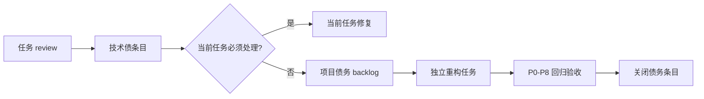

# agate 项目生命周期演进框架讨论稿

> 状态：讨论稿，未批准实施
>
> 目的：讨论 agate 如何帮助项目从 0-1、1-N 持续演进，避免每个任务单独看都通过，但长期叠加成架构屎山。
>
> 本文不是实现计划。任何实现前仍需独立需求分析、设计评审和实施评审。

## 1. 问题定义

agate 当前主要解决任务级问题：

- 需求是否被写清楚；
- 设计是否经过独立评审；
- 测试是否先于实现；
- 实现是否经过全量验证；
- 验收证据是否存在并可追溯；
- 阶段是否按状态机推进。

这些机制能显著降低“单个任务做坏”的概率，但不能自动回答项目级问题：

- 连续多个任务是否把同一模块越改越复杂；
- 模块边界和依赖方向是否持续恶化；
- 技术债是否被记录、排序并真正偿还；
- 当前架构是否仍适合项目规模和业务阶段；
- 重构是否被正确拆成独立工作，而不是每次功能任务顺手扩大范围；
- 项目是否从可用的 0-1 逐渐演进成可维护的 1-N。

### 1.1 屎山的形成机制

项目变成屎山通常不是某个任务单独失败，而是以下累积过程：

1. 每个任务只优化局部目标；
2. 临时耦合和复制逻辑被接受，但没有登记；
3. 技术债没有负责人、优先级和复查时间；
4. 重构不断被“以后再做”推迟；
5. 没有周期性架构审视，团队只看当前任务是否通过。

因此，agate 需要在任务级流程之上增加一个**项目级演进视图**，而不是继续给单任务增加更多门禁。

## 2. 目标与非目标

### 2.1 目标

- 让架构债、技术债和覆盖缺口可见；
- 让债务能够进入正常任务队列，而不是停留在评审文字里；
- 为重构任务提供明确的范围、回归和验收方法；
- 以低频、低负担方式进行架构健康审视；
- 保持 agate 技术栈中立，不把某种语言、框架或架构模式写成硬规则；
- 保持现有 P0-P8 主流程，不为每个普通功能任务增加固定阶段。

### 2.2 非目标

- 不保证自动选出“最优架构”；
- 不把架构整洁度变成机器硬 gate；
- 不要求每个任务都做完整架构审查；
- 不要求每次评审都产生技术债；
- 不用一个万能指标替代领域专家和项目团队判断；
- 不把现有项目改造成统一的微服务、六边形架构或其他固定模式。

## 3. 设计原则

### 3.1 让债务可见，不强迫立即偿还

发现技术债时，应先记录事实、影响、建议和优先级。除非债务已经阻断当前任务或造成安全/正确性风险，否则不应在当前任务中强行扩大范围。

### 3.2 把重构作为一等任务，而不是隐式顺手修改

重构可以单独立项，也可以由评审建议产生。重构任务必须有自己的范围和回归证据，不能用“顺便整理一下”绕过 P1/P2/P5/P6。

### 3.3 机器检查留痕，人工判断语义

机器可以检查债务条目字段、状态、优先级、关联模块和任务链接是否完整，但不应判断架构是否“优秀”。架构质量由独立评审、项目约束和长期结果共同判断。

### 3.4 周期性审视，而不是每任务增加负担

架构审视应绑定里程碑、发布或明确触发条件。普通小任务不应自动增加一次架构评审派发。

## 4. 当前能力与缺口

### 4.1 已有能力

| 能力 | 当前机制 | 局限 |
|---|---|---|
| 任务状态 | `.state.yaml`、`active-tasks.md` | 只有任务视图，没有项目健康视图 |
| 方案评审 | P2 architect + plan-eng-review + plan-design-review | 关注当前方案，不追踪跨任务累积结果 |
| 实现评审 | P4 review/design-review/cso | 能发现局部问题，缺少债务登记出口 |
| 一致性审查 | P7 consistency-reviewer | 主要对照当前任务的 P1-P6 产出 |
| 回归验证 | P5 基线、全量测试、P6 验收 | 证明行为未退化，不等于架构持续健康 |
| Roadmap | agate 自身 `docs/hardening-roadmap.md` | 使用 agate 的项目没有同等标准的项目债务视图 |

### 4.2 主要缺口

- 没有项目级 `tech-debt` 或架构债登记规范；
- review 发现的长期问题没有统一的结构化出口；
- 没有“债务条目 → 独立任务 → 关闭验证”的标准链路；
- 没有周期性架构健康审视的触发规则；
- 重构任务没有统一的“行为不变”工作流说明；
- 没有区分当前任务缺陷、项目技术债和 agate 协议缺陷的统一分类。

## 5. 候选架构

### 5.1 方案 A：只增加技术债文件

在项目中增加 `docs/agents/tech-debt.md`，所有 review 可以追加债务条目，项目团队手动把条目转成任务。

**优点**：改动最小，容易接入现有项目。

**缺点**：仍然依赖主 Agent 和团队自觉；条目很容易变成长期积压清单；没有明确的架构审视入口。

### 5.2 方案 B：债务登记 + 重构任务规范

增加项目级债务登记模板，并规定每条债务包含：

- 唯一编号；
- 类型（架构/设计/代码质量/性能/安全/测试覆盖/运维）；
- 事实证据；
- 影响；
- 建议；
- 优先级；
- 关联模块；
- 是否需要独立任务；
- 关联任务和关闭条件。

重构任务仍走普通 P0-P8，但 P1/P2/P5/P6 使用重构专用约定。

**优点**：债务可见、可排期、可关闭；不新增常设阶段；能够直接承接 review 输出。

**缺点**：需要设计条目状态和任务引用关系；仍然不能自动判断债务价值。

### 5.3 方案 C：项目健康快照 + 债务登记 + 周期性审视

在方案 B 的基础上，增加 `architecture-health.md` 或等价的项目健康快照，并在发布或里程碑时执行一次架构审视。

快照可以记录：

- 主要模块和边界；
- 关键依赖方向；
- 已知架构决策；
- 高优先级技术债；
- 当前重构计划；
- 需要持续关注的性能、安全和可扩展性风险。

**优点**：最接近“从 0-1 到长期演进”的目标，能看到跨任务趋势。

**缺点**：维护成本最大；快照可能过期；容易变成另一份没人更新的文档。

## 6. 推荐方向

推荐采用 **方案 B 作为第一阶段，保留方案 C 的扩展点**。

理由：

1. 方案 A 太弱，无法形成债务闭环；
2. 方案 C 一次引入项目健康快照，容易把项目带入文档维护负担；
3. 方案 B 能直接利用已有 review、roadmap、active-tasks 和 P0-P8；
4. 只有当多个项目实际使用债务登记后，才有足够证据决定是否需要健康快照。

推荐数据流：



## 7. 技术债条目建议

### 7.1 最小字段

```yaml
id: DEBT0001
type: architecture
title: "模块 X 直接依赖模块 Y 的内部实现"
status: open
priority: medium
affected_areas:
  - package-a
evidence:
  - path: src/module_x.py
    note: "直接调用 module_y._internal_*"
impact: "阻碍模块独立演进，增加变更回归风险"
recommendation: "通过公开接口隔离依赖"
task_id: null
closure_criteria:
  - "调用方只依赖公开接口"
  - "相关回归测试通过"
reported_by: design-review
created_at: 2026-08-11
```

这里的 YAML 只是机器可读元数据；复杂证据、权衡和方案仍可放在 Markdown 正文中。不要把所有语义强行压进 YAML。

### 7.2 状态转换

```text
open -> accepted -> planned -> in_progress -> resolved -> verified -> closed
  \-> rejected / duplicate / wont-fix
```

`resolved` 不等于 `closed`。只有关联重构任务通过回归和关闭条件验证后，才允许 `closed`。

## 8. 重构任务约定

重构任务不是特殊阶段，而是任务类型。建议在 P1 中明确：

- `change_type: refactor`；
- 行为保持不变，除非 P1 明确批准行为变化；
- 改动范围和不改范围；
- 需要偿还的债务条目；
- 基线测试命令和性能基线（如适用）；
- 目标设计/边界变化。

重构任务的验收不应伪造功能 BDD，而应使用：

- P5 全量回归；
- P2 基线与 P5 结果对照；
- 关键路径 P6 验收；
- P7 设计到实现的一致性检查；
- 需要时的性能、资源和依赖方向证据。

## 9. 强制力设计

### 不建议的强制

- 每个任务必须更新架构快照；
- 每个 review 必须产生技术债；
- gate 自动判断“架构是否优秀”；
- 固定要求某种设计模式；
- 未登记债务就阻断所有提交。

这些规则容易制造形式主义，并增加已有的派发和文档负担。

### 建议的最小强制

- review 如果提出“后续应重构/存在架构债”，必须使用标准债务条目格式；
- 债务条目必须有事实证据和影响，不能只写“代码不好”；
- 进入 `closed` 必须有验证证据；
- 高优先级债务在任务看板中可见；
- 任务完成时只需确认“是否产生新的 agate/项目债务”，没有则明确标记无新增。

## 10. 指标与成本效益

指标只用于趋势，不用于单次任务硬 gate。候选指标：

- 未关闭高优先级债务数量；
- 债务平均存活时间；
- 重构任务占全部任务的比例；
- 重构后的回归失败率；
- 同一模块被重复修改的频率；
- review 发现债务到实际关闭的周期；
- 架构审视产生的有效决策数，而不是文档字数。

这些指标应定期抽样分析，不能为了好看而强行优化。否则会出现“债务数量下降只是因为不登记”的 Goodhart 问题。

## 11. 主要风险

### 11.1 债务清单变成垃圾场

### 11.2 过度重构

### 11.3 架构快照过期

### 11.4 主 Agent 伪造健康数据

## 12. 待其他 Agent 讨论的问题

1. 方案 B 的债务条目应该独立 YAML 文件、frontmatter 条目，还是项目级 Markdown 中的结构化区块？
2. `tech-debt.md` 是否足够，还是必须同时维护架构快照？
3. review 发现债务时，标准格式是否应该强制，还是只在准备进入 backlog 时强制？
4. “重构任务行为不变”是否需要新的 task type 和专用模板？
5. 哪些债务必须阻断发布，哪些只做趋势记录？
6. 项目级审视应该按发布、任务数量，还是人工触发？
7. P2.71 是否应该作为 v2.1 顶层主题，还是先以独立小试点验证？

## 13. 当前建议

先不加常设阶段、不加架构硬 gate、不强制每任务维护健康快照。建议顺序：

1. 设计并试用最小技术债条目模板；
2. 让 review 能稳定地产出可追踪债务；
3. 用一个真实重构任务验证“登记 → 立项 → 回归 → 关闭”闭环；
4. 有实际数据后再决定是否引入项目架构健康快照。

这条路线把“避免屎山”从口号变成可见、可排期、可验证的演进闭环，同时控制 agate 本身的流程复杂度。
