```mermaid
flowchart TD
    START([任务开始]) --> P0

    %% ═══ P0 ═══
    P0{{"P0 立项\n主Agent亲自写P0-brief\n写orchestrator-log.md\n防无响应"}} --> |"P0-brief 五字段通过"| P1

    %% ═══ P1 需求分析 + 评审迭代 ═══
    P1{{"P1 需求分析"}} --> |"① 写 P1-dispatch-context.md\n（客观信息+任务上下文）\n② 派发 analyst\n（自带progress.md落盘指令）\n③ D2校验"| P1A["P1 产出\nP1-requirements.md\n+ P1-progress.md"]
    P1A --> P1R["派发 requirements-review\n（自带progress.md落盘指令）"]
    P1R --> P1RV{"review\napproved?\nagent≠main"}
    P1RV --> |"否\n→ 派发 analyst 修改\n→ D2校验\n→ 再 review"| P1A
    P1RV --> |"是"| G1
    G1{"P1 gate\n≥1 BDD +\n无NEED_CONFIRM +\n无GAP +\nreview approved +\nagent≠main"}
    G1 --> |通过| C1["commit"] --> P2
    G1 --> |未通过| DIAG1{"红灯诊断"}
    DIAG1 --> |"本步抖动\n→ 写 P1-gate-diagnosis.md\n→ 重试一次"| P1A
    DIAG1 --> |"上游\n退回P0"| P0
    DIAG1 --> |"retry ≥ MAX\n或外部"| PAUSED1["PAUSED ✅"]

    %% ═══ P2 方案设计 + 评审迭代 ═══
    P2{{"P2 方案设计"}} --> |"① 写 P2-dispatch-context.md\n（客观信息+任务上下文\n+P1摘要关键决策）\n② 派发 architect\n（自带progress.md落盘指令）\n③ D2校验"| P2A["P2 产出\nP2-design.md\n+ P2-progress.md"]
    P2A --> P2R["派发 design-review\n（自带progress.md落盘指令）"]
    P2R --> P2RV{"review\napproved?\nagent≠main"}
    P2RV --> |"否\n→ 派发 architect 修改\n→ D2校验\n→ 再 review"| P2A
    P2RV --> |"是"| G2
    G2{"P2 gate\n候选方案≥2 +\n权衡 + 四字段"}
    G2 --> |通过| C2["commit"] --> P3
    G2 --> |未通过| DIAG2{"红灯诊断"}
    DIAG2 --> |"本步抖动\n→ 写 P2-gate-diagnosis.md\n→ 重试一次"| P2A
    DIAG2 --> |"P1需求有洞\n→ 写 P2-gate-diagnosis.md\n→ 新写 P1-dispatch-context.md\n  （引用诊断）\n→ 退回P1\n（diff=1 放行）"| P1A
    DIAG2 --> |"retry ≥ MAX"| PAUSED2["PAUSED ✅"]

    %% ═══ P3 TDD ═══
    P3{{"P3 TDD"}} --> |"① 写 P3-dispatch-context.md\n② 派发 test-designer\n（自带progress.md落盘指令）\n③ D2校验"| P3A["P3 产出\n测试文件\n+ P3-progress.md"]
    P3A --> G3
    G3{"P3 gate\ncheck-tdd-red.sh"}
    G3 --> |"exit 0 红灯通过"| C3["commit"] --> P4
    G3 --> |"exit 2 全绿\n→ 重派 test-designer"| P3
    G3 --> |"exit 1 A类\n→ 重试一次"| P3
    G3 -.-> |"retry ≥ MAX"| PAUSED3["PAUSED ✅"]

    %% ═══ P4 实现 + 评审迭代 ═══
    P4{{"P4 实现"}} --> |"① 写 P4-dispatch-context.md\n（客观信息+任务上下文\n+P2摘要关键决策\n+P2 files_to_read导航）\n② 派发 implementer\n（自带progress.md落盘指令）\n③ D2：grep确认落盘"| P4A["P4 产出\n代码文件\n+ P4-progress.md"]
    P4A --> P4R["可选：design-review\n（实现偏差审查）"]
    P4R --> P4RV{"review\napproved?"}
    P4RV --> |"否\n→ 派发 implementer 修改\n→ D2校验\n→ 再 review"| P4A
    P4RV --> |"是 或 跳过review"| G4
    G4{"P4 gate\n暂存区含代码文件"}
    G4 --> |通过| C4["commit"] --> P5
    G4 --> |未通过| DIAG4{"红灯诊断"}
    DIAG4 --> |"本步抖动\n→ 写 P4-gate-diagnosis.md\n→ 重试一次"| P4A
    DIAG4 --> |"P2设计有洞\n→ 写 P4-gate-diagnosis.md\n→ 新写 P2-dispatch-context.md\n  （引用诊断）\n→ 退回P2\n（diff=2→PAUSED→人工批准）"| PAUSED4D["PAUSED ✅\n带诊断：目标P2"]
    DIAG4 --> |"retry ≥ MAX"| PAUSED4["PAUSED ✅"]

    %% ═══ P5 技术验证（subagent） ═══
    P5{{"P5 技术验证"}} --> |"① 写 P5-dispatch-context.md\n（客观信息+任务上下文\n+P2 gate_commands.P5\n  grep提取）\n② 派发 verifier（P5模式）\n（自带progress.md落盘指令）\n③ D2校验"| P5A["P5 产出\nP5-test-results/\n+ P5-progress.md"]
    P5A --> G5
    G5{"P5 gate\nexit 0 + failed=0\n无PROD_TOUCHED"}
    G5 --> |通过| C5["commit"] --> P6
    G5 --> |"failed>0"| DIAG5{"红灯诊断"}
    DIAG5 --> |"本步抖动\n→ 写 P5-gate-diagnosis.md\n→ 重派 verifier 全量重跑\n（防回归）"| P5A
    DIAG5 --> |"P4实现不对齐\n→ 写 P5-gate-diagnosis.md\n→ 新写 P4-dispatch-context.md\n  （引用诊断）\n→ 退回P4\n（diff=1 放行）"| P4A
    DIAG5 --> |"PROD_TOUCHED"| PAUSED5U["PAUSED ✅\n生产触碰"]
    DIAG5 -.-> |"retry ≥ MAX"| PAUSED5["PAUSED ✅"]

    %% ═══ P6 验收 + 评审迭代 ═══
    P6{{"P6 验收"}} --> |"① 写 P6-dispatch-context.md\n（客观信息+任务上下文\n不含预判）\n② 派发 verifier（P6模式）\n（自带progress.md落盘指令）\n③ 主Agent调\n  check-p6-format.sh --fix\n④ D2校验"| P6A["P6 产出\nP6-acceptance.md\n+ P6-evidence/\n+ P6-progress.md"]
    P6A --> P6CK{"P6 gate\n脚本审计层\n（含provenance审计）\n通过？"}
    P6CK --> |"否：格式问题\n→ 主Agent调\n  check-p6-format.sh --fix\n→ 再验gate"| G6CK["再验gate"]
    G6CK --> P6CK
    P6CK --> |"否：FAIL>0\n→ 红灯诊断"| DIAG6
    P6CK --> |"是"| G6
    G6{"P6 gate\n主Agent核实层\nBDD总数对照"}
    G6 --> |通过| C6["commit"] --> P7
    DIAG6{"红灯诊断"}
    DIAG6 --> |"本步抖动\n→ 写 P6-gate-diagnosis.md\n→ 重派 verifier 修改验收\n→ P5→P6 重跑"| P6A
    DIAG6 --> |"P4实现问题\n→ 写 P6-gate-diagnosis.md\n→ 新写 P4-dispatch-context.md\n  （引用诊断：\n  失败BDD+verifier诊断\n  +修复方向）\n→ 退回P4\n（diff=2→PAUSED→人工批准）"| PAUSED6D["PAUSED ✅\n带诊断：目标P4"]
    DIAG6 --> |"P2设计问题\n→ 写 P6-gate-diagnosis.md\n→ 新写 P2-dispatch-context.md\n  （引用诊断）\n→ 退回P2\n（diff=4→PAUSED→人工批准）"| PAUSED6D2["PAUSED ✅\n带诊断：目标P2"]
    DIAG6 -.-> |"retry ≥ MAX"| PAUSED6["PAUSED ✅"]

    %% ═══ P7 一致性检查（subagent） ═══
    P7{{"P7 一致性检查"}} --> |"① 写 P7-dispatch-context.md\n（客观信息+任务上下文\n+P1-P6摘要关键决策）\n② 派发 consistency-reviewer\n（自带progress.md落盘指令\nP7输入文件数不受限）\n③ D2校验"| P7A["P7 产出\nP7-consistency.md\n+ P7-progress.md"]
    P7A --> G7
    G7{"P7 gate\nBLOCKER=0\nCRITICAL=0\nDESIGN_GAP全配对"}
    G7 --> |通过| C7["commit"] --> P8
    G7 --> |"未通过"| DIAG7{"红灯诊断"}
    DIAG7 --> |"本步抖动\n→ 写 P7-gate-diagnosis.md\n→ 重派 consistency-reviewer\n→ 再验gate"| P7A
    DIAG7 --> |"P4 DESIGN_GAP\n→ 写 P7-gate-diagnosis.md\n→ 新写 P4-dispatch-context.md\n  （引用诊断）\n→ 退回P4\n（diff=3→PAUSED→人工批准）"| PAUSED7D["PAUSED ✅\n带诊断：目标P4"]
    DIAG7 -.-> |"retry ≥ MAX"| PAUSED7["PAUSED ✅"]

    %% ═══ P8 发布准备（subagent + 主Agent收尾） ═══
    P8{{"P8 发布"}} --> |"① 写 P8-dispatch-context.md\n（客观信息+任务上下文\n+P2 packages grep提取\n+bump导航）\n② 派发 releaser\n（自带progress.md落盘指令）\n③ D2校验"| P8A["P8 产出\nP8-release.md\n+ P8-progress.md"]
    P8A --> G8
    G8{"P8 gate\nbump_type +\nversion变更 +\nCHANGELOG"}
    G8 --> |通过| READY{"主Agent亲自做\nREADY收尾检查\n（环境清理+生产确认）"}
    READY --> |通过| DONE["READY\n交付小结"]
    G8 --> |"未通过"| DIAG8{"红灯诊断"}
    DIAG8 --> |"→ 写 P8-gate-diagnosis.md\n→ 重派 releaser"| P8A
    DIAG8 -.-> |"retry ≥ MAX"| PAUSED8["PAUSED ✅"]

    DONE --> |"人手动\nmake publish"| FINISH([DONE])

    %% ═══ PAUSED 恢复 ═══
    PAUSED1 --> |"人工确认\n恢复P1"| P1A
    PAUSED2 --> |"人工确认\n恢复P2\nrecovery_bonus"| P2A
    PAUSED3 --> |"人工确认\n恢复P3"| P3A
    PAUSED4 --> |"人工确认\n恢复P4"| P4A
    PAUSED4D --> |"人工批准诊断\n恢复P2\n→修完→P3→P4重跑"| P2A
    PAUSED5 --> |"人工确认\n恢复P5"| P5A
    PAUSED5U --> |"人工处置\n恢复P5"| P5A
    PAUSED6 --> |"人工确认\n恢复P6"| P6A
    PAUSED6D --> |"人工批准诊断\n恢复P4\n→修完→P5→P6重跑"| P4A
    PAUSED6D2 --> |"人工批准诊断\n恢复P2\n→修完→P3→P4→P5→P6重跑"| P2A
    PAUSED7 --> |"人工确认\n恢复P7"| P7A
    PAUSED7D --> |"人工批准\n恢复P4"| P4A
    PAUSED8 --> |"人工确认\n恢复P8"| P8A

    %% ═══ SCOPE+ ═══
    SCOPE["任意阶段产出\n含 SCOPE+"] --> |"增补P1基线\n→ 定向回补\n→ 重触P1评审"| P1A

    %% ═══ 样式 ═══
    style P0 fill:#e8f5e9,stroke:#388e3c
    style P1 fill:#e3f2fd,stroke:#1976d2
    style P2 fill:#e3f2fd,stroke:#1976d2
    style P3 fill:#e3f2fd,stroke:#1976d2
    style P4 fill:#e3f2fd,stroke:#1976d2
    style P5 fill:#e3f2fd,stroke:#1976d2
    style P6 fill:#e3f2fd,stroke:#1976d2
    style P7 fill:#e3f2fd,stroke:#1976d2
    style P8 fill:#e3f2fd,stroke:#1976d2
    style READY fill:#fff3e0,stroke:#f57c00
    style DONE fill:#c8e6c9,stroke:#2e7d32
    style FINISH fill:#a5d6a7,stroke:#1b5e20
    style PAUSED1 fill:#f3e5f5,stroke:#7b1fa2
    style PAUSED2 fill:#f3e5f5,stroke:#7b1fa2
    style PAUSED3 fill:#f3e5f5,stroke:#7b1fa2
    style PAUSED4 fill:#f3e5f5,stroke:#7b1fa2
    style PAUSED4D fill:#f3e5f5,stroke:#7b1fa2
    style PAUSED5 fill:#f3e5f5,stroke:#7b1fa2
    style PAUSED5U fill:#f3e5f5,stroke:#7b1fa2
    style PAUSED6 fill:#f3e5f5,stroke:#7b1fa2
    style PAUSED6D fill:#f3e5f5,stroke:#7b1fa2
    style PAUSED6D2 fill:#f3e5f5,stroke:#7b1fa2
    style PAUSED7 fill:#f3e5f5,stroke:#7b1fa2
    style PAUSED7D fill:#f3e5f5,stroke:#7b1fa2
    style PAUSED8 fill:#f3e5f5,stroke:#7b1fa2
    style SCOPE fill:#fff9c4,stroke:#f9a825
    style P1A fill:#e8eaf6,stroke:#5c6bc0
    style P2A fill:#e8eaf6,stroke:#5c6bc0
    style P3A fill:#e8eaf6,stroke:#5c6bc0
    style P4A fill:#e8eaf6,stroke:#5c6bc0
    style P5A fill:#e8eaf6,stroke:#5c6bc0
    style P6A fill:#e8eaf6,stroke:#5c6bc0
    style P7A fill:#e8eaf6,stroke:#5c6bc0
    style P8A fill:#e8eaf6,stroke:#5c6bc0
```

## 主 Agent 职责边界

| 职责 | 阶段 | 说明 |
|------|------|------|
| **亲自写** | P0 | P0-brief（编排者本职，PM 视角任务简报） |
| **亲自写** | P0-P8 | orchestrator-log.md（长操作前写 NEXT:，防无响应） |
| **亲自做** | P8 收尾 | READY 收尾检查（环境清理+生产确认，编排者的最终责任） |
| **只派发+验gate+写dispatch-context+诊断落盘** | P1-P8 全部 | 读状态→写dispatch-context→派发→验gate→失败时写gate-diagnosis→更新状态，不做第五件 |

## 各阶段执行方式

| 阶段 | 执行者 | 角色 | 产出 | 派发前 dispatch-context 特有内容 |
|------|--------|------|------|------|
| P0 | **主Agent** | — | P0-brief.md | — |
| P1 | subagent | analyst → requirements-review | P1-requirements.md + P1-progress.md | P0-brief 已知风险 |
| P2 | subagent | architect → design-review | P2-design.md + P2-progress.md | P1 摘要关键决策 |
| P3 | subagent | test-designer | 测试文件 + P3-progress.md | P2 BDD 映射 |
| P4 | subagent | implementer → design-review(可选) | 代码文件 + P4-progress.md | P2 摘要 + **files_to_read grep 提取** |
| P5 | subagent | verifier（P5模式） | P5-test-results/ + P5-progress.md | **P2 gate_commands.P5 grep 提取** |
| P6 | subagent | verifier（P6模式） | P6-acceptance.md + P6-evidence/ + P6-progress.md | 不含预判 |
| P7 | subagent | consistency-reviewer | P7-consistency.md + P7-progress.md | P1-P6 摘要关键决策（输入文件数不受限） |
| P8 | subagent | releaser | P8-release.md + P8-progress.md | **P2 packages grep 提取** + bump 导航 |
| READY | **主Agent** | — | 收尾检查确认 | — |

## 落盘机制对照

| 文件 | 写入者 | 何时写 | 作用 |
|------|--------|--------|------|
| `P{N}-progress.md` | subagent | 每读完一个输入或完成一个关键步骤时追加 | 防空返回——即使 subagent 无法产出完整报告，progress 文件让主 Agent 知道它做了什么 |
| `P{N}-dispatch-context.md` | 主 Agent | 派发前写，派发后冻结 | 给 subagent 提供客观信息+任务上下文导航；provenance 审计基准 |
| `P{N}-gate-diagnosis.md` | 主 Agent | gate 失败诊断后写 | 防诊断丢失——回退时携带诊断信息给上游 subagent |
| `orchestrator-log.md` | 主 Agent | 长操作前写 NEXT: | 防无响应——降低主 Agent 单次推理复杂度 |
| `PAUSED-resolution.md` | 主 Agent | PAUSED 时写 | 记录人工决策，PAUSED 恢复时参照 |

## dispatch-context.md 结构（扩展后）

每个阶段派发前，主 Agent 写 `P{N}-dispatch-context.md`。派发后**冻结**，不再追加。

```markdown
## 客观信息（主 Agent 已查证）
- 环境状态：...
- 关键路径/标识：...
- 接口/结构清单：...

## 任务上下文（主 Agent 从 P0-brief + gate + 摘要积累）
- 目标：本阶段要解决什么问题
- 关注点：从上游产出/gate 诊断中提取的关键约束
- 已知风险：P0-brief 的 known_risks 中与本阶段相关的
- 上游关键决策：上一阶段 subagent 摘要中提到的关键选择
- 上游结构化字段（从 P2-design.md grep 提取，非读全文）：
  - packages: {值}
  - domains: {值}
  - ui_affected: {值}
  - gate_commands.P5: {值}（P5/P6/P8 派发时）
  - files_to_read: {值}（P4 派发时）
- 回退诊断（仅回退时）：引用 P{N}-gate-diagnosis.md 路径
```

**信息来源**：

| 来源 | 何时写入 | 写什么 |
|------|---------|--------|
| P0-brief | 首次派发 P1 时 | 目标 + 已知风险 |
| subagent 返回摘要 | 每次收到 subagent 返回时 | 上游关键决策 |
| gate 诊断 | gate 失败时 → 写 `P{N}-gate-diagnosis.md` | 关注点 + 回退诊断（dispatch-context 引用诊断文件路径） |
| 主 Agent 查证 | 派发前查证客观信息时 | 客观信息节 |
| P2-design.md 结构化字段 | P4/P5/P6/P8 派发时 | packages/domains/gate_commands/files_to_read（grep 提取） |

## gate-diagnosis.md 结构

gate 失败后，主 Agent 写 `P{N}-gate-diagnosis.md`（单独文件，不追加到 dispatch-context.md）：

```markdown
---
phase: P6
date: 2026-07-11
trigger: gate_fail
---
# P6 Gate 诊断

- gate 结果：FAIL=3, NC=0
- 失败项：B03 过期链接返回 404 非 410, B07 批量操作无确认
- 诊断：P4 实现问题（B03/B07）
- 路由：退回 P4
- 修复方向：link-service.ts 的 TTL 检查逻辑 + batch 的确认流程
```

## 派发 prompt "## 任务"节（模板化）

```
## 任务
目标：{一句话：本阶段要产出什么}
关注点：{从 dispatch-context.md 任务上下文节提取，2-5 条}
已知约束：{从 P0-brief + 上游产出提取}
与上阶段关联：{上一阶段 subagent 摘要中的关键信息}
```

## 回退机制：诊断→跳转→PAUSED→人工批准→修→重跑

1. **诊断**：主 Agent 分析 gate 失败原因，确定问题源头，**写 `P{N}-gate-diagnosis.md`**
2. **跳转**：直接改 .state.yaml phase 到目标阶段
3. **新写 dispatch-context**：目标阶段的 dispatch-context.md 在"回退诊断"子节引用 gate-diagnosis.md 路径
4. **PAUSED**（diff≥2 时）：check-state-transition.sh 拦截 → 主 Agent 在 PAUSED resolution 写明诊断和目标 → 人工批准
5. **恢复到目标**：修完后从目标往下逐阶段重跑
6. **不在中间阶段停留**：诊断已确认问题在源头

**回退携带诊断信息**：

| 从 | 到 | 诊断内容（gate-diagnosis.md） | dispatch-context 回退诊断节 |
|----|-----|------|------|
| P6→P4 | P4 implementer | 失败BDD清单 + verifier诊断 + 修复方向 | 引用 P6-gate-diagnosis.md |
| P6→P2 | P2 architect | 验收暴露的设计缺陷 + 受影响BDD | 引用 P6-gate-diagnosis.md |
| P5→P4 | P4 implementer | 失败测试 + 失败原因 | 引用 P5-gate-diagnosis.md |
| P7→P4 | P4 implementer | DESIGN_GAP清单 + 一致性偏差 | 引用 P7-gate-diagnosis.md |
| P4→P2 | P2 architect | 实现中遇到的设计不可行点 | 引用 P4-gate-diagnosis.md |

## do→review 迭代循环

| 阶段 | do | review | 循环 |
|------|-----|--------|------|
| P1 | analyst 写需求 | requirements-review（agent≠main） | review 否 → analyst 修改 → 再 review → … → approved |
| P2 | architect 写方案 | design-review（agent≠main） | review 否 → architect 修改 → 再 review → … → approved |
| P4 | implementer 写代码 | design-review(可选) | review 否 → implementer 修改 → 再 review → … → approved |
| P6 | verifier 写验收 | provenance审计 + check-p6-format | 格式问题 → 主Agent调 --fix → 再验 → … → 通过 |
| P7 | consistency-reviewer | gate脚本 | BLOCKER → reviewer 修改 → 再验gate → … → 通过 |

**retry 预算**：review 迭代和 gate 重试共享 `retries[Pn]`。首次 review 不算 retry，从第二轮起算。
