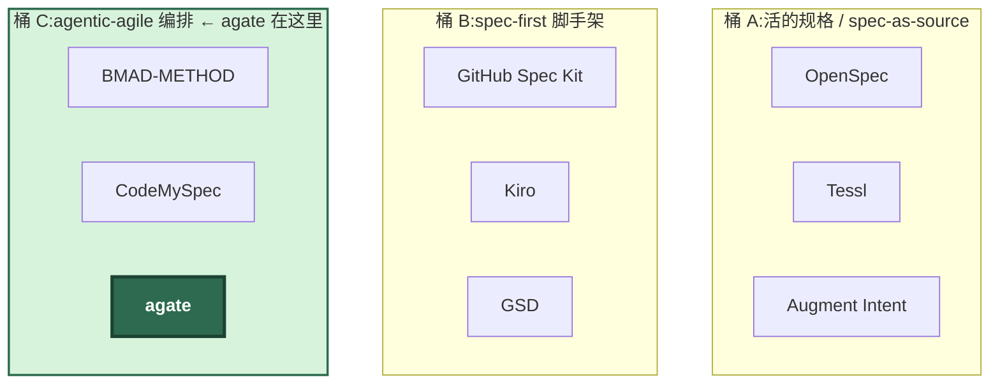
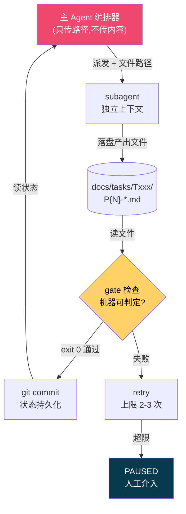
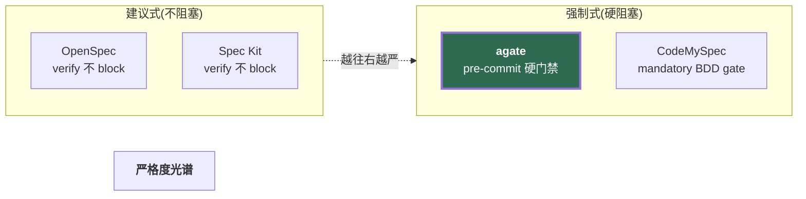
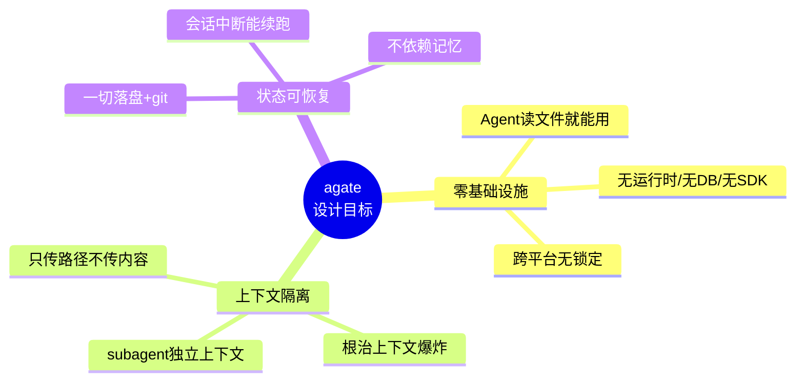
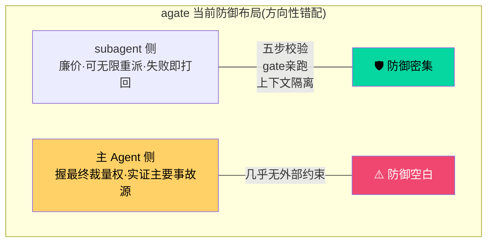

# Agate 项目分析报告

> 面向软件工程的 AI Agent 编排协议 —— 定位分析、竞品对标与总体评价
>
> 分析基于 agate v0.10.0 源码(WORKFLOW / LIMITATIONS / role-system / CHANGELOG / scripts / tests)+ 2026 年 SDD 赛道现状调研

---

## 目录

1. [Agate 的定位](#一agate-的定位它到底是什么)
2. [Benchmark 分组对标](#二benchmark-分组对标)
3. [按作者真实目标评价](#三按作者真实目标评价)
4. [总体意见](#四总体意见)

---

## 一、Agate 的定位:它到底是什么

**结论:agate 不是 coding agent,也不是 agent framework,而是一套「AI Agent 软件工程编排协议」(orchestration protocol)——更准确地说,是纯文档形态的 agentic-agile orchestration(智能体敏捷编排)方法论。**

三个关键限定词决定了它的一切:

| 限定词 | 含义 | 影响 |
|--------|------|------|
| **协议**(非框架) | 零运行时:无服务、无数据库、无 SDK,载体是 markdown + 一层 pre-commit hook(约 2600 行脚本 / 92 测试文件) | Agent 能读文件就能用,但也继承了纯文档路线的结构性弱点 |
| **编排**(非执行) | 主 Agent 只做四件事:读状态、派发 subagent、验 gate、更新状态。不亲自写代码 | 解决长任务的上下文污染与质量失控 |
| **gate 是硬边界** | 阶段之间用机器可判定的门槛卡关(pytest exit code、BDD 实跑、grep) | 不靠「看起来对」,exit code 客观可量化 |

> `agent + gate → agate` —— 名字本身就是定位。

### 在 2026 SDD 赛道中的位置

业界通行的分类把规格驱动工具分为三桶,agate 落在**第三桶**:

**agate 是桶 C 里唯一「纯文档 + 无平台绑定 + 把 BDD gate 做成 pre-commit 强制」的方案。**

### 核心工作流:P0-P8 阶段编排

### 主 Agent 编排机制

**四条核心原则:**
1. 主 Agent 只编排不执行
2. 上下文隔离 = 只传路径
3. 状态在文件里,不在记忆里(配合 git 持久化)
4. 门槛必须机器可判定
5. 重试有上限

---

## 二、Benchmark 分组对标

因为 agate 同时具备「多角色编排」+「规格驱动」+「质量门禁」三重属性,单一 benchmark 会失真。分三组,每组比较目的不同。

### 组 1:核心同类 —— agentic-agile 编排(直接对标)

| 项目 | 为什么选它 | 与 agate 的共同点 | 不可比之处 | 比较边界 |
|------|-----------|------------------|-----------|---------|
| **BMAD-METHOD** | 这一桶的事实标准,21 个专职 agent、多阶段生命周期,最接近 agate 的「多角色 relay + 每角色产版本化产物」 | 角色分工(Analyst/Architect/Dev/QA)、每角色独立上下文、产物落 git、编排者协调 | BMAD 有安装器、模块系统、社区市场,面向「团队感」;agate 是极简协议,角色靠 prompt 注入 | 只比编排结构与角色隔离机制,不比生态/易用性 |
| **CodeMySpec** | 公开声称的护城河 = 强制 BDD gate + live 验证 + 单需求图全生命周期,**几乎逐条命中 agate 设计** | 强制行为门禁、活的需求基线、验收即实跑 | CodeMySpec 深绑 Elixir/Phoenix 单栈;agate 语言无关 | 只比「BDD 硬门禁 + 实跑验证」机制的严格度 |

**这组的目的**:验证 agate 在「多角色编排 + 硬验收」这个最核心命题上,机制是否站得住。

### 组 2:规格驱动 / 门禁(方法论对标)

| 项目 | 为什么选它 | 共同点 | 不可比之处 | 比较边界 |
|------|-----------|--------|-----------|---------|
| **GitHub Spec Kit** (9.3万+ star) | 开源 SDD 社区默认,Constitution→Specify→Plan→Tasks 阶段化最接近 P0-P8 | 阶段化、规格先行、产物 markdown、bring-your-own-agent | 无多 agent 编排、无硬门禁(verify 不 block)、单 agent 顺序执行 | 只比阶段流水线设计与规格结构 |
| **Amazon Kiro** | SDD 做成 IDE 的代表,EARS 需求 + GIVEN/WHEN/THEN 验收,2026 还加了 SMT solver 查矛盾 | Given/When/Then 验收契约、需求→设计→任务三段 | 商业 IDE、AWS 生态、按 credit 计费;agate 是纯协议 | 只比验收条件的形式化程度 |
| **OpenSpec** (5.2万 star) | 纯 SDD、无锁定的最强开源选项,三阶段状态机(proposal/apply/archive) | 状态机落盘、repo-resident、MIT | OpenSpec 的 GWT 可选、verify 只警告不阻塞 —— **恰好与 agate 的「强制」相反** | 只比「门禁强制 vs 建议」这条哲学分界 |

**这组的目的**:agate 的门禁是「强制阻塞」派,大多数 SDD 工具是「建议不阻塞」派。这组划出 agate 在**严格度光谱**上的位置 —— 它站在最严的一端。

### 组 3:全自主 coding agent(能力上限参照,非同类)

| 项目 | 为什么选它 | 共同点 | 不可比之处 | 比较边界 |
|------|-----------|--------|-----------|---------|
| **Claude Code / Codex** | agate 明确说自己**运行在**这些平台之上(依赖它们的 task 工具) | 都在做「让 LLM 可靠完成开发任务」 | 它们是执行引擎/产品,agate 是套在外面的方法层 —— **宿主与协议的关系,不是竞品** | 只比「agate 加在裸 agent 上,多解决了什么」 |

**这组的目的**:回答「不用 agate、直接用 Claude Code 裸跑有什么不同」。答案是:agate 补的是**流程纪律与状态持久化**,不是补模型能力。

---

## 三、按作者真实目标评价

> 不拿别人当唯一标尺 —— 先理解作者想做什么,再看做到没有。

从 LIMITATIONS.md 和 272 次 commit 的演进看,作者的目标**不是**做成 BMAD 或 Kiro,而是三条:

### 目标实现了吗?—— 基本实现,且诚实

| 目标 | 达成度 | 说明 |
|------|--------|------|
| 零基础设施 | ✅ 完全做到 | 相对 BMAD/Kiro 的真实差异化 |
| 上下文隔离 | ⚠️ 机制成立但有边界 | 作者自承「隔离是认知层面,非真独立视角」—— 同源模型有共享盲区 |
| 状态可恢复 | ✅ 做到 | v0.9/v0.10 还在加「逐阶段 commit 强制」等硬约束 |

**最打动人的是 LIMITATIONS.md 局限 3 的自我批判**:作者主动指出「防御机器全布置在廉价的 subagent 一侧,而握有最终裁量权、且被四个真实事故(T005/T006/T016/T019)证明是主要事故源的**主 Agent** 一侧几乎没有约束」。

**能主动写下自己架构的方向性错配、并归类为「无解/未根治」,这是工程成熟度的信号,不是缺陷。**

### 若目标扩展到「行业领先」,还需补什么

| 待补能力 | 问题根源 | 难度 |
|---------|---------|------|
| 主 Agent 监督的外部锚点 | self-authored gate(P1/P2/P6/P7)裁判与作者同一人;T026 曾编造 11/16 条 BDD 结果、grep 仍通过 | 高(独立模型裁判被作者以「同源盲区」否决) |
| 测试质量本身的评估 | gate 客观,但验证的标准可能是弱测试(局限 1) | 中 |
| subagent 可观测性 | Task 工具只返回最终结果,活动不可见(局限 4) | 依赖平台,超协议范围 |
| 易用性 / 上手成本 | 纯文档协议心智负担重(9 阶段 + 一堆 hook),对比 Spec Kit 一条 CLI | 与「纯协议」定位本质冲突 |

### 哪些「差异」是有意设计,不是缺陷

- ✅ **没有 GUI/IDE** —— 刻意,换来跨平台、无锁定
- ✅ **门禁强制阻塞**(vs OpenSpec 建议式)—— 刻意,这是 agate 立身之本
- ✅ **对微任务「不划算」** —— 作者自己在「适用边界」写明:派发有固定开销,小任务应裁剪甚至不走 agate
- ✅ **只做测试环境、生产不管** —— 刻意的边界收缩

---

## 四、总体意见

> **一句话:agate 是一个想得非常清楚、诚实到罕见、但注定小众的高质量协议。**

### 真正价值

它的价值**不在**「多角色」(BMAD 角色更全)、也**不在**「规格」(Spec Kit 社区更大),而在于把一个别人往往留作 optional 的东西 —— **BDD 验收的强制实跑 + pre-commit 硬阻塞** —— 做成了不可绕过的结构。

在「84% 开发者用 AI、但只有 33% 信任其产出」的 2026,agate 攻的正是**信任缺口**,而不是产能。**这个切入点是对的。**

### 三个突出优点

| 优点 | 说明 |
|------|------|
| **诚实** | LIMITATIONS.md 是罕见地把无解问题标成无解、不粉饰的「已知局限」文档 |
| **机制自洽** | gate 分「外部产出 / 自写文件」两类并给出可信度差异,分类学本身有方法论价值 |
| **零基础设施** | 是真差异化,不是营销话术 |

### 三个必须正视的风险

| 风险 | 说明 |
|------|------|
| **单点故障是主 Agent** | 防御全在 subagent 侧 —— 路线的结构性天花板,作者已承认但未解 |
| **重、门槛高** | 对个人/小任务像「用锤子砸核桃」(SDD 赛道通病);靠「裁剪」缓解,但裁剪权又回主 Agent 手里,绕回风险 1 |
| **生态与采纳** | 纯协议无安装器、无社区市场,天然难扩散;宿命可能是「少数重视质量纪律团队的内部标准」而非大众工具 |

### 给作者 / 使用者的建议

**若目标是行业领先:**
下一版重心应从「继续给 subagent 加检查」转向「给主 Agent 加外部锚点」。哪怕先做一个「独立 git author + CI 层重跑 provenance」的最小闭环,也比在 subagent 侧加第 20 个 hook 更有价值。作者自己在局限 3 里已指出这个方向,值得优先落地。

**若只是自用:**
它已经够好了。对高风险任务(数据迁移、安全),配合人工终审,agate 提供的流程纪律是裸 agent 给不了的。

---

### 总评

**这是「协议路线」在 AI 编程工程化上一次诚实而克制的尝试。它不追求打败谁,而是把一件小事(强制验收)做到不可妥协 —— 这种克制,反而是它最稀缺的地方。**

---

*分析日期:2026-07-06 · 基于 agate v0.10.0*
