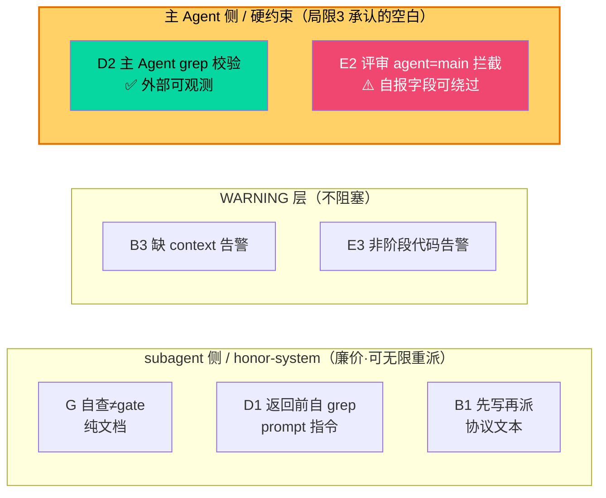

# T048 Phase 2 方案评审（plan-eng-review）

> 评审对象：`docs/plans/t048-improvements-phase2-20260708.md`（v2，评审后迭代版）
> 评审依据：方案引用的复盘条目（§5.4 / §10.1）、当前 `check-p6-provenance.sh` 实际逻辑、`ci-gate-backstop.py` 覆盖范围、`pre-commit-gate.sh` 触发时机
> 评审视角：偏执工程经理（是否会在生产中被绕过 / 是否名实相符 / 强制力是否被高估）

---

## 审查结论汇总

| 项 | 结论 | 强制力等级 | 关键问题 |
|----|------|-----------|---------|
| **G** 自查≠gate | ✅ approved | L0 指导 + L1 漂移测试 | 诊断准确；6 处编辑点仅 1 处有防漂移测试 |
| **B** dispatch-context 时序 | ⚠️ needs-revision | L0 协议文本 + L2 WARNING | **未解决其引用的 §10.1（事后补写）** |
| **D** 假完成防护 | ⚠️ needs-revision | L0 prompt + L3 主 Agent 校验 | 丢弃了复盘更强的 `files_modified` 结构化返回 |
| **E2** 评审 agent=main 硬拦截 | 🔴 **BLOCKER** | L3 硬拦截（exit 1） | **触发时机未定义 + 自报字段可绕过 + CI 不覆盖** |
| **E3** 非阶段代码 WARNING | ✅ approved | L2 WARNING | 盲区恰在最该管的 P4；低价值低成本，可放行 |

**强制力等级说明**（建议方案正文补此分级列，防止 L1 被误读为行为强制）：
- **L0 指导**：只写在文档，靠自觉，机器不验证遵守
- **L1 漂移测试**：只验证「规则文本还在」，不验证「规则被执行」——当前几乎所有测试的真实等级
- **L2 WARNING**：exit 2，提醒不阻塞
- **L3 硬拦截**：exit 1，唯一真正强制。全方案仅 E2 属此级（且有下述三个洞）

---

## 总体结论

方案整体成立、方向正确，但存在 **1 个阻塞级实现缺口（E2 触发时机）** 和 **1 处 scope 错配（B 未打中其引用的靶子）**，需迭代后再实施。

更重要的结构性观察：这一轮 5 项里，4 项仍落在「subagent 侧 / honor-system」，只有 **D2 与 E2** 真正触及 `LIMITATIONS.md` 局限 3 承认的「主 Agent 侧防御空白」——而 **E2 又被同一根因（自报字段）架空**。因此 Phase 2 是**增量加固，不是结构性修复**；方案 framing（E2 标 🔴「评审缺口」）略微高估了它对主 Agent 监督问题的实际覆盖。

---

## 逐项详评

### G. 自查≠gate —— approved（本轮质量最高）

重命名抓对了根子：旧名「写跑分离」在语义上就错，它把「谁写 vs 谁跑」与「自查 vs gate 权威」混为一谈。实际是——写的人**可以**自查，只是自查结论不等于 gate。v2 还补上了 v1 评审的两个洞（P5 无 subagent 不受影响、G 的「自查」与 D 的「自检」不冲突）。

**真实价值**：消除「协议-现实」裂缝。T048 里 implementer 实际自跑了 pytest 才返回——旧规则下这是**违规**但无人管。G 把既成事实合法化，比假装规则被遵守更诚实。

**弱点**：G 是**纯指导，非强制**。"不要声称 P5 已过" 是 honor-system 指令，返回「全部测试通过」的 subagent 不会被任何机器检查抓到——唯一的 bats 测试只验证模板里**有无关键词**，不验证 subagent **是否遵守**。且概念要在 6 个文件同步，漂移测试只覆盖 `dispatch-prompt.md` 一处，**另外 5 处（implementer.md / verifier.md ×2 / phase-cards / dispatch-protocol.md）无防漂移保护**。

**要求**（非阻塞）：漂移测试扩到 6 处编辑点，或抽单一 source + 其余引用。

### B. dispatch-context 时序 —— needs-revision（scope 错配）

B 在问题描述里明确引用复盘 §10.1：「hash 校验形同虚设——事后补写当然能通过校验」。但 B3 的 WARNING **只检测 dispatch-context 是否存在**，不检测它**何时被创建**。方案自己在覆盖边界承认：

> ❌ dispatch-context 事后补写且同次 commit → 无法检测

即 **B 引用的问题（事后补写 defeat hash 校验）与 B 解决的问题（文件缺失）不是同一个**。事后补写——§10.1 的核心痛点——在 B3 之后依然完全不设防。

B 并非无价值：B1（先写再派协议约束）+ B3（缺失告警）能拦「压根忘了写」的情况。但**问题陈述必须诚实改写**：B 解决「dispatch-context 缺失」，不是「事后补写」。后者按 `LIMITATIONS` 逻辑属「自报数据同源」无解类，应明确 defer，勿让 §10.1 的引用制造「已解决」错觉。

**要求**（阻塞本项）：改写 B 的问题陈述，剥离对 §10.1 的「解决」暗示；事后补写明确归入 defer 清单。

### D. 假完成防护 —— needs-revision（D2 是亮点，但丢了更强方案）

D2 是本轮**第二好**的设计：主 Agent 收到「已修复」后**自己** grep 文件系统确认，不信 subagent 摘要——把验证锚到外部可观测事实（磁盘内容）而非自报，方向完全正确。真正的防线是 D2，D1（subagent 返回前自 grep）仍是 honor-system。

**操作性缺口**：D2 说「grep 新增函数名」——**主 Agent 怎么知道该 grep 什么？** 它需要 subagent 先报告「具体加了什么」。复盘 §5.4 原建议（#278）是结构化返回 `files_modified: [path1, path2]` 让主 Agent **自动**校验。方案把这个更强版本**丢了**，退回「grep 猜函数名」的模糊形式。

**要求**（阻塞本项）：把 `files_modified: [...]` 结构化返回加回 D；若坚持降级需说明理由。它比「grep 猜名」可靠一个量级，成本仅是 prompt 里要求返回路径列表。

### E2. 评审 agent=main 硬拦截 —— 🔴 BLOCKER（优先级对，实现有致命缺口）

先肯定：**这是全方案唯一真正约束主 Agent 侧的项**，直指局限 3 的「防御全在廉价 subagent 侧、主 Agent 侧几乎无约束」。标 🔴 正确。移除 `risk=high` 前置条件的推理也对（T048 的 P2 违规是 risk=medium，self-review 在任何风险等级都不可信）。

三个问题，第一个**阻塞**：

**① 触发时机未定义（BLOCKER）。** 当前 `check-p6-provenance.sh` 中，遍历所有产出检查 agent 字段的循环（L219-235）**整体包在 `if [ -f "$P6_FILE" ]` 里**——只在 `P6-acceptance.md` 存在时才跑。方案新循环遍历 `P[0-8]-review.md`，但**未说明是否也受 P6_FILE 门控**。若新硬拦截循环只在 P6 触发，则 P2 阶段 self-approved 的评审要到 **P6 提交时才被拦**——此时 P3/P4/P5 早已基于自批设计跑完。E2 要起作用，`P2-review.md` 的 `agent=main` 检查必须在 **P2 gate 时**触发，不是 P6。

> **打回要求**：明确 `P2-review.md` 的 agent=main 检查在 P2 gate 触发；确认 `pre-commit-gate.sh` 在 P2 阶段调起 provenance 脚本（当前 provenance 的 P2-review 段虽不受 P6_FILE 门控，但需确认 hook 在 P2 phase 变更时确实调用本脚本，否则拦截时机落空）。

**② 自报字段可绕过——与局限 3 同根。** 方案自承「主 Agent 同时改 agent 字段 → 绕过」。`agent:` 字段由主 Agent 自己写。此检查本质是「主 Agent 请诚实写 `agent: main` 好让我抓你」。既想 self-approve 又写 `agent: subagent` 的主 Agent **零成本绕过**。而局限 3 的四事故（T005/6/16/19）定性正是「主 Agent 遇困倾向自行解决而非报告」——正是**会改标签**的那类。故 E2 对**其想防的失败模式**真实覆盖存疑：它抬高「随手/偷懒 self-approve」成本（诚实标注者被抓），挡不住「蓄意 self-approve」。真正修复需 agent 身份来自主 Agent **写不了**处（git author），方案已正确 defer。

> **建议**：E2 定位措辞从「拦截自批评审」降级为「提高随手自批成本」，勿过度承诺。可选：加一层廉价佐证——交叉核对 `agent: subagent` 声明与「该评审确有 subagent 派发记录（dispatch-context / progress）」的存在性，短于 git author 但能抬高蓄意绕过成本。

**③ CI 层不覆盖。** 按局限 3，`check-p6-provenance.sh` **不被 CI backstop 重跑**（CI 只重跑 `check-gate.sh`）。已确认 `ci-gate-backstop.py` 的 P6 部分仅做 `git blame` 单 author 的 WARNING，不重跑 provenance 全量。故 `git commit --no-verify` **完全绕过 E2**，CI 抓不到。方案未提扩展 CI。

> **打回要求**：E2 落地同时，把评审 agent=main 硬拦截加进 CI backstop，堵 `--no-verify` 后门；否则 E2 与其他 hook 一样有绕过洞。

### E3. 非阶段代码暂存 WARNING —— approved（低价值低成本）

便宜绊线，无害。但盲区恰在最该管处：方案承认「P4 阶段主 Agent 自己改代码 → 无法区分」。而 P4 正是主 Agent 按原则 1 **最不该写代码**的窗口（该派给 implementer）。E3 只能抓「P2 暂存代码」这种明显情形，抓不到「P4 冒充 implementer 自己写」——违规最可能的场景。价值有限、成本亦低，作为绊线保留，勿依赖。

---

## 结构性观察（最重要）

按「防御布在哪一侧」摆开 5 项：

**5 项里只有 D2 与 E2 落在局限 3 的「空白」上，而 E2 又被自报字段架空。** 即 Phase 2 尽管处处引用 T048 复盘，却**未把防御重心从廉价 subagent 侧挪到昂贵主 Agent 侧**——仍在已很密的 subagent 侧继续加检查。这正是作者在局限 3 里批评的模式（「往 subagent 侧加检查比承认主 Agent 侧错配更容易」）。

增量加固有其价值，但 framing 应**诚实标注**：真正触及结构性缺口的只有 D2 一项半（E2 算半项，因可绕过）。勿让 E2 的 🔴 与「评审缺口」表述给人「主 Agent 监督问题这轮已解决」的错觉。

---

## 打回清单（按优先级）

| # | 项 | 级别 | 要求 |
|---|----|----|------|
| 1 | E2 触发时机 | 🔴 阻塞 | 明确 P2-review 的 agent=main 检查在 P2 gate 触发（非 P6）；确认 hook 在 P2 phase 变更时调起 provenance |
| 2 | B 问题陈述 | 🔴 阻塞 | 改写为解决「context 缺失」而非 §10.1「事后补写」；后者明确 defer 到自报同源无解类 |
| 3 | E2 CI 覆盖 | 🟠 高 | 评审 agent=main 硬拦截加进 CI backstop，堵 `--no-verify` |
| 4 | D 结构化返回 | 🟠 高 | 复盘 §5.4 的 `files_modified: [...]` 加回 D，替代「grep 猜函数名」 |
| 5 | G 漂移测试范围 | 🟡 中 | 漂移测试扩到 6 处编辑点，或抽单一 source |
| 6 | 强制力分级列 | 🟡 中 | 方案表格加 L0-L3 强制力列，防 L1 漂移测试被误读为行为强制 |

**保留（做得对）**：D2「主 Agent 独立 grep 磁盘」是正确验证锚点；E2 移除 risk 前置条件的推理正确。

---

## 最终判定

**status: needs-revision** — 方向认可，但打回清单 #1、#2 为阻塞级，需迭代后重审。E2 作为唯一主 Agent 侧硬约束，实施前必须先解决触发时机与 CI 覆盖，否则名义硬拦截、实际到 P6 才生效且可 `--no-verify` 绕过。

*评审依据均为 checkout 时点源码；实施时以最新 main 为准。*
