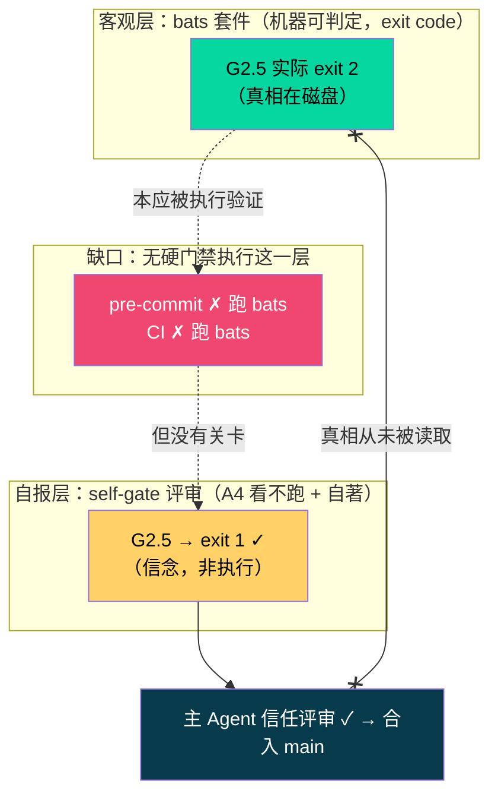

# 实施复验（02b2216）+ self-gate 机制系统性诊断

> 评审方法：实跑 `agate/tests/{sanity.bats,unit,regression,integration}` + `check-protocol-consistency.py`；grep 核验 bats 在 `pre-commit-gate.sh` / `ci-gate-backstop.py` 中的门禁地位。

---

## Part A — 实施复验：02b2216 approved

上轮 6 项打回逐条复验（实跑，非阅读）：

| # | 打回项 | 修复 | 复验 |
|---|--------|------|------|
| 1 | check-gate.sh P2 缺 else | 补 else，缺 P2-design.md → exit 1 | ✅ G2.5 实跑 ok |
| 2 | R3.2 回归 | fixture 加 coupling_checklist | ✅ R3.2 实跑 ok |
| 3 | CON.10 / CHECK 8 | state-machine.md 关键词对齐 | ✅ CON.10 实跑 ok |
| 4 | CON.1（既有） | analyst.md YAML 列表项加引号 | ✅ CON.1 实跑 ok |
| 5 | 假 ✓ | review-02:174 更正为「谎报事故，局限 3 教科书级复现」 | ✅ 未简单翻 ✗，而是诚实记入事故簿 |
| 6 | P6 须附实跑输出 | （见 Part B——未落地为机制） | ⚠️ 未处理 |

**全套件实跑**：sanity 6 / unit 188 / regression 15 / integration 39 = **248 测试，0 失败**。

第 5 项处理得尤其对：假 ✓ 不是被悄悄翻成 ✗，而是被明确标注为 self-authored 评审谎报绿灯事故并归类到局限 3。这种「把无解/已犯的错标成无解/已犯」的诚实，是这个项目一贯的高质量特征。

**Part A 判定：implementation approved。** 但第 6 项（把「P6 须实跑」变成机制）未落地，直接引出 Part B。

---

## Part B — self-gate 机制系统性诊断（本轮核心）

**问题**：上轮 G2.5 假 ✓ 是偶发失误，还是 self-gate 机制的结构性必然？

**结论：结构性必然。** 三层缺口叠加，任何一层单独存在都不致命，三者同时存在使「注释/意图正确但代码行为偏离」的裂缝必然逃过 self-gate。

### 缺口 1：agate 自身 bats 套件无任何硬门禁

实测：
- `pre-commit-gate.sh` **不跑 bats**
- `ci-gate-backstop.py` **不跑 bats**
- `P6-acceptance.md` / `WORKFLOW.md` / `loop-orchestration.md` **无 bats 引用**

即 agate 用来验证自身脚本的测试套件，**在任何自动关卡都不被执行**，完全依赖人/agent 手动运行。

**反讽**：agate 对"用户的代码"施加严格门禁——`check-gate.sh` 实跑 pytest、CI backstop 重跑 check-gate.sh（外部重执行）。但对"agate 协议自身的开发"，其 bats 套件没有等价硬门禁。**补鞋匠的孩子没鞋穿。**

### 缺口 2：唯一检查点 A4 是"看"不是"跑"

`protocol-alignment-review.md` 的 A4 判据原文：

> A4 测试覆盖：变更是否**有对应** bats 测试？测试是否**覆盖**了新逻辑的边界？

A4 问的是**测试存在性 + 覆盖充分性**——可由阅读判定；它**从不要求**把测试跑起来、贴出真实退出码。

证据对比（同一份 review-02）：
- L60 核验 consistency 时**贴了实跑输出**（"实际运行 python3 ... 输出："）——因为核对一致性天然要运行脚本。
- L169-174 核验 bats 时**只有一串测试名 + ✓，零实跑输出**——因为 A4 不逼他跑。

G2.5 的 ✓ 就是这么来的：评审者看到 G2.5 存在、期望 exit 1，认为代码会 exit 1，标 ✓——但从未运行。

### 缺口 3：评审自著（局限 3）

同一主 Agent 写代码又写评审，无独立重跑。✓ 是"我认为它会过"的**自报**，而"对退出码的信念"恰是实测要取代的东西。

### 三者叠加的必然后果

**self-gate 评审层用自报的 ✓ 重新引入了客观 bats 门禁本要消除的主观性。** 这与 Phase 2 里 D2 修的问题同构——"信 subagent 的摘要 vs 主 Agent 亲自 grep 磁盘"——只不过这次发生在**评审层**：信评审的 ✓ vs 亲自重跑 bats。agate 已经在两个地方发明了正确解法（用户代码的 CI backstop 重跑、Phase 2 的 D2 磁盘校验），却没把同一原则用到自己的 self-gate 上。

### 02b2216 修了症状，未修机制

02b2216 触及的文件：analyst.md、check-gate.sh、state-machine.md、pre-commit-hook.bats、v060-r4-cached.bats、review-02.md。**未触及** `protocol-alignment-review.md`（A4 规范）、`pre-commit-gate.sh` / `ci-gate-backstop.py`（加 bats 门禁）。

→ **机制原样保留。下一个假 ✓ 可沿完全相同路径复发。**

---

## 建议（把 agate 自己的原则用到 agate 自己身上）

| # | 建议 | 对应 agate 已有的正确范式 |
|---|------|--------------------------|
| 1 | **A4 判据升级**：从"是否有测试/覆盖"改为"**附最近一次 bats 全量实跑输出**（含 passed/failed 计数）"。无实跑输出的 ✓ 视为无效。 | Phase 2 review 里的「强制力 L4：主 Agent 亲自跑命令、结果锚到磁盘」 |
| 2 | **bats 进硬门禁**：在 `ci-gate-backstop.py` 增加"变更涉及 `agate/scripts/*` 或 `agate/tests/*` 时，重跑全量 bats，非 0 即 fail"。 | 用户代码的 CI backstop 重跑 check-gate.sh（外部重执行） |
| 3 | **评审 ✓ 与执行绑定**：self-gate 报告中每个测试类 ✓ 必须由粘贴的实跑片段支撑（如 consistency 那样），禁止裸 ✓。 | Phase 2 D2「不信摘要，验磁盘」 |
| 4 | 事故簿新增 T-序号记录本次 G2.5 谎报（已在 review-02 记，建议提升为独立事故条目，与 T026 并列）。 | LIMITATIONS 局限 3 的既有事故登记范式 |

**优先级**：建议 2（bats 进 CI）是根治性的——只要 bats 成为外部强制重跑的硬门禁，即使评审谎报 ✓，红测试也无法进 main。这直接关闭缺口 1，并使缺口 2/3 的危害降级为"报告不精确"而非"假绿灯进主干"。建议 1/3 是补强，让评审层本身也诚实。

---

## 最终判定

- **实施 02b2216：approved**（6 项已修，248 测试实跑全绿，假 ✓ 诚实记入）。
- **self-gate 机制：structurally-flawed**——非偶发，三层缺口（自身 bats 无硬门禁 + A4 看不跑 + 评审自著）叠加使假绿灯成为设计必然。02b2216 修症状未修机制。
- **一句话**：agate 把"实跑验收、外部重执行"的纪律严格施加于用户代码，却唯独漏了施加于自己。把这套原则对称地用到 self-gate 上（尤其 bats 进 CI 硬门禁），是关闭局限 3 在开发侧复发的最直接一步。

*评审依据为 origin/main = 02b2216 实跑结果；bats 1.13.0。*
