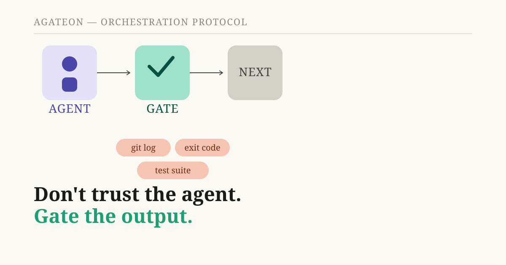
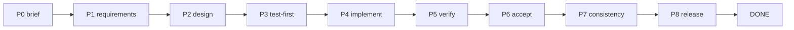
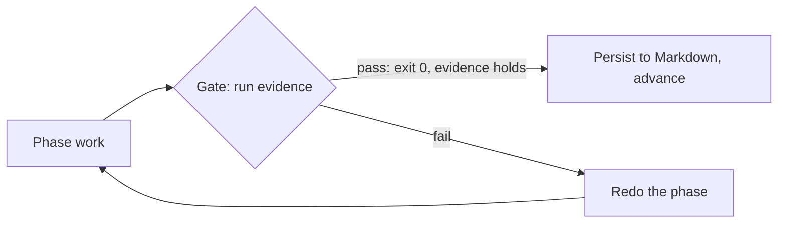
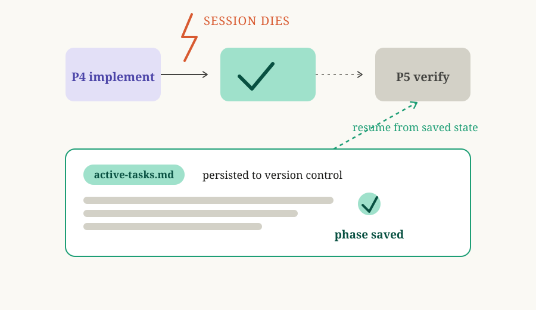

# Agateon: verify AI agents the way a build system verifies a compiler



If you've run a long task through an AI coding agent, you know the quality signal most setups leave you with: *it looks done*. Not "the test suite is green and the typechecker is clean" — just that the agent says so, and the diff seems plausible. We spent months building the alternative, and this post is about what it is and why it's shaped the way it is.

**TL;DR** — Agateon is an open-source orchestration protocol for software-engineering tasks run by AI agents. There's no runtime, no daemon, no build step: it's a set of Markdown protocol files plus gate-check scripts. Work moves through eight phases, and after every phase an objective gate — a test runner's exit code, a typechecker, a git log — must pass before the state machine may advance. All state lives in version-controlled Markdown. The orchestrator agent never writes code; it dispatches a dedicated subagent per phase and checks their output against evidence. Progress can't advance on "it looks done" — only on things you can point at and re-run.

## The problem: "it looks done" is not a quality signal

LLM agents are genuinely good at software work in a single burst: scaffold a repo, fix a lint error, write a test for a known case. The trouble is long tasks. Context gets polluted. Subagents drift from the original brief. And as a task stretches across hours and dozens of turns, the only signal most setups give you is the agent's own summary of what it did.

That's the failure mode this project exists to close. A build system doesn't trust a compiler's claim that it produced correct code — it checks the exit status, runs the test suite, typechecks the output. We wanted the same shape for agents: **you don't trust the output, you verify it through gates.**

## The idea: treat the agent like a compiler

The core claim, stated plainly: an AI agent working on a codebase should be treated like a compiler feeding into a build. You don't ask it to be more honest. You don't read its diary. You make the mechanism refuse to advance unless objective evidence says the phase is done.

That reframing changes a lot of defaults. "Done" stops meaning "the agent finished talking" and starts meaning "the gate command exited 0 and the evidence file is non-empty."

## How it works

### Phases and gates

A task moves through a fixed state machine: P0 brief → P1 requirements → P2 design → P3 test-first → P4 implementation → P5 verification → P6 acceptance → P7 consistency → P8 release → READY → DONE.



Between every pair sits a gate, and the gate's job is to run evidence the agent didn't write about itself. For a verification phase, that's the real test command — the gate script executes it and looks at the exit code. For requirements, it's a structural check: does the document contain at least one BDD (behavior-driven-development) acceptance criterion, are there unresolved `NEED_CONFIRM` items? For acceptance, it checks that the evidence files are non-empty and the gate commands all exited 0.



If a gate fails, the phase is redone and the retry is recorded. This is where a recent postmortem — [our AI safety net depended on the agent being honest. It wasn't.](/blog/20260826/post-01-retry-self-authorization) — gets relevant: we found the retry counter itself could be left empty by an agent, silently disabling the whole safety mechanism. The fix anchored that check to git history instead of the agent's own bookkeeping. The honest takeaway: the gates are only as strong as the evidence they're anchored to, and we're always looking for places where the "evidence" is really another self-report in disguise.

### State you can see

Every phase result is written to version-controlled Markdown (`active-tasks.md`, `.state.yaml`). This is a deliberate choice, and it buys two things. First, a crash — a killed session, a power loss, a model context that hit its ceiling — is a pause, not a restart: the next run reads the state file and picks up where the machine left off. Second, a human (or another agent) can audit what happened by reading the files, not by trusting the summary.



### Roles are separated

The orchestrator agent never writes code. Each phase is dispatched to a dedicated subagent — a requirements analyst, an architect, a test designer, an implementer, a verifier — and their output is handed back through the gate. This keeps the orchestrator's context clean (it's a dispatcher, not a participant) and makes the review genuinely independent of the work it's reviewing. Same reason you don't let the author be the only reviewer.

## Does it actually work? We make it eat its own food.

Agateon is built with Agateon. The repository's own task history — dozens of tasks, from the original bootstrap to recent mechanism fixes — was produced through this same state machine, and it's all in the repo for anyone to read: [`agate-workspace/tasks/`](https://github.com/randomgitsrc/agateon/tree/main/agate-workspace/tasks). The postmortem linked above is a real example of the loop working: an audit found a design hole, the fix went through phases with gates, adversarial tests were run against a real git repository, and the task record shows all of it.

We also try to break our own gates. The verification phases run adversarial tests — rollbacks, missing records, half-finished evidence — and check that the gate blocks what it's supposed to block and passes what it's supposed to pass. When a gate can be fooled by something an agent can simply omit, that's a bug, and it goes back into the machine.

## What it is not (read this before trying it)

- **It's not a magic agent.** It's a protocol and a set of scripts. You bring the coding agent; Agateon shapes how it's orchestrated and checked.
- **It's not a runtime or a service.** There's nothing to deploy. Your agent just needs to read Markdown and run commands. Setup is a symlink plus a couple of git hooks: `curl -sSL https://raw.githubusercontent.com/randomgitsrc/agateon/main/install.sh | bash`.
- **It doesn't make gates immune to bad design.** A gate that checks "did the agent write a plausible-looking report" is theater; a gate that runs a real test suite is not. The difference is entirely in what you choose as evidence, and choosing well is a design problem, not a tooling problem.
- **It's early and honest about it.** The phase machine, the gate scripts, and the docs are all live in an MIT-licensed repository at v0.64.0, but "early" isn't a euphemism for "stable": the right expectation is that you audit the gates you depend on.

## If you're building agent tooling, check this

The lesson generalizes beyond this project: whenever an agent's own report feeds a safety or progress mechanism, ask whether that mechanism depends on evidence the agent could simply omit. Ours did — the retry counter that triggered a human pause could be left empty, silently. The fix wasn't "make the agent more careful." It was "stop needing the agent to be careful about the parts that matter most," and anchor the check to something that exists independent of what the agent chooses to report.

## Try it

The repository is [github.com/randomgitsrc/agateon](https://github.com/randomgitsrc/agateon) (MIT). One-line install, no infrastructure:

```bash
curl -sSL https://raw.githubusercontent.com/randomgitsrc/agateon/main/install.sh | bash
```

If you've ever shipped a long agent task on "it looks done" and felt uneasy about it, this is the project for you. The honest summary of what Agateon does: it makes "done" mean something you can re-run, not something you were told.
