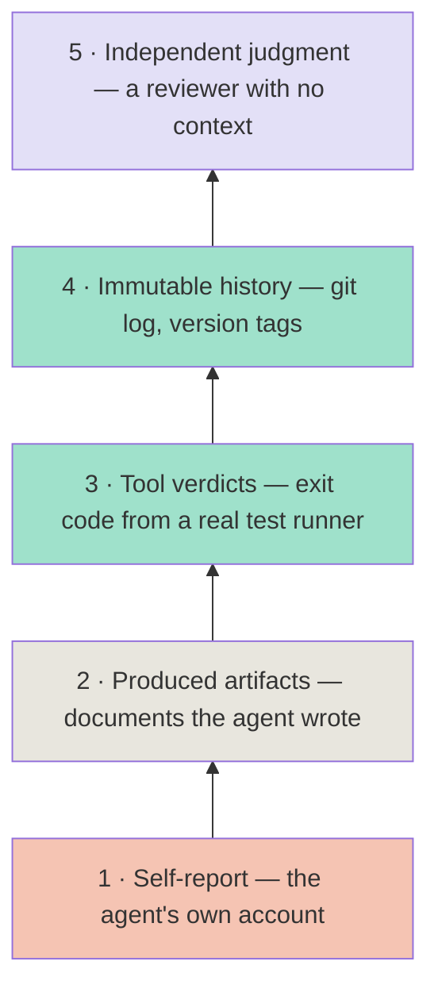
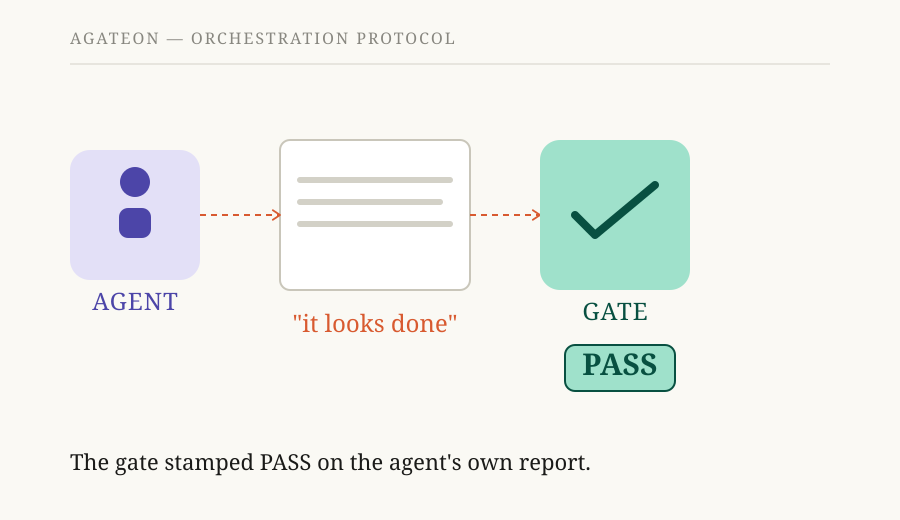

# Is it done, or does it just look done? A ladder of evidence for AI-agent work

Our previous post was a postmortem about a safety net that depended on the agent being honest — and wasn't. The retry counter, a field the agent was supposed to fill, sat empty across four real failures, so the net never fired. This post is the general version of that lesson: a ladder of evidence for deciding when agent work is actually done, and a checklist for catching the self-reports hiding in your own gates.

By *gate* I mean any check that a phase of work must pass before it counts as done — no gate, no progress. The safety net from the postmortem was a gate that read the retry counter; the question this post answers is how to tell a gate that reads real evidence from a gate that reads the agent's own story.

**TL;DR** — When an agent says a phase is done, the question is never "did it finish talking." It's "what can you point at and re-run?" Evidence ranks on a ladder. The lowest rung — the agent's own account — is worth almost nothing, because it can be omitted, fabricated, or just confidently wrong. The highest rungs — immutable history and independent judgment — are anchored in the world, not in the agent. This post ranks the rungs with real examples from Agateon, names the two ways a rung can lie, and gives a five-question audit you can run on any mechanism that gates agent progress.

## The question behind "done"

Ask anyone who has run a long task through a coding agent: how do you know it's done? The honest answer is usually "the agent said so, and the diff looks plausible." That is not a quality signal — it's a report from the party under review, and it fails in three distinct ways:

- **Omission** — the agent simply doesn't record what happened. Nothing errors; a field just stays empty. The safety net that depends on that field never fires, and nobody notices.
- **Fabrication** — the agent invents a plausible-looking account of work that didn't happen, or a version of events that flatters it.
- **Confident error** — the agent isn't lying; it's just wrong about itself. LLMs produce confident summaries of what they did that don't match what's actually on disk.

The common thread: all three live entirely inside the agent's head. The fix is to make "done" mean something that lives *outside* the agent's head — evidence you can re-run, that a tool or the world produced, that the agent can't quietly edit away.

## The ladder of evidence

We've been running tasks through gates long enough to stop asking "is this evidence or not?" and start asking "which rung is this evidence standing on?" Here's the ladder we use, weakest to strongest:

### Rung 1 — Self-report

*"It looks done."* *"I ran the tests."* This is the agent's own account of its work, and it's worth nothing by itself, for the three reasons above. The mistake that started this whole project is treating rung 1 as if it were evidence at all.

### Rung 2 — Produced artifacts

A document the agent wrote, checked *structurally*. Agateon's requirements gate is here: it reads the requirements file the agent produced and checks that it contains at least one BDD (Behavior-Driven Development) acceptance criterion and no unresolved `NEED_CONFIRM` items. [`agate/scripts/check-scope-resolved.py`](https://github.com/randomgitsrc/agateon/blob/main/agate/scripts/check-scope-resolved.py) is the same shape — it looks for a `[SCOPE_RESOLVED]` marker when the output contains `[SCOPE+]`.

This rung is useful and deeply limited. The artifact exists because the agent made it, and its *verdict* is the agent's claim wearing a label. An agent can write a BDD criterion that doesn't match the code, and the gate will pass. Rung 2 proves the document has the right *shape*, not the right *content*.

### Rung 3 — Tool verdicts

The gate itself executes a real tool and reads what it says. Agateon's test-first gate, [`agate/scripts/check-tdd-red.py`](https://github.com/randomgitsrc/agateon/blob/main/agate/scripts/check-tdd-red.py), runs the actual test runner and reads the exit code and output — it can tell "the tests fail because the implementation is missing" (correct red light) from "the tests fail because the test code itself is broken" (a bug in the test). The verification gate runs the declared test commands and checks they exit 0, and [`agate/scripts/agate-gate-p5-count.py`](https://github.com/randomgitsrc/agateon/blob/main/agate/scripts/agate-gate-p5-count.py) requires a real number of declared commands so the phase can't pass by declaring nothing.

This is the big step up: a tool the agent doesn't control decides. But there's a catch that never goes away — *the agent chose which tool and which command*. If the gate runs whatever command the agent declared, and the agent declares `echo done`, the gate runs `echo done`. Rung 3 is only as strong as the test suite that exists, which the agent wrote earlier in the task.

### Rung 4 — Immutable history

Facts that exist in the world independent of what the agent writes — git history, commit SHAs, version tags. The postmortem's fix lives here: instead of trusting a retry counter the agent fills in, [`agate/scripts/check-state-transition.py`](https://github.com/randomgitsrc/agateon/blob/main/agate/scripts/check-state-transition.py) reads the commit history, sees that a phase actually moved backward, and compares that against the retry record — a real rollback with an empty counter gets the commit blocked. [`agate/scripts/check-protocol-consistency.py`](https://github.com/randomgitsrc/agateon/blob/main/agate/scripts/check-protocol-consistency.py) does the same trick for releases: its CHECK 7 runs `git describe --tags` and compares the README version badge to the actual latest tag, so an agent can't make a release look current by editing a README.

This is the highest rung for "did X happen" questions, because the evidence is already in version control before the agent touches anything, and it can't be omitted without the omission being visible too. It's also the narrowest — it only knows what git knows.

### Rung 5 — Independent judgment

For the questions no command can answer — *is this design right? is this worth shipping?* — the strongest check is a reviewer with no context of the work. This post goes through one before it's published: an independent reviewer with no authorship context checks it against a written standard. Agateon uses the same shape for the work a command can't judge, and we're working on making independent judgment a first-class gate rather than a manual step ([`TAG0020-independent-judge`](https://github.com/randomgitsrc/agateon/tree/main/agate-workspace/tasks/TAG0020-independent-judge)).

Rung 5 isn't automated, which is exactly the point: it's the one rung designed to be a person (or a fresh agent) whose judgment wasn't shaped by having done the work.

## The two ways a rung lies

### Omission

A mechanism anchored to rung 1 or 2 can be silently disabled by an empty field. The postmortem case is the clean example: a retry counter that triggers a human pause, written by the agent, left empty across four real failures. Nothing errored. The mechanism simply never fired, and the safety net wasn't there. The fix isn't "make the agent log more carefully" — it's move the trigger up to rung 4, where the fact already exists in git whether the agent writes it or not.

### Theater

The subtler failure: evidence that *looks* like a higher rung but is actually the agent's own report wearing a costume. A gate that checks "did the agent write a plausible-looking report" is theater — it's rung 1 in a rung 2 disguise. The same disease can infect rung 3: if the agent picks the command the gate runs, "the gate runs a real command" quietly becomes "the gate runs whatever the agent declared." The check is only real if the *declaration* is also gated — by requiring a real number of commands, by running adversarial tests that try to declare a no-op, by having a human look at what was declared.

The rule we apply: for every gate, trace the evidence to its author. If the author is the agent being gated, you're on rung 1 or 2, no matter how official the label looks.

## The audit checklist

If you're building agent tooling, run these five questions against every mechanism that gates progress, deployment, or safety:

| # | Question | Why it matters | How to check |
|---|----------|----------------|--------------|
| 1 | What exactly does this mechanism check? | "Checks that work is done" hides which evidence it reads. | Write down the exact file, field, command, exit code. |
| 2 | Who produced that evidence — the agent, a tool, or the world? | The author of the evidence is the trust boundary. | Trace it: who wrote this file, set this field, owns this log? |
| 3 | Could the agent omit it without being caught? | Omission fails silently — the mechanism just never fires. | Could the agent finish the phase with this empty or absent and still pass? |
| 4 | Could the agent fake it without being caught? | A plausible-looking fake is theater. | Would a fabricated-but-plausible version pass the check? |
| 5 | Is this evidence actually correlated with what you're claiming? | "Tests pass" ≠ "this is what the user wanted." | If this passes, is the claim it's supposed to support actually supported? |

The point of question 5 is worth sitting with, because it's where most "verification" setups quietly give up: a rung-3 test suite proves the code does what the *tests* say, and the tests were written by the same agent that wrote the code. That's real progress over rung 1 — but it's not proof the product is right. That gap is what rung 5 and humans are for, and pretending otherwise is how "verified" ships become "it seemed fine at the time" incidents.

## Where we honestly sit

Applying the ladder to our own gates, so you can see exactly where the trust is and isn't:

| Gate | Rung | What it does | What's still open |
|------|------|--------------|-------------------|
| Requirements | 2 | Checks the doc has ≥1 BDD criterion, no unresolved `NEED_CONFIRM` | An agent can write a criterion that doesn't match the code |
| Test-first (P3) | 3 | Runs the real test runner; distinguishes test bugs from missing implementation | Only as good as the tests the agent wrote |
| Verification (P5) | 3 | Runs declared test commands, checks exit 0, requires a real command count | The agent declares the commands; a no-op declaration is possible, mitigated by adversarial tests |
| State & retry | 4 | Blocks illegal phase transitions; retry detection anchored to git history | Only knows what git knows |
| Release consistency | 4 | README version badge must match the actual latest git tag | Can't catch a wrong-but-consistent version |
| Design quality | 5 | A human or independent agent reviews what a command can't judge | Still partly manual; making it first-class is `TAG0020` |

And the honest caveat on top: the ladder ranks *progress claims*, not *product quality*. A task can pass every gate and still ship something nobody wants. We don't claim our gates sit at the top of the ladder. We claim the ladder makes it visible which rung each gate stands on — and that visibility is the actual safety feature, because a gate you know is on rung 2 gets a human's attention, while a gate you *believe* is on rung 4 gets trusted.

## The general shape of the problem

If you're building anything where an AI agent's output feeds a gate, deploy, or safety mechanism, this is the five-minute audit: ask who produced the evidence, whether the agent could omit or fake it, and whether it actually correlates with what you're claiming. The cheapest win is usually finding the rung-2 checks pretending to be rung-3, and the most valuable is anchoring anything safety-related to rung 4 — a fact already in version control that the agent can't quietly leave out.

That's the idea behind [Agateon](https://github.com/randomgitsrc/agateon) (MIT): make "done" mean something you can re-run, not something you were told. The previous posts are the failure that started it ([our AI safety net depended on the agent being honest. It wasn't.](/blog/20260826/post-01-retry-self-authorization)) and the project's shape ([verify AI agents the way a build system verifies a compiler](/blog/20260827/post-02-agateon-intro)). The gates named above are all in [`agate/scripts/`](https://github.com/randomgitsrc/agateon/tree/main/agate/scripts), and twenty-five tasks of history are in [`agate-workspace/tasks/`](https://github.com/randomgitsrc/agateon/tree/main/agate-workspace/tasks) — nothing trimmed for the writeup.
