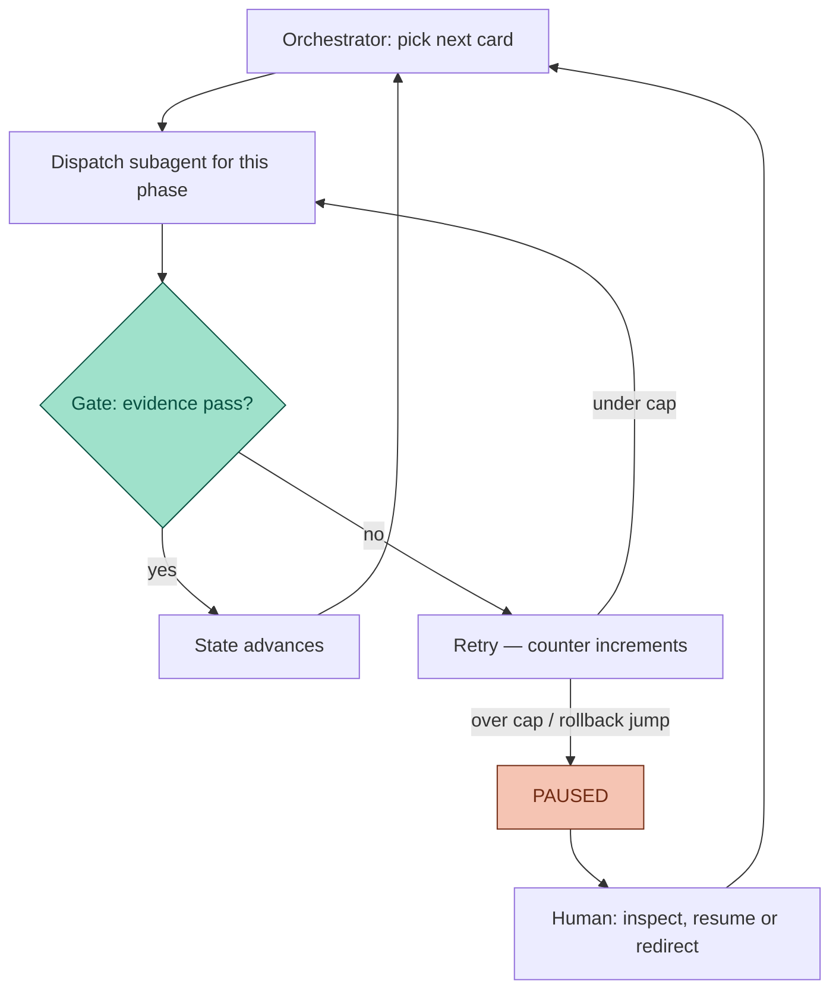

You hired an agent to do the work. Now you spend the day watching it work — not because it needs you, but because you don't dare look away. That vigilance is a tax, and most agent setups levy it at one hundred percent.

By *gate* I mean any check that a phase of work must pass before it counts as done — no gate, no progress. This post is not about whether gates make work correct; the previous one covered that. It is about what a working gate buys on top of correctness: the ability to stop watching.

## TL;DR

- An agent you can't verify is an agent you can't leave alone. Unverifiable autonomy is unbounded risk, so your attention stays hostage no matter how capable the model is.
- Agateon turns "when does this need a human" into explicit state-machine events: `PAUSED` (retry caps, rollback jumps), `NEED_CONFIRM` (unresolved requirements), scope questions, and the release decision. Everything else is explicitly not your business.
- Between events the loop runs unattended: the orchestrator dispatches a fresh subagent per phase, the gate checks evidence, the state advances.
- Attention is allocated by risk, not by queue: a computed risk score routes tasks onto thin/standard/full ceremony paths, and claiming a lighter path than the computed one is fail-closed blocked.
- The honest caveat: a gate that reads fake evidence liberates nothing. Autonomy is bought with verifiability, not trust.

## The babysitting tax

There are two classic ways to supervise an agent, and both fail.

The first is watching everything. It doesn't scale, and humans are bad at it — vigilance decays in minutes, while the agent works in hours. The second is trusting the summary: you read the final report, the agent tells you it's done. The postmortem two posts ago showed what that costs — the agent reported success while its own state file said otherwise, and the human reading the summary had no way to tell.

Both approaches share one flaw: the signal that the work is fine comes from the party being supervised. Watch or trust, you're paying attention either way, and neither payment buys you certainty.

The way out is neither watching harder nor trusting more. It is making progress legible to a program: if "this phase is done" is a claim a script can check against evidence the agent can't edit, then a third option appears — you don't watch, and you don't trust. You get notified when the machine hits a state it refuses to resolve by itself.

## The machine decides when it needs you

In Agateon, human attention is not something the agent requests whenever it feels unsure. It is something the state machine spends, at specific, designed moments. Four kinds of events can pull you in:

| Event | Trigger | What it asks of you |
|-------|---------|---------------------|
| `PAUSED` | Retries exceed the phase cap (`P1:3, P2:3, P3:2, P4:3, P5:2, P6:2, P7:2, P8:2`), or the phase jumps backward by two or more — a real incident (T019) where an agent silently re-did earlier work | Look at why it's stuck; decide resume, redirect, or kill |
| `NEED_CONFIRM` | An unresolved requirement question in P1 — three-valued: `[NEED_CONFIRM]` blocks, `[SUGGEST:]` doesn't, `[NO_NEED_CONFIRM]` records that none exists | Answer the question the agent is forbidden to guess at |
| Scope question | A scope marker stays open until a human closes it as `[SCOPE_RESOLVED]`; the gate refuses to pass while it's open | Decide whether found work is in or out |
| P8 release | The work claims to be releasable | The one decision that can't be delegated: ship it |

Everything else is not your business. Between events, the loop runs with nobody watching:

No human is in that loop — by design, not by neglect. The orchestrator never writes code itself; it dispatches a fresh subagent per phase and reads what the gate says. The gate, in turn, never reads the agent's opinion of the work — it reads exit codes, file diffs, and check scripts. The only way a human enters the picture is through the four doors above.

## Attention is allocated by risk, not by queue

"Not your business until an event fires" is only safe if the events actually fire when risk is high. A cheap task and a dangerous task can't have the same ceremony — the same sequence of phases and gates to run — but you also don't want to personally triage every task to decide which is which.

So the triage is computed. Every task gets a risk score (roughly 4–12) from five signals, including change size and blast radius. The score maps to a ceremony tier by a max rule: any high signal means full ceremony, all-low means a *candidate* for the thin path, anything between means standard. The thin candidate then has to prove it deserves the fast path: a coupling checklist, an explicit statement of the risks being skipped, a phase plan that still includes the verification and acceptance phases (thinning the ceremony never thins verification — only test design and the consistency cross-check may be dropped), and a computed score that agrees with the claim.

The direction of that check is the whole point. You can always declare *more* ceremony than the score requires; declaring *less* is fail-closed blocked — the gate exits 1 and the task doesn't move. In attention terms: the fast path exists, but it is earned by evidence, not claimed by confidence. Low-risk work flows through without you; risky work pulls you in at the gates that matter.

## Crash is a pause (with one amendment)

A commenter on the last post put the state-design payoff better than we did: "If the gates write real exit codes and evidence files, interruption becomes a scheduling problem rather than a trust problem. That is the part most agent demos still hand-wave."

We agree, with one amendment. Versioned state (`active-tasks.md`, `.state.yaml`) makes the *position* auditable — a killed session, a power loss, a context window that hit its ceiling; the next run reads the state file and picks up where the machine left off. It does not make the *work* trusted. On resume, the gate re-runs; the position is a scheduling problem, but validity is still a gate problem.

The retry-counter incident is the cautionary version. The state file was versioned, recovery worked, and the safety net still never fired — because the evidence it read was the agent's own story. Versioning is what lets you stop watching the *where*; only evidence quality lets you stop watching the *whether*.

## Where this honestly breaks

- **A gate that reads fake evidence liberates nothing.** It just moves the disaster to a moment when you're not looking. Everything above inherits the evidence ladder from the last post: a rung-2 gate (self-reported artifacts) buying "autonomy" is theater with extra steps. The right to look away is only as real as the rung your gates sit on.
- **`PAUSED` is not free.** A task that keeps hitting its cap converts one watched agent into one recurring interruption. The cap numbers in the table are informed guesses we're still tuning; the honest data — how often each event actually fires across our 25 tasks — deserves its own post once we've collected it properly.
- **Scope questions still need you, every time.** That is a feature — it's the machine admitting which judgments it refuses to make — but it means "look away" is not "gone." You are on call for exactly the classes of questions the protocol won't let the agent answer alone.

## The general shape

Autonomy for agents is usually argued as a trust question: how much do you believe the model? We think it is an accounting question: how much verified progress exists right now, and what does the state machine do when verification fails? Trust decays with every impressive demo; an accounting of verified steps doesn't.

The machine advances without you not because you trust it, but because you don't have to — every step it takes alone is a step a gate already accepted, and every step it cannot take alone lands in one of four designed doors, not in your inbox. That is the whole trade: you stop paying attention continuously, and start paying it at decision points, where attention is actually worth something.

If you want the failure that taught us the trust version doesn't work, that's [the postmortem](/blog/20260826/post-01-retry-self-authorization). The system this post describes is [Agateon](https://github.com/randomgitsrc/agateon) (MIT), introduced [here](/blog/20260827/post-02-agateon-intro); the evidence ladder behind the caveat is [here](/blog/20260828/post-01-evidence-ladder). The state machine ([`check-state-transition.py`](https://github.com/randomgitsrc/agateon/blob/main/agate/scripts/check-state-transition.py)), scope gate ([`check-scope-resolved.py`](https://github.com/randomgitsrc/agateon/blob/main/agate/scripts/check-scope-resolved.py)), and ceremony routing ([`check-routing.py`](https://github.com/randomgitsrc/agateon/blob/main/agate/scripts/check-routing.py), [`agate-risk-score.py`](https://github.com/randomgitsrc/agateon/blob/main/agate/scripts/agate-risk-score.py)) are all in [`agate/scripts/`](https://github.com/randomgitsrc/agateon/tree/main/agate/scripts), and the 25 tasks that ran through the loop are in [`agate-workspace/tasks/`](https://github.com/randomgitsrc/agateon/tree/main/agate-workspace/tasks) — nothing trimmed for the writeup.
