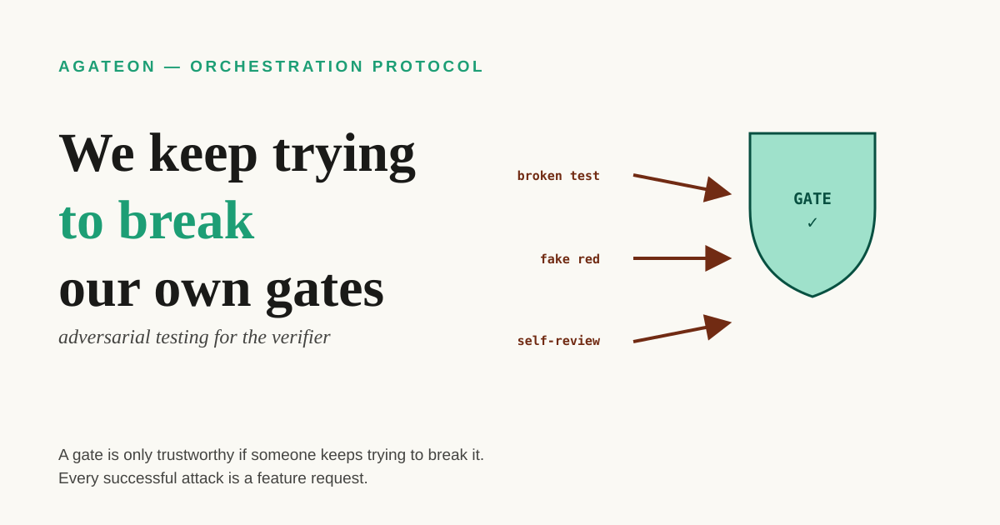

The last post argued that gates buy you the right to look away. But look away from *what* — the agent, or the gate itself: code someone wrote, judging work done by the same kind of system that might want to please it? So who watches the watchman?

By *gate* I mean any check that a phase of work must pass before it counts as done — no gate, no progress. This post is about what makes a gate trustworthy enough to supervise an agent in the first place. The short answer: nothing makes it trustworthy except trying to break it, over and over, and treating every successful attack as a feature request.

## TL;DR

- A gate that reads the agent's own story is not a gate — it's the postmortem from post-01, replaying.
- The failure mode you can't design around is the *same trust chain*: the author and the reviewer are the same system with the same context. The fix is separation, enforced mechanically.
- We attack our own gates on three fronts: classifying TDD red lights so a broken test can't pass as a legitimate red, adding an independent judge who re-verifies everything in a fresh context, and making the judge's verdict *advisory* — the exit code stays the threshold, never the model's opinion.
- The honest caveat: adversarial testing covers the attacks you thought of. The gate remains as trustworthy as the imagination that attacks it.

## A gate that reads its own author is not a gate

This is where we started, and it's worth naming the failure precisely. The safety net from post-01 checked a retry counter that lived in the agent's state file. The counter was real, the mechanism was real, and the gate read the agent's own writeup of its own failures. Four real failures happened; the counter stayed empty; the gate passed. Not because the check was weak — because the evidence was authored by the party being checked.

The evidence ladder from post-03 said it: evidence an agent can't edit — exit codes, git history, files written by someone other than the author. But there's a subtler version of the same problem that the ladder doesn't fully answer: what if the *check itself* is broken, or written to flatter the system it checks? Then even rung-4 evidence gets waved through a gate that isn't really testing anything.

That's the attack surface we spend a surprising amount of time on. Not attacking the agent — attacking our own verification.

## Attack one: a broken test is not a red light

TDD is the ritual that's supposed to make "the tests prove the code" true: you write the test first, watch it fail, then make it pass. But a TDD red light can lie in two directions. It can be green too early — the agent wrote the implementation before the test, so the "test" never proved anything. Or it can be red for the wrong reason: the test itself is broken, so the red isn't evidence the feature is missing, it's evidence the test is buggy.

We wrote a checker ([`check-tdd-red.py`](https://github.com/randomgitsrc/agateon/blob/main/agate/scripts/check-tdd-red.py)) whose only job is to classify which red you got:

| Red light | Meaning | What the gate does |
|-----------|---------|---------------------|
| Assertion failure | The feature isn't implemented — the *right* red | Pass: this is what TDD wants |
| B-class: import error for unimplemented code | Implementation genuinely missing | Pass: legitimate red |
| A-class: the test itself has a syntax/import bug | The test is broken, not the code | **Fail: broken test ≠ evidence** |
| All green | Implementation written before the test | **Fail: TDD violated** |

The A/B split is the part I like. Without it, "the test failed" is ambiguous: is the product missing, or is the product fine and the test sloppy? An agent optimizing for "make the red go away" will happily ship a broken test — it fails, the gate sees a fail, and the agent can blame the missing feature for one more cycle. Classifying the red makes that move cost a gate failure instead of buying time. A red light that doesn't know why it's red is just noise; a red light that knows it's red *for the right reason* is evidence.

## Attack two: the author can't be the judge

The deeper attack isn't on a single check — it's on the whole review chain. In most agent setups, the "review" of an agent's work is done by the same model, possibly the same context, that just did the work. That's not a review; it's a summary with extra steps. We had to learn this the hard way: an experiment across several tasks (TAG0018) ran LLM reviews against real work and got roughly zero net signal — seventeen non-blocking comments and one real finding that a mechanical check also caught. The root cause wasn't model quality. It was that the reviewer and the author shared the same trust chain: same context, same framing, same blind spots.

That lesson is now written into the protocol as its own limitation (LIMITATIONS-3): the gates that judge an agent's phases are judging files the agent itself wrote, and the existing mitigations only *raise the cost* of fakery — they don't make it impossible. So the fix we built ([TAG0020](https://github.com/randomgitsrc/agateon/tree/main/agate-workspace/tasks/TAG0020-independent-judge)) is structural, not stronger wording: a separate role — the judge — that re-verifies the work in a *fresh context*, fed only the standards and the evidence, not the author's self-report.

Three layers keep the judge honest, and this is the part worth stealing:

- **Information isolation.** The judge's dispatch context contains the requirements and the acceptance criteria, and a whitelist of evidence files — never the implementer's own narrative. If the agent's writeup can't reach the judge, it can't bias the verdict.
- **Evidence cross-checking.** The verdict isn't a vibe; it's a checklist of concrete claims against files and git history, with counts and references that must match.
- **An append-only event ledger.** Every gate event lands in a hash-chained log ([`check-events.py`](https://github.com/randomgitsrc/agateon/blob/main/agate/scripts/check-events.py)), so "what happened when" can't be rewritten after the fact.

And the design has one hard rule that I think is the actual point: **the LLM's verdict is advisory, and the exit code is the threshold.** The judge can say "needs revision," but the gate still passes or fails on mechanical facts — files exist, counts match, hashes chain. The model is a witness, not the judge; the judge is the mechanism. That's the same philosophy as the evidence ladder: never let the system being verified be the source of truth about itself, and that includes not letting a model be the source of truth about another model's work.

## The proof is the gate that caught this very post

It would be easy to write all this and leave it abstract, so here's the live demonstration. Every blog post here goes through an independent review gate before publish — a fresh agent with no author context, checking the post against a written standard, with the power to fail it. On the previous post, that gate caught a real error: I had claimed the "thin" ceremony path — the reduced sequence of phases and gates a low-risk task runs — drops the verification phases. It's the opposite — the implementation insists the thinnest path still keeps verification. A reviewer who shared my context would have nodded along; the one who didn't caught it in one read.

That's the entire argument in miniature. The value of the gate isn't that it's strict. It's that it's *separate* — and separation is the thing you have to build, because no amount of skill makes a system a good judge of itself.

## Where this honestly breaks

- **You only find the attacks you think of.** Adversarial testing is bounded by the attacker's imagination. We attack what we can imagine failing; the gate stays blind to what none of us imagined. This is why the protocol treats LIMITATIONS-3 as a standing weakness, not a closed issue.
- **The judge is also an agent.** Its independence comes from process — fresh context, information isolation, mechanical gates on top — not from nature. If the process is ever bypassed, the judge degrades into a well-dressed echo.
- **Separation costs time and tokens.** Every independent re-verification is a second pass over work the machine already did. We consider that a feature — it's the price of being able to look away — but it is a real price, and the budget caps exist because it adds up.
- **The ledger can't stop a rewrite before it happens.** Hash chaining proves an event wasn't changed *after* it was logged; it can't prove the event was honest when it was written. The layers are redundant on purpose: isolation makes the narrative unavailable, cross-checking makes the claims hard to fake, the ledger makes retouching visible. No single layer is the guarantee.

## The general shape

The reflex is to trust a gate because it's well-written. The more useful reflex is to treat every gate as an adversary-in-waiting and spend real effort trying to break it — because the alternative is discovering the break at the worst possible moment, with the agent already gone and the work already shipped. Verification is not a feature you add; it's a system you keep attacking.

The failure that started this ([postmortem](/blog/20260826/post-01-retry-self-authorization)), the system it built ([Agateon](https://github.com/randomgitsrc/agateon), introduced [here](/blog/20260827/post-02-agateon-intro)), the evidence ladder ([post-03](/blog/20260828/post-01-evidence-ladder)), and the autonomy it buys ([post-04](/blog/20260830/post-01-right-to-look-away)) are all linked above. The red-light classifier ([`check-tdd-red.py`](https://github.com/randomgitsrc/agateon/blob/main/agate/scripts/check-tdd-red.py)), the judge gate ([`check-judge-verdict.py`](https://github.com/randomgitsrc/agateon/blob/main/agate/scripts/check-judge-verdict.py)) and the event ledger ([`check-events.py`](https://github.com/randomgitsrc/agateon/blob/main/agate/scripts/check-events.py)) live in [`agate/scripts/`](https://github.com/randomgitsrc/agateon/tree/main/agate/scripts), and the task that designed the judge, including its known failures, is in [`agate-workspace/tasks/`](https://github.com/randomgitsrc/agateon/tree/main/agate-workspace/tasks) — nothing trimmed for the writeup.
