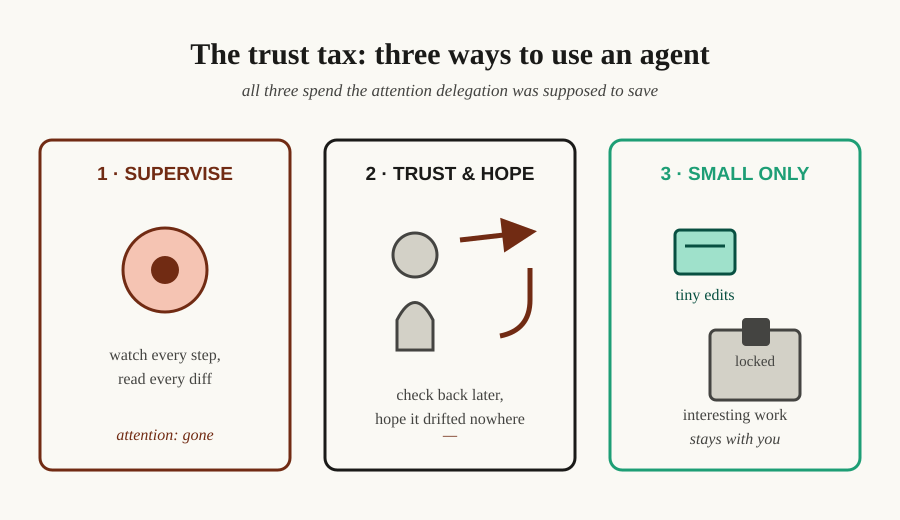

# You can't delegate what you can't verify


You hired an AI agent to save your attention, and somewhere along the way you became its supervisor. Every long task leaves you the same choice: watch it the whole way, or look away and hope. Neither feels like delegation.

**TL;DR** — Model capability is climbing fast, but the thing that decides how much you can hand to an agent isn't the model's IQ. It's how much of its work you can check. Until verification is structural, you pay a trust tax: supervise (attention gone), don't supervise (risk silent failure), or only delegate small things you can eyeball. This post argues the ceiling moves when verification stops being a hope and becomes infrastructure — and where Agateon, an orchestration protocol we've been building, stands on that path today.

## The trust tax

Watch anyone use a capable coding agent on a task that matters and you'll see one of three behaviors:



1. **Supervise.** You read every diff, question every commit, watch the tool calls. Your attention is gone — you've spent the delegation's whole value on the supervision it was supposed to remove.
2. **Trust and hope.** You kick off a long task and check back later. When it works you feel clever; when it silently drifts, you discover it at the worst possible moment — merged, deployed, or three days of context ago.
3. **Only delegate what you can eyeball.** Small, reversible, single-file changes. You've kept the interesting work for yourself, not because you want to, but because it's the only work whose failure you'd notice.

All three are the same tax paid differently. The scarce resource isn't capability — it's **confidence you can check**.

## Capability is not your ceiling. Verification is.

Single-burst agent work is easy to trust because you can see the whole thing at once: scaffold a repo, fix a lint error, write a test for a known case. The model's capability is genuinely there.

Long work is different. A task that runs across hours and dozens of steps produces far more than you can hold in your head, and the only summary most setups offer is the agent's own. That's when "can I delegate this?" stops being a question about the model and becomes a question about you: **how much of this could I actually check if I had to?**

The uncomfortable answer is what sets your ceiling. Two engineers with the same model have different ceilings — the difference is entirely in what they can verify, not in the model.

## What the ceiling does to your job

Now the part that matters. When verification is structural, the shape of your work changes:

- **You give goals, not steps.** You don't babysit the process because you don't need to — the process won't advance on a claim, only on checked evidence.
- **You review outcomes, not transcripts.** Your attention goes to the artifact that came back, and to the judgment calls the machine couldn't make — not to watching it work.
- **You can say yes to more.** The boundary of what you delegate moves from "what I dare risk" to "what I can check." That's a bigger delegation frontier, and it compounds: every task you can safely hand over frees judgment for the ones only you can do.

That's the destination: an agent that is genuinely *delegable* — not because it's honest, but because its work is checkable. You own the outcome; you don't defend its every step.

## The "why now": capability is outrunning everyone's ability to check

The reason this matters more every quarter: model capability is compounding faster than any individual's ability to verify it by reading output. The gap between *what the model could do* and *what you dare let it do* is widening. Whoever closes that gap with structure gets an outsize share of the capability — and everyone else keeps supervising.

That's the bet: verification can be made structural, and when it is, your ceiling stops being set by anxiety and starts being set by judgment.

## What's real today

This isn't a product vision with nothing behind it — the mechanisms exist and are dogfooded. Agateon is an open-source orchestration protocol (introduced [here](/blog/20260827/post-02-agateon-intro)) that runs software tasks through eight phases. Each phase is gated on objective evidence: a test runner's exit code, a git log, files on disk — not the agent's report. Concretely, today:

- **Progress can't advance on "it looks done."** Every phase must pass a machine check before the state machine moves. If it fails, the phase goes back — and the rollback is recorded against git history, so a silent retry-counter reset doesn't disable the safety net ([postmortem](/blog/20260826/post-01-retry-self-authorization)).
- **State survives crashes.** All progress lives in version-controlled Markdown, so an interrupted session resumes from its last checked phase. That turns interruption into a scheduling problem rather than a restart — the argument of [the previous post](/blog/20260830/post-01-right-to-look-away) about how gates buy autonomy.
- **The verifier gets verified.** We run adversarial tests against our own gates and an independent judge re-checks acceptance in a fresh context; the exit code, not the model's opinion, is the threshold ([we keep trying to break our own gates](/blog/20260831/post-01-we-break-our-own-gates)).
- **It's dogfooded.** The repository itself is built with Agateon. The task history in [`agate-workspace/tasks/`](https://github.com/randomgitsrc/agateon/tree/main/agate-workspace/tasks) is the record of that loop — including tasks that fixed the protocol's own weaknesses, like the [mechanism checks](https://github.com/randomgitsrc/agateon/tree/main/agate-workspace/tasks/TAG0023-mechanism-checks) that closed a gap the protocol's own audits had found, and the [protocol hygiene](https://github.com/randomgitsrc/agateon/tree/main/agate-workspace/tasks/TAG0016-protocol-hygiene) pass that cut redundant verification runs.

The trust tax is engineering-down-able in principle — the mechanism exists and is dogfooded. How much supervision it actually removes at scale is the open question below.

## What's still open (read this before betting on us)

The destination is a direction, not an arrival. The honest gaps:

- **It's a protocol, not a product.** Adopting it is real work: symlink, hooks, a phase discipline your agents follow. The tax goes down, but it's replaced by setup cost and ceremony — which is why progressive adoption matters (small tasks run a pruned flow).
- **Gates are only as strong as their evidence.** A gate that checks a weak test verifies the weakness, not the work — the quality ceiling is the test's quality, and no protocol fixes that ([known limitations](https://github.com/randomgitsrc/agateon/blob/main/agate/LIMITATIONS.md)).
- **The residual self-authorization gap.** Gates that judge files the agent wrote itself are mitigated, not cured — the independent judge raises the cost of fakery and leaves an audit trail, but "author and judge are the same actor" is structural ([LIMITATIONS-3](https://github.com/randomgitsrc/agateon/blob/main/agate/LIMITATIONS.md)).
- **We don't yet have long-run data** on how much supervision the structure actually removes across real projects. That's the next honest post, once the numbers accumulate.

So: the mechanism is real, the direction is argued, the distance is stated.

## If you're building with agents, audit your tax

You don't need Agateon to benefit from this framing. Next long task, ask where *you* supervise because you can't check — and whether that check could be made mechanical. The single most useful question for anyone delegating to AI:

> **What would it take for me to not watch this?**

If the honest answer is "nothing, I'd have to trust it" — that's not a model problem. That's a verification gap, and it's the one worth closing.

## Try it

The repository is [github.com/randomgitsrc/agateon](https://github.com/randomgitsrc/agateon) (MIT). One-line install, no runtime:

```bash
curl -sSL https://raw.githubusercontent.com/randomgitsrc/agateon/main/install.sh | bash
```

You can't delegate what you can't verify. Agateon is the bet that verification can be built — so the thing you delegate, and the ceiling you delegate to, both move.
