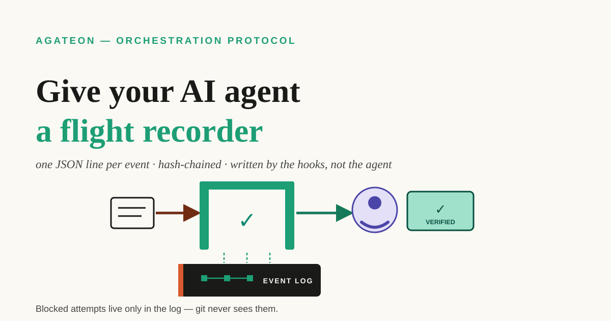
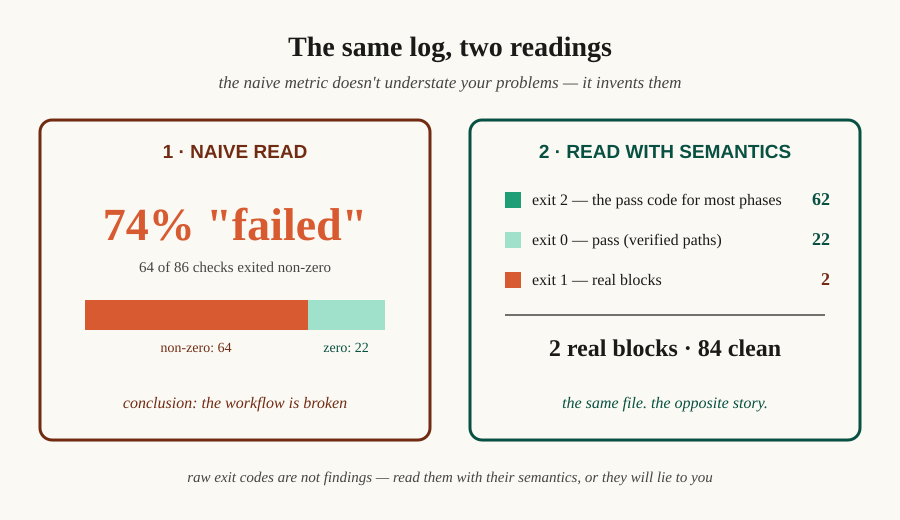

# Give your AI agent a flight recorder



Quick quiz about last month: how many tasks did you hand to an AI agent, how many times did a check stop one, and how much work got quietly redone? If you're like most teams — including ours, until recently — you can't answer, because the workflow left no record. So we made ours write everything down, and this post is what the log actually says — including where it misleads you and what it can't see.

**TL;DR** — Agent work produces no trace by default, so every claim about it runs on memory, and memory is worse than wrong: it's confident. The fix is small — one JSON line per event, hash-chained so tampering breaks the chain. Ours recorded ~200 events across ten tasks, and reading it taught us three things you can't learn any other way: naive metrics invert the truth (our log "says" 74% of checks failed; the real count is 2), failures that never become commits are invisible to git and survive only in the log, and every log has blind spots you should map on purpose. Steal the vocabulary, not our numbers.

## Memory is not a record

Ask around a team that uses coding agents and you'll hear confident answers: "it works great", "we had a bad week", "it saved us a ton of time". None of that is data — it's the residue of whatever happened most recently or vividly. Humans are fine at remembering that an AI once wrote something impressive and terrible in the same afternoon; they're useless at rates and counts, and rates and counts are what decision-making needs.

We noticed this about ourselves the embarrassing way. When we sat down to write an honest retrospective, we couldn't answer basic questions about our own workflow: how often does a check actually stop anything? How often does work go backwards? We had opinions. We did not have numbers. And we build software whose entire job is verification — if *we* were running on vibes, everyone is.

## The smallest useful log

So we added a flight recorder. Not a platform, not a dashboard: a JSONL file per task, written by the same hooks that enforce the gates — a *gate* being a check a phase must pass before work can advance — with three event types, a vocabulary small enough to fit in your head:

- **`gate_run`** — a check executed: which phase, which command, what exit code, who ran it.
- **`state_transition`** — the task's phase moved: from where to where.
- **`judge_verdict`** — [an independent re-verification](/blog/20260831/post-01-we-break-our-own-gates) ruled on the work.

Two design choices matter more than the vocabulary. First, the log is written by the *enforcement* hooks, not by the agent — an agent that can forget to do the work can also forget to log it. Second, every event carries the hash of the previous one, so the file is a chain: edit any line and the chain breaks, and a checker script ([`check-events.py`](https://github.com/randomgitsrc/agateon/tree/main/agate/scripts)) validates chain integrity, timestamp monotonicity, and verdict counts. A log you can edit after the fact is a diary; a log you can't is a record.

## What ours actually says

Ten tasks in, the log held about 200 events. Here's the part worth your time: **our first reading of it was almost exactly wrong.**

The raw count said 86 checks ran and 64 of them exited non-zero — a 74 percent failure rate. Put that on a dashboard and the reasonable conclusion is that the workflow is broken. The truth is the opposite: in our state machine, exit 2 *is* the pass code for most phases — a successful gate often exits non-zero on purpose, because "passed" and "nothing to check" and "passed with warnings" are different outcomes that shell conventions can't distinguish. Read with the semantics, the log says: **86 checks, 2 real blocks, 84 clean.** The naive metric didn't understate our problems; it invented them.



The two real blocks are my favorite records in the file, because of where they *aren't*. Both were gate stops on a task in its implementation phase — two commits refused about a minute apart one evening, then fixed and passed in the early hours of the next morning. If you go looking for them in git history, you'll find nothing: **a blocked commit never becomes a commit.** Git remembers what shipped; it has no slot for what was prevented. The only place those two failures exist is the log — which is precisely the difference between a record and a rumor. Don't take our word for it: the ledger ships in the repo, and the blocked task's [gate-events.jsonl](https://github.com/randomgitsrc/agateon/blob/main/agate-workspace/tasks/TAG0027-orchestration-semantics/gate-events.jsonl) is greppable for `"exit":1`. Without it, "our gates mostly wave things through" would be unfalsifiable, and "the gates once stopped two bad commits" would be a story nobody could check.

## What it can't say (yet)

A log earns trust by admitting its edges, so here are ours, found by asking what the file *can't* tell us:

- **It covers 10 of our 31 tasks.** We added the recorder partway through; earlier work left no events. Any "average" over the whole project would be a lie of denominator, so we don't compute one.
- **It ends before shipping.** Every task's log closes at the judge's verdict — the release phase happens after the log closes, so the record covers the work, not its aftermath. (We know; we haven't fixed it yet.)
- **It is structurally blind to pauses.** The recorder skips tasks whose state is paused — a paused task writes no events at all. In ten tasks, zero pause events show up, and we *cannot* tell you from the log whether that means "nothing ever paused" or "pauses are invisible." That ambiguity is our bug, and writing this post is what surfaced it.
- **Zero rollbacks — and that's a finding, not a victory.** Our design includes machinery for sending work backwards when a check fails late. In the ledger era it never fired once. Meanwhile 17 of 31 tasks show retries of a different kind — subagent dispatches redone for quality — recorded in an entirely separate file. Two instruments, two partial views; neither is the whole workflow.

That last pair is the deeper lesson: **instrumentation gaps are findings too.** What a log can't see tells you where your model of your own workflow is wrong.

## Your version of this costs an afternoon

You don't need our protocol to do any of this. The whole idea is: pick the moments where your workflow claims something happened, and write one JSON line when they occur. Three event types is enough to start:

```bash
echo '{"event":"gate_run","phase":"test","exit":0,"ts":"2026-09-05T10:00:00Z"}' >> .agent-events.jsonl
```

Then ask the log three questions, in this order:

1. **What does the naive read say?** Count failures by the rawest metric you have — then go check whether your exit codes and statuses mean what you think they mean. (Ours didn't.)
2. **What's missing from the log?** List the states your workflow can be in, then find which ones produce no events. Every silent state is either fine or a blind spot — you want to know which, on purpose.
3. **What happened that git can't show you?** Blocked attempts, rejected reviews, re-run commands — the work that left no commit is usually exactly the work you'd want to remember.

Do this for one task — not a platform, one task — and you'll already be ahead of every team arguing about their agents from memory.

## Try it

Agateon is [github.com/randomgitsrc/agateon](https://github.com/randomgitsrc/agateon) (MIT) — the protocol these events come from, with the recorder built into its hooks. One-line install, no runtime:

```bash
curl -sSL https://raw.githubusercontent.com/randomgitsrc/agateon/main/install.sh | bash
```

The numbers in this post are small and early — ten tasks is a beginning, not a verdict. Our [previous post](/blog/20260903/post-01-you-cant-delegate-what-you-cant-verify) promised they'd come honestly once they accumulated; this is that post, gaps included. But the direction holds already: an agent workflow without a record isn't verified or unverified — it's *unobservable*, and unobservable means every argument about it ends in a tie. Give it a flight recorder. The log will disagree with your memory, and the log will be right.
