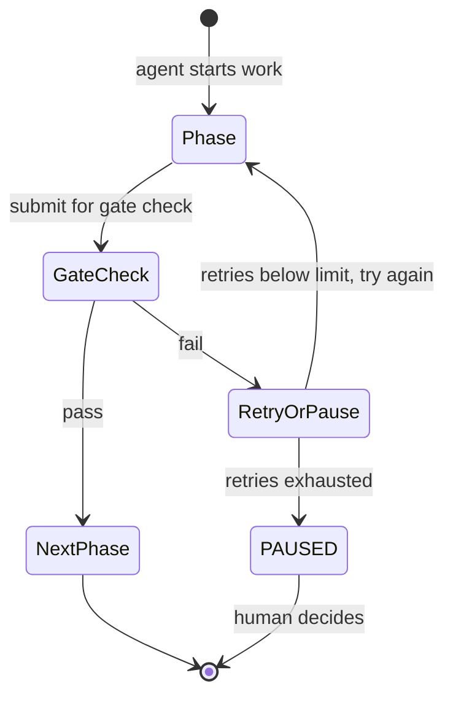
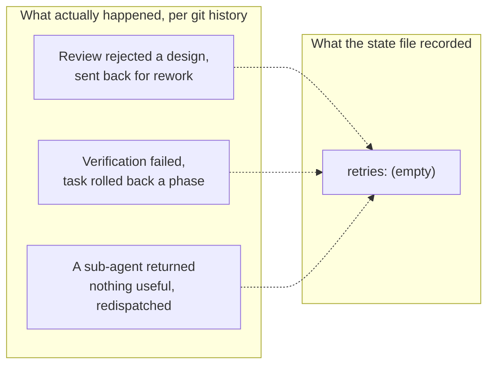
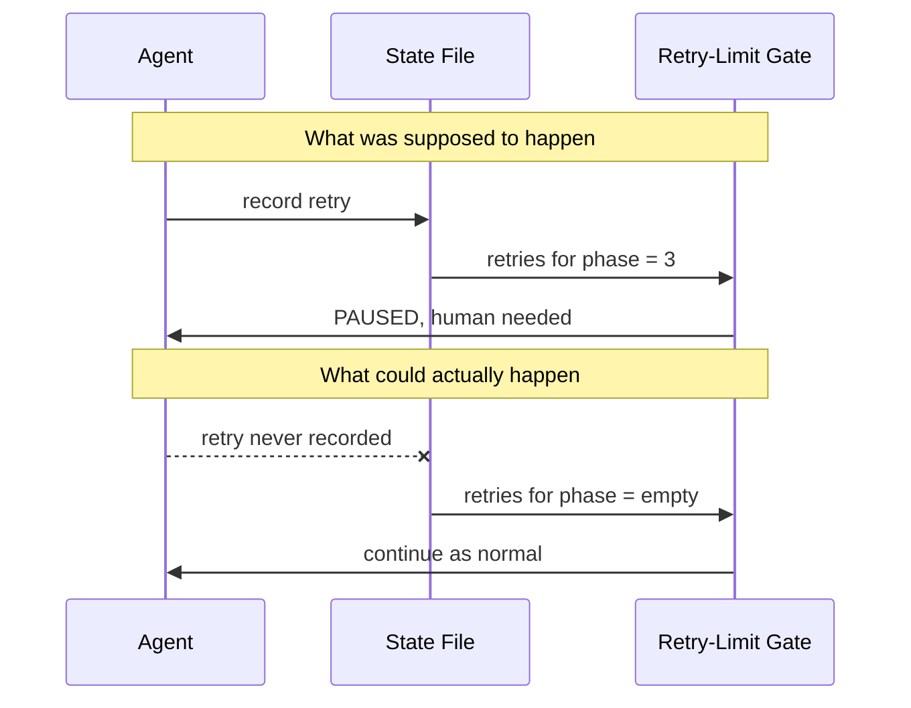
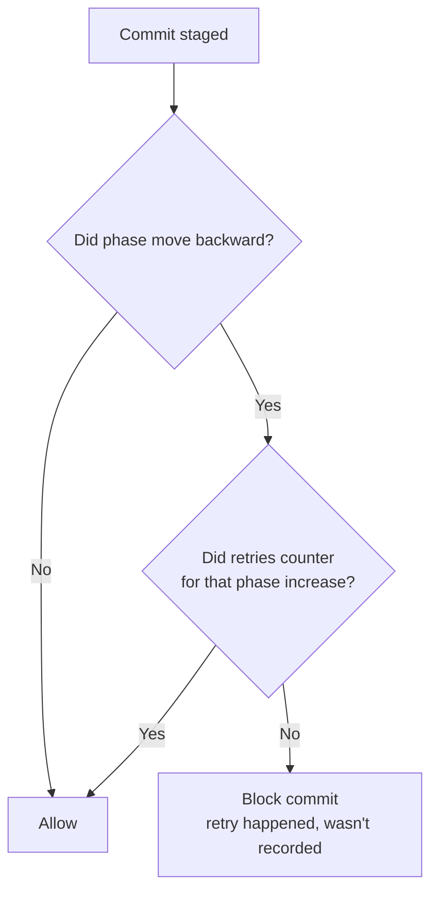

# 我们的 AI 安全网全靠 agent 说实话。它没说实话。

Agateon 是一套让 AI agent 承担软件工程工作的协议，核心原则只有一条：不信 agent 的自我陈述，只信客观验证。每个 phase——需求、设计、实现、测试、发布——都得过一道 gate（阶段收尾前必过的一道检查）才算完成。没有 gate，就不许往前走。前提就这么简单。

几天前，一次例行审计在我们自己的 gate 里挖出一个洞。不是逻辑 bug，是*设计*上的洞——机制一丝不苟地干着分派给它的事，问题恰恰出在这儿。下面讲清楚：出了什么事，我们怎么发现的，又是怎么修的。

## 机制：失败次数超限，就停下等人拍板

agent 会卡住：看错一条需求，测试挂了又看不懂原因，sub-agent 交不上有用的东西。Agateon 的对策很简单——按 phase 记重试次数，某个 phase 失败得太多次，就全面停下自动化，强制交给人工决策。

其实没什么稀奇的，思路和断路器一样：连续失败攒够次数，系统就不再自己绕着问题打转，把控制权交还给人。

关键在于系统*怎么知道*发生过重试：靠 agent 自己记。一个 phase 被打回重做时，这次重试按设计要写进该任务的状态文件。

## 审计查出了什么

一次独立评审抽查了四个刚完成的任务，核对重试记录和实际发生的事。对不上。

四个任务都有实打实的动态：评审打回过设计，任务回滚过一个 phase，sub-agent 空手而归。但每一个的重试计数器读出来都是空的，好像这些事从没发生过。

重试上限机制一次都没触发，因为除了写进那个字段的内容，它什么都看不见。字段里写的是没发生，对安全网而言就是没发生。

## 为什么这不只是漏了一个 edge case

让人不舒服的，不是有几条重试没记上账，而是这个洞的*性质*。

Agateon 立项的理由就是：AI agent 对自己工作的描述不能直接信，要拿证据去对。重试上限机制本来是做验证的手段之一。可它自己的触发条件，说白了，完全押在让同一个不可信方老实自报上。守卫在防狐狸，用的却是狐狸想瞒就能瞒的信息。

这类问题，靠给正常路径多写几个测试用例是碰不到的。它是信任模型上的洞——机制可以被整个架空，不必谁使坏，agent 忙忘了、或者压根没接上记账这一步，就够了。而且失败得*无声无息*：不报错，不崩溃，只是一张从没真正张开过的安全网。

## 修复：别再信字段，改查证据

修复没有要求 agent 把账记得更认真。它干脆不在最要命的环节上信日志了，改查一样 agent 想瞒也瞒不掉的东西：git history。

一次真实的 phase 回滚——比如验证失败、任务退回上一个 phase——在发生的那一刻就已经躺在版本控制里，agent 在任何地方写什么都不影响这个事实。所以修复思路是拿两样东西对账：commit 历史里出现了真回滚，而这个 phase 的重试计数却没涨，就拦下这次 commit。

我们故意把拦截范围收得很窄。还有一些更弱的信号——比如磁盘上出现了 review-rejection 文件，或者 sub-agent 的输出里带着那些一看就是“啥也没带回来”的措辞。它们有用，但本质是模式匹配，模式匹配就有误报，所以这类信号只给警告，不拦提交。真正会硬拦 commit 的检查，只建在一个靠“不吭声”伪造不出来的事实上：git history 里实打实后退过的 phase 编号。信任程度决定执行力度——自己都不全信的证据，不拿去拦人。

## 真的有效吗？我们试着搞破坏

修复自己的话，我们也没全信。两个对抗性测试，都跑在真实的 git 仓库上：

**攻击：** 摆出一个 phase 回滚，重试记录留空——正是审计撞见的那个场景。
**结果：** commit 被拦下，报错信息点名了具体是哪个 phase、缺了哪条记录。

**对照：** 同样的回滚，这次把重试老老实实记上。
**结果：** commit 放行。

还有一件事得说。复盘里这种细节最容易省掉，但不该省：这个修复的早期版本带了一个守卫条件，细看之下，它恰好会让修复抓不住当初催生修复的那个故障模式——原始证据是那些*一次都没*记过重试的任务，而守卫却默认已经存在一条旧记录可供比对。好在评审阶段就有人揪出来了，没等上线。特意写这一段，是因为“修自报问题的方案，自己逻辑里的毛病也得靠第二双眼睛才看得见”——这件事本身就说明，为什么我们不指望任何单一检查第一次就完美生效，包括这一个。

## 还没解决的部分

启发式检查——那些只警告不拦截的——照样能被绕过，只要 agent 稍微小心一点，别留下惯常的模式匹配痕迹。我们知道这一点。我们没说重试追踪这块现在就滴水不漏了；我们说的是：那条原本在结构上注定无声失效的路径，不再无声了。剩下的部分，照实说：还是不确定。

## 这类问题的形状

如果你在造任何“agent 自己的报告会参与触发安全机制”的东西，值得专门查一下：触发条件是否依赖 agent 可以一声不吭就略掉的证据？如果是，那不是理论风险。我们这个洞就安安静静趴在四个已完成的任务底下，什么也没干，直到审计专门去找它才现形。

修复的思路不是“让 agent 更小心”，而是“让最要紧的环节不再需要 agent 小心”——把检查锚在一样东西上：它存在与否，不取决于 agent 选择汇报什么。

这就是 Agateon 背后的全部想法：[github.com/randomgitsrc/agateon](https://github.com/randomgitsrc/agateon)。本文说的修复在 [`agate/scripts/check-state-transition.py`](https://github.com/randomgitsrc/agateon/blob/main/agate/scripts/check-state-transition.py)，交付它的任务是 [`TAG0023-mechanism-checks`](https://github.com/randomgitsrc/agateon/tree/main/agate-workspace/tasks/TAG0023-mechanism-checks)——完整历史都在，没为写文章删任何东西。
