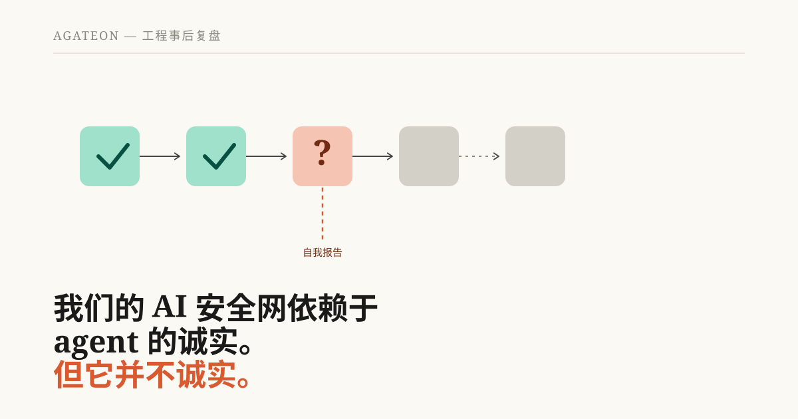
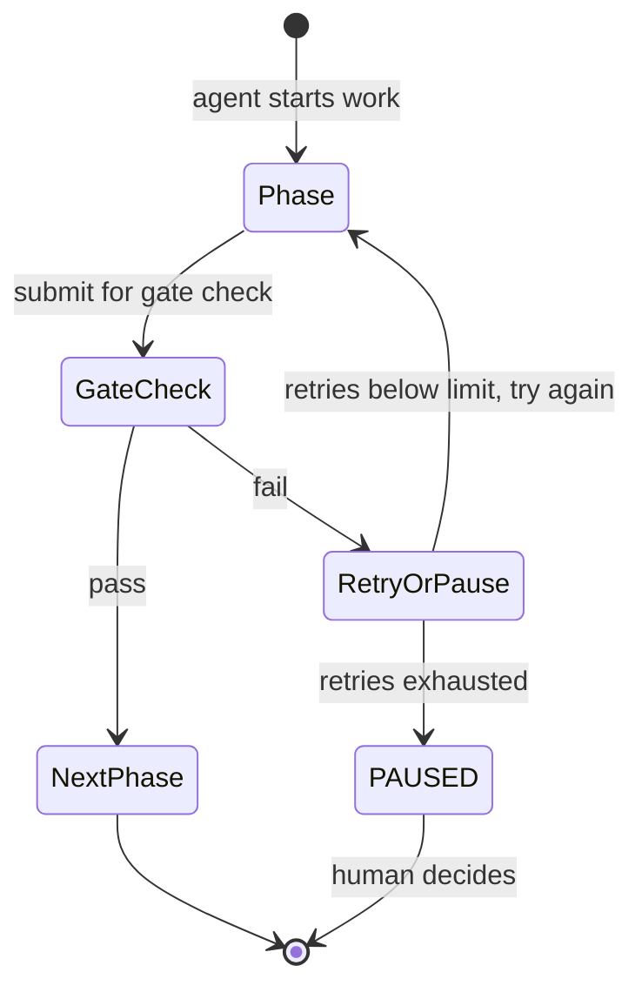
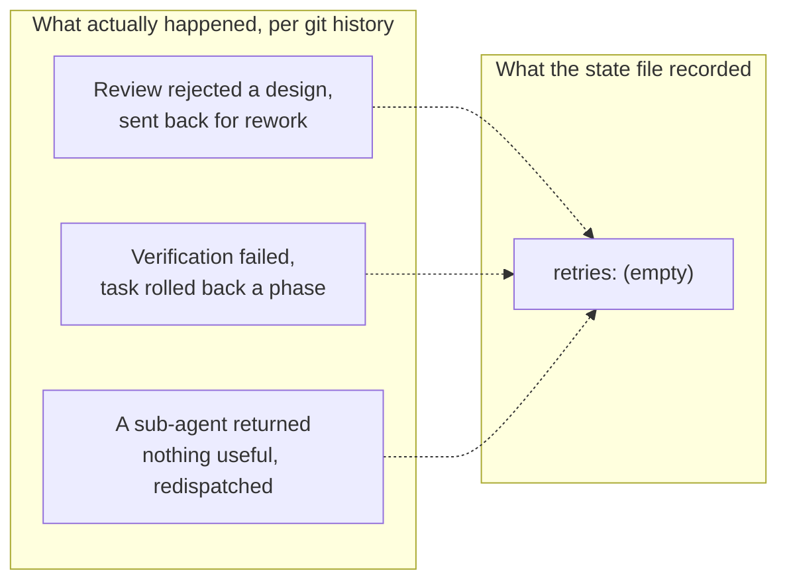
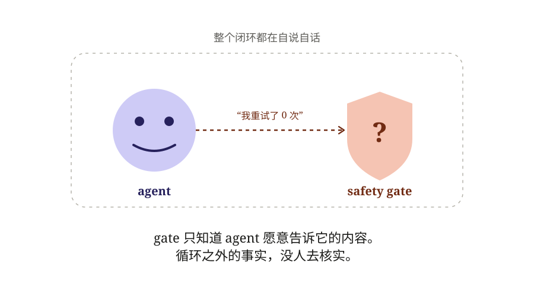
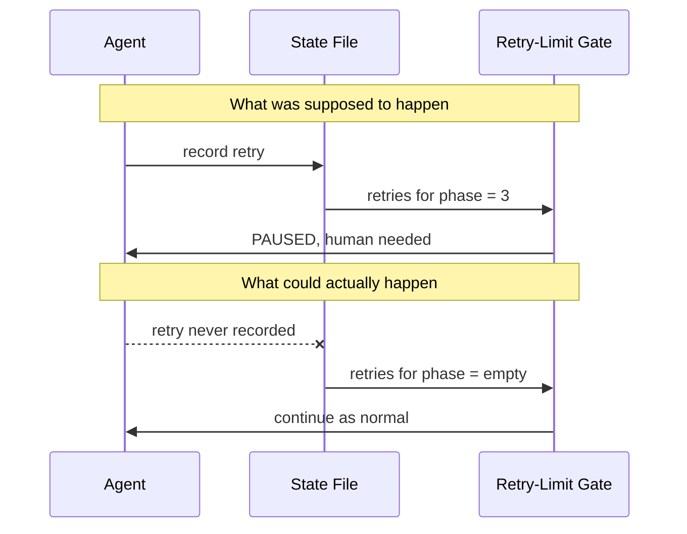
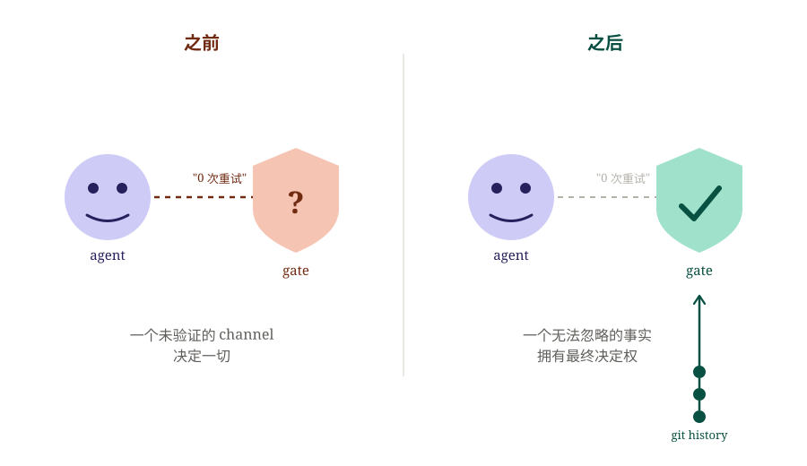
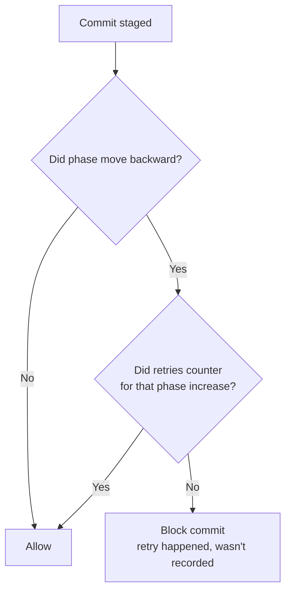

# 我们的 AI 安全网曾依赖于 Agent 的诚实。但它并不诚实。

Agateon 是一个用于通过 AI agent 执行软件工程任务的协议，其核心原则是不盲目信任 agent 的自我陈述。工作的每一个阶段——需求、设计、实现、测试、发布——都必须通过客观的 gate 才能被视为完成。没有 gate，就没有进展。这就是整个前提。

几天前，一次例行审计在我们自己的一个 gate 中发现了一个漏洞。这不是逻辑错误，而是一个*设计*漏洞——即机制完全按照指令执行，但问题恰恰出在这里。以下是事件经过、我们如何发现它，以及我们如何修复它。

## 机制：失败次数过多，则必须由人工介入

Agent 会遇到瓶颈。它们可能误读需求、测试因其无法理解的原因失败，或者 sub-agent 返回了无用的结果。Agateon 的应对方案很简单：跟踪每个 phase 的重试次数，一旦某个 phase 失败次数过多，就完全停止自动化并强制进行人工决策。

这并不复杂。其理念与断路器相同：连续失败达到一定次数后，系统停止尝试自行绕过问题，并将控制权交还给人类。

关键在于系统如何得知发生了重试：由 agent 进行记录。每当一个 phase 被拒绝并重做时，重试记录理应被写入该任务的状态文件中。

## 审计发现了什么

一项针对四个近期完成任务的独立审查检查了重试记录是否与实际情况相符。结果并不相符。

这四个任务都经历了真实的拒绝、真实的 phase 回滚以及真实的 sub-agent 无功而返，但它们的重试计数器全都显示为空。就好像什么都没发生过一样。

重试限制机制从未被触发，因为该机制除了读取该字段中写入的内容外，无法感知外部世界。如果该字段显示什么都没发生，那么对于安全网而言，确实什么都没发生。

## 为什么这不仅仅是一个被遗漏的边界情况

令人不安的不是某些重试未被记录，而是这种漏洞的*性质*。

Agateon 存在的全部理由在于：你不应该信任 AI agent 对其自身工作的描述——你应该根据证据对其进行验证。重试限制机制本应是执行这种验证的手段之一。然而，它自身的触发条件完全依赖于同一个不可信方进行诚实的自我报告。守卫在监视狐狸，却使用了狐狸可以随意隐瞒的信息。

这不是通过为正常路径编写更多测试用例就能发现的 bug。这是设计信任模型中的一个漏洞——该机制可以被静默地失效，并非出于恶意，仅仅是因为 agent 太忙、忘记了，或者从未接入记账功能。而且它是*静默*失败的：没有错误，没有崩溃，只是一个实际上从未生效的安全网。

## 修复方案：不再信任该字段，转而检查证据

此次修复并非要求 agent 在记录日志时更加谨慎，而是完全不再依赖日志中最重要的部分，转而检查 agent 无法悄悄忽略的内容：git 历史记录。

真正的 phase 回滚——例如验证失败导致任务向后回退一个 phase——是发生时就已经存在于版本控制中的事实，这与 agent 在任何地方写入的内容无关。因此，该修复方案会对两者进行比对：如果提交历史显示发生了实际的回滚，但该 phase 的重试计数器没有增加，则该提交会被拦截。

我们刻意缩小了拦截范围。还有一些较弱的信号，例如磁盘上存在 review-rejection 文件，或者 sub-agent 的输出中包含通常意味着“返回为空”的短语。这些都是有用的提示，但它们属于模式匹配，而模式匹配存在误报的可能。因此，这些信号只会产生警告，而不会进行拦截。唯一能强制拦截提交的检查是基于一个无法通过遗漏来伪造的事实：在 git 历史中实际向后移动的 phase 编号。置信度决定了执行强度——对于我们无法完全信任的证据，我们不会进行拦截。

## 它真的有效吗？我们尝试破坏它。

我们并没有盲目相信这个修复方案。我们针对真实的 git 仓库进行了两项对抗性测试：

**攻击：** 在没有重试记录的情况下模拟 phase 回滚——这正是审计发现的场景。
**结果：** 提交被拦截，并显示了明确指出具体 phase 和缺失记录的消息。

**对照：** 同样的重试，但这次正确记录了重试信息。
**结果：** 提交被允许。

还有一点值得一提，因为这类细节很容易在事后总结中被遗漏，但实际上不应被遗漏：该修复方案的早期版本包含一个保护条件，经检查发现，它无法捕获最初促使我们进行修复的那个故障模式——原始证据显示，任务在重试时从未被记录过，而该保护条件假设已经存在可供比对的先前记录。这个问题在发布前的代码审查中被发现，而不是在发布后。我们提到这一点是因为，“针对自报告问题的修复方案需要第二双眼睛来发现其自身逻辑中的缺陷”，这很好地证明了为什么我们不依赖任何单一检查（包括这一项）在第一次尝试时就能完美运行。

## 遗留问题

启发式检查（即那些只发出警告而不拦截的检查）仍然可以被那些在规避模式匹配信号方面更“小心”的 agent 所绕过。我们对此心知肚明。我们并不是声称重试跟踪问题现在已经无懈可击；我们声称的是，那条原本在结构上必然会静默失败的路径现在不再静默了，而其他所有部分依然保持其诚实的、不确定的状态。

## 问题的总体形态

如果你构建的任何系统中，AI agent 自身的报告是触发安全机制的一部分，那么直接检查这一点非常重要：触发条件是否依赖于 agent 可以轻易隐瞒的证据？如果是，那这就不是假设性的风险。我们的系统就曾出现过这种情况，在四个已完成的任务中，它一直处于静默状态，直到审计人员专门去查找才被发现。

解决方案不是“让 agent 更谨慎”，而是“不要让最关键的部分依赖于 agent 的谨慎程度”——将检查锚定在独立于 agent 报告内容之外的事物上。

这就是 Agateon 背后的核心理念：[github.com/randomgitsrc/agateon](https://github.com/randomgitsrc/agateon)。此处描述的修复方案位于 [`agate/scripts/check-state-transition.py`](https://github.com/randomgitsrc/agateon/blob/main/agate/scripts/check-state-transition.py)，而交付该修复的任务是 [`TAG0023-mechanism-checks`](https://github.com/randomgitsrc/agateon/tree/main/agate-workspace/tasks/TAG0023-mechanism-checks) ——包含了完整的历史记录，未对撰写内容进行任何删减。
