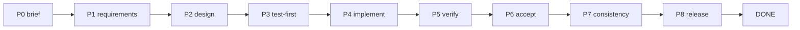
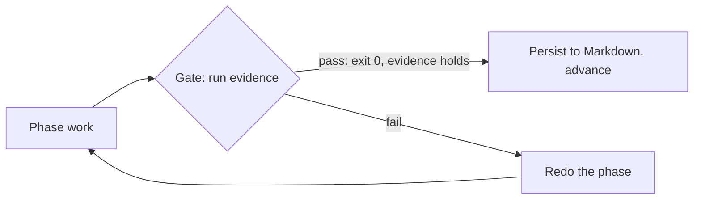

# Agateon：像构建系统验证编译器那样验证 AI agent


用 AI 编码 agent 跑过长任务的人，多半熟悉这种收场：*看起来做完了*。测试套件是不是全绿？类型检查干净吗？没人知道。你手上只有 agent 的一句"搞定了"，外加一份看起来还算合理的 diff。我们花了几个月做另一条路，这篇文章讲它是什么、为什么长成现在这个样子。

**TL;DR** —— Agateon 是一套开源编排协议，管的就是 AI agent 做软件工程任务这件事。没有 runtime，没有守护进程，也没有构建步骤：一组 Markdown 协议文件，加上一些 gate 检查脚本（gate 就是关卡：跑一条检查命令，过了才放行）。任务按八个 phase 推进，每个 phase 收尾都要过一道客观 gate——测试运行器的 exit code、类型检查器、git log——通不过，状态机就不许往前走。所有状态都存在版本控制的 Markdown 里。编排 agent（orchestrator）自己永远不写代码：它给每个 phase 派一个专门的 subagent，再拿证据核对 subagent 的产出。"看起来做完了"推不动进度；推得动的，只有你指得出来、也跑得起来的东西。

## 问题："看起来做完了"不是质量信号

LLM agent 干短活儿确实在行：搭仓库骨架，修一个 lint 报错，给已知场景补个测试。麻烦出在长任务上。上下文会越跑越脏。subagent 会跑偏，离最初的任务简报越来越远。任务一旦拖到几个小时、几十轮对话，大多数方案能给你的信号，就只剩 agent 自己写的那份完工总结。

这个项目要堵的就是这个漏洞。构建系统从不轻信编译器说"我生成的代码没问题"——它看 exit status，跑测试套件，对输出做类型检查。我们要给 agent 同样的待遇：**不信任输出，用 gate 验证输出。**

## 思路：把 agent 当编译器对待

核心主张一句话说得完：在代码库上干活的 AI agent，就该当成给构建系统喂料的编译器。不求它更诚实，也不翻它的日记。你让机制自己把关——没有客观证据证明 phase 完成，就不放行。

这个视角一换，很多默认设定跟着变。"完成"不再是"agent 说完了"，而是"gate 命令 exit 0，证据文件非空"。

## 它是怎么跑起来的

### phase 与 gate

任务沿一台固定的状态机往前走：P0 brief → P1 requirements → P2 design → P3 test-first → P4 implementation → P5 verification → P6 acceptance → P7 consistency → P8 release → READY → DONE。



每个 phase 之间都有一道 gate。gate 的职责是把证据实际执行一遍，而且这类证据不由 agent 自己写。到了 verification phase，它执行的就是真正的测试命令——gate 脚本跑命令，看 exit code。到了 requirements phase，它做结构检查：文档里至少有一条 BDD（行为驱动开发）验收标准吗？还有没有没解决的 `NEED_CONFIRM` 项？到了 acceptance phase，它检查证据文件非空、所有 gate 命令都 exit 0。



gate 不过，phase 就重做，重试记录在案。这里正好用得上我们最近的一篇复盘——[我们的 AI 安全网全靠 agent 说实话。它没说实话。](/zh/blog/20260826/post-01-retry-self-authorization)。我们在复盘里发现：agent 可以把 retry 计数器留成空值，整张安全网随之悄悄失效。修法是把这项检查锚到 git 历史上，不再依赖 agent 自己的记账。说句实话：gate 有多硬，取决于它锚的证据有多硬；而我们一直在找的，正是那些伪装成"证据"的自我汇报。

### 状态看得见

每个 phase 的结果都写进版本控制的 Markdown（`active-tasks.md`、`.state.yaml`）。这是刻意的设计，换来两个好处。其一，崩溃不可怕：会话被杀、断电、模型上下文顶到天花板，都只是暂停，不是从头再来——下一次运行读一下状态文件，机器从原地接着走。其二，人（或者另一个 agent）可以直接读文件，审计发生过什么，不用信任何人的总结。


### 角色分开

编排 agent 永远不写代码。每个 phase 派给一个专门的 subagent——需求分析师、架构师、测试设计、实现、验证，各管一段——产出经由 gate 收回来。这样编排 agent 的上下文是干净的（它是调度员，不是干活的），评审也真正独立于被评审的东西。道理和"作者不能当唯一评审"一样。

## 它真的有效吗？我们让它吃自己的狗粮

Agateon 是用 Agateon 造出来的。仓库自己的任务历史——从最早的 bootstrap 到近期的机制修复，几十个任务——全部出自这台状态机，记录都在仓库里，谁都能翻：[`agate-workspace/tasks/`](https://github.com/randomgitsrc/agateon/tree/main/agate-workspace/tasks)。上面链接的那篇复盘，就是这个闭环真实运转过的一次：审计发现一个设计漏洞，修复走完带 gate 的 phase 流程，还在真实 git 仓库上跑了对抗性测试，任务记录里都有据可查。

我们也会主动砸自己的 gate。verification phase 会跑对抗性测试——回滚、缺记录、写了一半的证据——看它该拦的拦没拦住、该放的放没放过。一道 gate 如果能被 agent 干脆略去的东西骗过，那它就是 bug，得送回状态机里修。

## 它不是什么（动手前先读这段）

- **它不是魔法 agent。** 它是一套协议加一组脚本。编码 agent 你自己带，Agateon 管的是编排和检查的方式。
- **它不是 runtime，也不是服务。** 没有东西要部署。你的 agent 只要会读 Markdown、会跑命令就行。安装就是一个软链接加两个 git hooks：`curl -sSL https://raw.githubusercontent.com/randomgitsrc/agateon/main/install.sh | bash`
- **它治不了 gate 的坏设计。** 只检查"agent 是不是交了份像样的报告"的 gate 是走过场；跑真实测试套件的 gate 不是。差别全在你拿什么当证据，而选对证据是设计问题，不是工具问题。
- **它还在早期，这点直说。** phase 状态机、gate 脚本和文档都放在 MIT 许可的仓库里，当前版本 v0.64.0。但"早期"不是"稳定"的委婉说法：合理的预期是，你会把要依赖的 gate 亲自审一遍。

## 如果你在做 agent 工具，记住这条

这条经验不止适用于本项目：只要 agent 自己的汇报会流进某个安全或进度机制，就先问一句——这个机制依赖的证据，agent 能不能干脆不交？我们踩过这个坑：触发人工暂停的 retry 计数器，可以被悄悄留成空值。修法不是"让 agent 更小心"，而是"在最要紧的环节上，压根不依赖 agent 小心"——把检查锚到一样东西上，它在不在，与 agent 汇报了什么无关。

## 上手试试

仓库在 [github.com/randomgitsrc/agateon](https://github.com/randomgitsrc/agateon)（MIT）。一行命令装好，不需要任何基础设施：

```bash
curl -sSL https://raw.githubusercontent.com/randomgitsrc/agateon/main/install.sh | bash
```

如果你也曾以"看起来做完了"交付一个长任务，然后心里发虚——这个项目就是为你准备的。Agateon 干的事，说白了就一件：让"完成"意味着你重新跑一遍就能验证的东西，而不是别人告诉你的结论。
