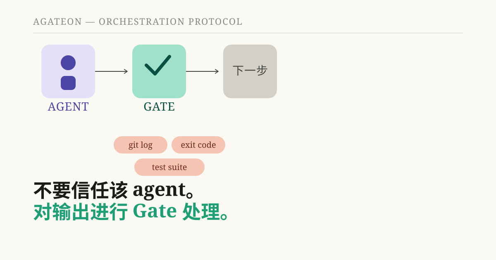
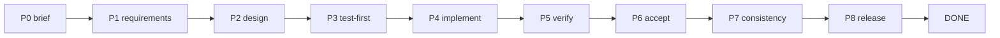
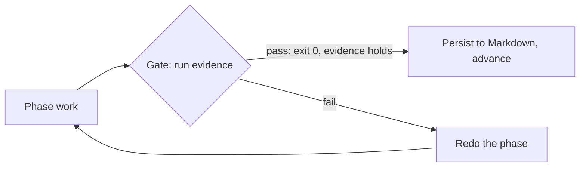
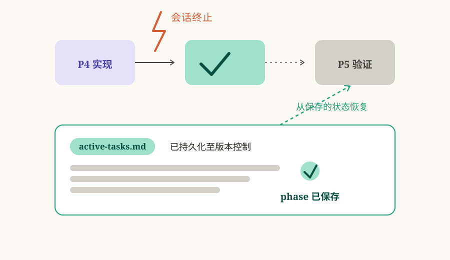

# Agateon：像构建系统验证编译器一样验证 AI agent



如果你曾通过 AI 编码 agent 运行过长任务，你就会知道大多数设置留给你的质量信号是什么：*看起来完成了*。不是“测试套件通过且类型检查器无误”——仅仅是 agent 这么说，而且 diff 看起来合理。我们花了几个月时间构建了替代方案，这篇文章将介绍它是什么，以及为什么它是这样设计的。

**TL;DR** — Agateon 是一个用于 AI agent 执行软件工程任务的开源编排协议。它没有运行时、没有守护进程、没有构建步骤：它是一组 Markdown 协议文件加上 gate 检查脚本。工作流经八个阶段，在每个阶段之后，必须通过一个客观的 gate（如测试运行器的退出代码、类型检查器、git log），状态机才能推进。所有状态都保存在版本控制的 Markdown 中。orchestrator agent 从不编写代码；它为每个阶段分派一个专门的 subagent，并根据证据检查它们的输出。进度不能因为“看起来完成了”而推进——只能基于你可以指出并重新运行的事物。

## 问题：“看起来完成了”不是质量信号

LLM agent 在单次爆发的任务中确实擅长软件工作：搭建仓库、修复 lint 错误、为已知案例编写测试。问题在于长任务。上下文会被污染。subagent 会偏离最初的简报。当任务跨越数小时和数十轮对话时，大多数设置给你的唯一信号就是 agent 自己对所做工作的总结。

这就是本项目旨在消除的故障模式。构建系统不会信任编译器关于它生成了正确代码的声明——它会检查退出状态、运行测试套件、对输出进行类型检查。我们希望 agent 具有相同的形态：**你不要信任输出，你要通过 gate 来验证它。**

## 理念：像对待编译器一样对待 agent

核心主张简单明了：在代码库上工作的 AI agent 应该被视为向构建系统提供输入的编译器。你不需要要求它更诚实。你不需要阅读它的日志。你要让机制在没有客观证据表明阶段完成的情况下拒绝推进。

这种重构改变了许多默认设置。“完成”不再意味着“agent 停止说话”，而是意味着“gate 命令退出代码为 0 且证据文件非空”。

## 工作原理

### 阶段与 gate

任务通过一个固定的状态机流转：P0 简报 → P1 需求 → P2 设计 → P3 测试优先 → P4 实现 → P5 验证 → P6 验收 → P7 一致性 → P8 发布 → READY → DONE。



在每一对阶段之间都有一个 gate，gate 的工作是运行 agent 没有关于其自身编写的证据。对于验证阶段，那是真实的测试命令——gate 脚本执行它并查看退出代码。对于需求阶段，它是一个结构检查：文档是否至少包含一个 BDD（行为驱动开发）验收标准，是否有未解决的 `NEED_CONFIRM` 项？对于验收阶段，它会检查证据文件是否非空，以及所有 gate 命令的退出代码是否均为 0。



如果某个 gate 失败，该 phase 会被重做，并记录一次重试。这正是近期一篇事后分析报告——[我们的 AI 安全网依赖于 agent 的诚实。但它并不诚实。](/zh/blog/20260826/post-01-retry-self-authorization)——的相关之处：我们发现 retry 计数器本身可能会被 agent 留空，从而静默地禁用整个安全机制。修复方案是将该检查锚定到 git 历史记录，而不是 agent 自己的记账方式。一个诚实的结论是：gate 的强度取决于其所锚定的证据，而我们一直在寻找那些实际上是伪装成“证据”的自我报告。

### 可见的状态

每个 phase 的结果都会被写入版本控制的 Markdown 文件中（`active-tasks.md`，`.state.yaml`）。这是一个经过深思熟虑的选择，它带来了两个好处。首先，崩溃——无论是会话被终止、断电，还是模型上下文达到上限——都只是暂停，而不是重启：下一次运行会读取状态文件并从机器中断的地方继续。其次，人类（或另一个 agent）可以通过阅读文件来审计发生了什么，而不是仅仅信任摘要。



### 角色分离

Orchestrator agent 从不编写代码。每个 phase 都被分派给专门的 subagent——需求分析师、架构师、测试设计者、实现者、验证者——它们的输出通过 gate 返回。这保持了 orchestrator 上下文的纯净（它是一个调度器，而不是参与者），并使审查工作真正独立于其所审查的内容。这也是为什么你不能让作者成为唯一的审查者。

## 它真的有效吗？我们让它“吃自己的狗粮”。

Agateon 是用 Agateon 构建的。该仓库自身的任务历史——从最初的引导到最近的机制修复，共数十个任务——都是通过这套状态机生成的，并且全部都在仓库中供任何人查阅：[`agate-workspace/tasks/`](https://github.com/randomgitsrc/agateon/tree/main/agate-workspace/tasks)。上面链接的事后分析报告就是该循环运作的一个真实案例：审计发现了一个设计漏洞，修复过程经过了带有 gate 的 phase，针对真实的 git 仓库运行了对抗性测试，任务记录显示了这一切。

我们也会尝试破坏自己的 gate。验证 phase 会运行对抗性测试——回滚、缺失记录、未完成的证据——并检查 gate 是否按预期拦截了该拦截的内容，并通过了该通过的内容。当一个 gate 可以被 agent 简单忽略的内容所欺骗时，这就是一个 bug，它会被重新送回机器中处理。

## 它不是什么（在尝试之前请阅读）

- **它不是一个魔法 agent。** 它是一套协议和脚本。你负责提供 coding agent；而 Agateon 则负责规范其编排与校验方式。
- **它不是运行时或服务。** 无需部署任何东西。你的 agent 只需要能够读取 Markdown 并运行命令即可。设置过程仅需一个软链接和几个 git hooks：`curl -sSL https://raw.githubusercontent.com/randomgitsrc/agateon/main/install.sh | bash`。
- **它无法让 gate 对糟糕的设计免疫。** 一个检查“agent 是否写了一份看起来合理的报告”的 gate 只是在演戏；而运行真实 test suite 的 gate 则不然。区别完全在于你选择什么作为证据，而如何做出正确的选择是一个设计问题，而非工具问题。
- **它处于早期阶段，且对此直言不讳。** phase machine、gate 脚本和文档均已在 MIT 许可的仓库中发布，版本为 v0.64.0，但“早期”并非“稳定”的委婉说法：你应该对所依赖的 gate 进行审计。

## 如果你正在构建 agent 工具，请关注这一点

这一经验不仅适用于本项目：每当 agent 自身的报告被用于安全或进度机制时，都要审视该机制是否依赖于 agent 可以随意忽略的证据。我们曾经就是这样——触发人工暂停的重试计数器可以被静默地置空。解决方案不是“让 agent 更谨慎”，而是“不再要求 agent 在最关键的部分保持谨慎”，并将检查锚定在独立于 agent 报告内容之外的事实上。

## 尝试一下

仓库地址为 [github.com/randomgitsrc/agateon](https://github.com/randomgitsrc/agateon) (MIT)。一行命令安装，无需基础设施：

```bash
curl -sSL https://raw.githubusercontent.com/randomgitsrc/agateon/main/install.sh | bash
```

如果你曾因“看起来完成了”而交付过长期的 agent 任务并感到不安，那么这个项目正是为你准备的。对 Agateon 功能的诚实总结是：它让“完成”意味着你可以重新运行验证的结果，而不是别人告诉你的结论。
