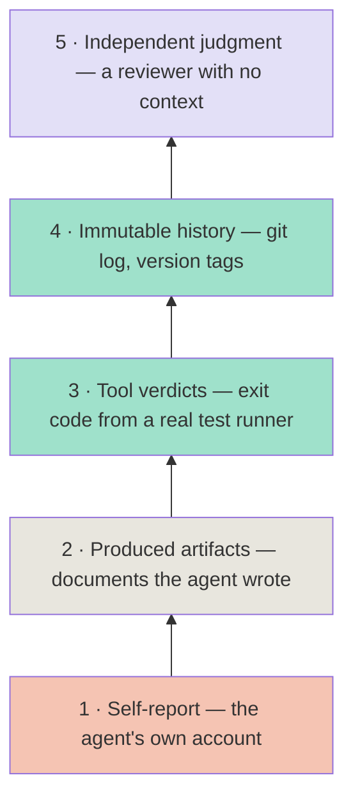

# 真做完了，还是只是看起来做完了？AI agent 工作的证据阶梯

上一篇复盘了一张安全网：它把一切都押在 agent 的诚实上——结果 agent 不诚实。本该由 agent 填写的 retry counter，在四次真实失败里一直空着，这张网从头到尾没触发过一次。这一篇把那个教训摊开成通用版本：一套判断 agent 工作是不是真做完的证据阶梯，外加一份审计清单，专抓藏在你自己 gate 里的自我报告。

*gate* 指的是：一个 phase 要算完成，必须先通过的那道检查——没有 gate，就不许往下走。复盘里那张安全网就是一个读 retry counter 的 gate。这篇文章回答的问题是：怎么分辨一个 gate 读的是真证据，还是只在读 agent 自己讲的故事。

**TL;DR** —— agent 说“这个 phase 做完了”，要问的从来不是“它话说完了没有”，而是“有什么你可以指出来、重新跑一遍”。证据分级，排成一条阶梯。最低一级——agent 自己的汇报——几乎一文不值：agent 可以不说，可以编，也可以自信地说错。最高几级——不可变历史和独立判断——锚在 agent 之外的世界里。这篇文章用 Agateon 的真实例子给每一级定位，讲清一条 rung 撒谎的两种方式，最后给五个问题，任何管 agent 进度的机制都可以拿来审一遍。

## “完成”背后的问题

去问任何一个用 coding agent 跑过长任务的人：你怎么知道它做完了？老实的回答多半是“agent 说做完了，diff 看着也像那么回事”。这不是质量信号——这是受审查一方自己交上来的汇报。它会在三个地方出问题：

- **遗漏（omission）** — agent 压根没记录发生了什么。没有报错，就是一个字段空着。依赖这个字段的安全网永远不会触发，也没人发现。
- **编造（fabrication）** — agent 写一份看起来像模像样的工作记录，事情根本没发生过；或者把经过讲成对自己有利的版本。
- **自信地说错（confident error）** — agent 没撒谎，它只是对自己判断错了。LLM 会一本正经地总结自己做过什么，总结跟磁盘上的实际情况对不上。

三条的共同点：都发生在 agent 的脑子里。修法也只有一条——让“完成”意味着某个长在 agent 脑子外面的东西：你能重新跑一遍的证据，由工具或外部世界产出的证据，agent 悄悄改不掉的证据。

## 证据阶梯

gate 用得久了，我们的问题就从“这算不算证据”换成了“这条证据踩在哪一级 rung（横档）上”。下面是我们用的阶梯，从最弱到最强：

### 第 1 级：自我报告（rung 1）

*“看起来做完了。”* *“我跑过测试了。”* 这是 agent 对自己工作的陈述，单凭它一文不值——理由就是上面那三条。这个项目当初会存在，正是因为有人把 rung 1 当成了证据。

### 第 2 级：产出物（rung 2）

agent 写出来的文档，检查只看*结构*。Agateon 的 requirements gate 停在这一级：它读 agent 交上来的需求文档，确认里面有至少一条 BDD（Behavior-Driven Development，行为驱动开发）验收标准，没有没处理的 `NEED_CONFIRM` 条目。[`agate/scripts/check-scope-resolved.py`](https://github.com/randomgitsrc/agateon/blob/main/agate/scripts/check-scope-resolved.py) 是同一个路数——输出里出现 `[SCOPE+]` 时，它就去找 `[SCOPE_RESOLVED]` 标记。

这一级有用，但也就有用到这里。文档存在，是因为 agent 写了它；那个“通过”的判定，其实是 agent 的自我声明换了身官方马甲。agent 完全可以写出一条跟代码对不上的 BDD 标准，gate 照样放行。说白了：rung 2 证明的是文档*形状*对，证明不了*内容*对。

### 第 3 级：工具判定（rung 3）

这一级，gate 自己动手跑一个真实的工具，读工具怎么说。Agateon 的 test-first gate [`agate/scripts/check-tdd-red.py`](https://github.com/randomgitsrc/agateon/blob/main/agate/scripts/check-tdd-red.py) 会真跑 test runner，读 exit code 和输出——它分得清“测试失败，因为实现还没写”（正确的红灯）和“测试失败，因为测试代码自己写坏了”（测试里的 bug）。verification gate 会跑任务里声明的测试命令，确认 exit code 是 0；[`agate/scripts/agate-gate-p5-count.py`](https://github.com/randomgitsrc/agateon/blob/main/agate/scripts/agate-gate-p5-count.py) 还要求声明的命令达到一个真实数量，phase 想靠“什么都不声明”混过去是不行的。

这是从 rung 2 迈出去的最大一步：拍板的换成了 agent 管不着的工具。但有个漏洞永远在——挑哪个工具、跑哪条命令，是 agent 自己定的。gate 只跑 agent 声明的命令，那 agent 声明 `echo done`，gate 就真的只跑 `echo done`。rung 3 的强度上限，就是任务里实际存在的那套 test suite——而它是 agent 自己早先写的。

### 第 4 级：不可变历史（rung 4）

这一级的事实长在现实世界里，跟 agent 写了什么无关：git 历史、commit SHA、版本 tag。复盘里那个修复就落在这里：[`agate/scripts/check-state-transition.py`](https://github.com/randomgitsrc/agateon/blob/main/agate/scripts/check-state-transition.py) 不再信 agent 填的 retry counter，而是自己去读 commit 历史，确认 phase 真的往回退过，再拿这个对照 retry 记录——真发生了回滚、计数器却空着，commit 会被直接拦下。[`agate/scripts/check-protocol-consistency.py`](https://github.com/randomgitsrc/agateon/blob/main/agate/scripts/check-protocol-consistency.py) 给发布环节用了同一招：它的 CHECK 7 跑 `git describe --tags`，拿 README 里的版本徽章跟实际的最新 tag 比对，agent 没法靠改 README 把旧版本扮成最新版。

对“X 到底发生没有”这类问题，这是最强的一级：agent 还没动手，证据就已经在版本控制里了；想瞒，瞒报这个动作自己也会露馅。但它也最窄——git 看不见的，它一概不知道。

### 第 5 级：独立判断（rung 5）

有些问题，任何命令都答不了——这个设计对不对？值不值得发布？对这些问题，最强的检查是一个对这项工作毫无上下文的评审者。这篇文章在发布前就过了一道这样的检查：一个不知道作者是谁的独立评审，拿着成文的规范逐条审。Agateon 把同样的形状用在命令判不了的工作上，我们正在把这种独立判断从手动步骤升级成正式的 gate（[`TAG0020-independent-judge`](https://github.com/randomgitsrc/agateon/tree/main/agate-workspace/tasks/TAG0020-independent-judge)）——由一个 judge（独立复核）来把关。

rung 5 没有自动化，而这恰恰是重点：五级里只有它，刻意留给一个没亲手做这项工作的人（或一个全新 agent）——没做过，判断才不会被过程本身带偏。

## rung 撒谎的两种方式

### 遗漏

锚在 rung 1 或 rung 2 上的机制，一个空字段就能让它整个失效，而且无声无息。复盘那个案子就是最干净的例子：一个用来触发人工暂停的 retry counter，由 agent 负责填写，结果在四次真实失败里一次都没填。没有任何报错。机制压根没触发，安全网等于不存在。修法不是“提醒 agent 记得填”——是把触发器搬到 rung 4：那里的事实不管 agent 写不写，都已经在 git 里了。

### Theater（表演式验证）

更隐蔽的一种：证据看上去站在高 rung 上，其实是 agent 自己的汇报穿了件戏服。一个 gate 如果检查的是“agent 有没有写出一份像样的报告”，那就是 theater——rung 1 套着 rung 2 的壳。同样的病也会传到 rung 3：命令既然是 agent 挑的，“gate 跑了真实命令”就会悄悄变成“gate 跑了 agent 声明的那一条”。要让检查是真的，*声明*这个动作本身也得有 gate 看着——要求声明的命令达到真实数量、用对抗性测试去试它敢不敢声明一个 no-op、或者让人亲眼看一眼到底声明了什么。

我们给自己定的规则：对每个 gate，把证据一路追到它的作者。作者就是被 gate 管着的那个 agent——标签做得再正式，你也站在 rung 1 或 rung 2 上。

## 审计清单

如果你在做 agent 工具，把你手里每一个管进度、管部署、管安全的机制，都拿这五个问题过一遍：

| # | 问题 | 为什么重要 | 怎么查 |
|---|------|-----------|--------|
| 1 | 这个机制到底在检查什么？ | “检查工作是否完成”这句话，把真正读了什么证据藏了起来。 | 把具体的文件、字段、命令、exit code 写下来。 |
| 2 | 证据是谁产出的——agent、工具，还是外部世界？ | 证据的作者就是信任边界。 | 一路追：这个文件谁写的、这个字段谁设的、这份日志归谁？ |
| 3 | agent 能不能悄悄把它漏掉？ | 遗漏是静默失败——机制干脆不触发。 | 把这项留空或整个拿掉，agent 还能不能照样过完这个 phase？ |
| 4 | agent 能不能不动声色地造假？ | 看着合理的假货就是 theater。 | 造一份以假乱真的版本，检查照样通过吗？ |
| 5 | 这条证据跟你想要主张的事，真的相关吗？ | “测试通过”≠“这是用户想要的”。 | 它通过了，它本该支撑的那个主张就真的站住了吗？ |

第 5 问值得多停留一会儿，因为大多数“验证”布置都悄悄倒在这里：rung 3 的 test suite 证明的是“代码做到了*测试*说的那样”，而测试是写代码的那个 agent 自己写的。比 rung 1 是实打实的进步——但产品对不对，它证明不了。这道缝就是留给 rung 5 和人来补的；不承认这道缝，“已验证”的发布迟早变成一句“当时看着没问题”的事故复盘。

## 我们自己的 gate 站在哪

把阶梯套到我们自己头上，信任在哪、不在哪，一目了然：

| Gate | Rung | 它做什么 | 还差什么 |
|------|------|----------|----------|
| Requirements | 2 | 检查文档有 ≥1 条 BDD 标准、没有未解决的 `NEED_CONFIRM` | agent 可以写出一条跟代码对不上的标准 |
| Test-first（P3） | 3 | 跑真实的 test runner；分得清测试自身的 bug 和实现缺失 | 强度上限就是 agent 自己写的那些测试 |
| Verification（P5） | 3 | 跑声明的测试命令、确认 exit 0、要求命令数量是真实的 | 命令是 agent 声明的；可能声明成 no-op，靠对抗性测试缓解 |
| State & retry | 4 | 拦下非法的 phase 转换；retry 检测锚在 git 历史上 | git 看不见的，它就不知道 |
| Release consistency | 4 | README 版本徽章必须跟实际最新的 git tag 一致 | 抓不住“错但一致”的版本号 |
| Design quality | 5 | 命令判不了的部分，交给人或独立 agent 来审 | 还有一步靠手工；做成正式 gate 是 `TAG0020` |

最后补一句实话：阶梯衡量的是*进度声明*靠不靠谱，不是产品好不好。一个任务可以过掉全部 gate，交付的东西照样没人要。我们不说自己的 gate 站在梯子顶端；我们说的是，这张表让每个 gate 站在哪一级变得可见——而可见性才是真正的安全特性。你知道某个 gate 只在 rung 2，就会派人盯它；你*以为*它在 rung 4，才会放心信它。

## 换到你的系统上

只要你手里有 AI agent 的输出喂给 gate、部署或安全机制的系统，这五分钟的审计就值得做：证据是谁产出的？agent 能不能漏掉它、伪造它？它跟你主张的事真的相关吗？最便宜的收益，通常是揪出那些扮成 rung 3 的 rung 2 检查；最值钱的，是把所有跟安全沾边的东西锚到 rung 4——一条已经在版本控制里、agent 悄悄删不掉的事实。

这就是 [Agateon](https://github.com/randomgitsrc/agateon)（MIT）的想法：让“完成”意味着某个你能重新跑出来的东西，而不是别人告诉你的东西。前两篇文章分别是这一切的起点（[我们的 AI 安全网全靠 agent 说实话。它没说实话。](/zh/blog/20260826/post-01-retry-self-authorization)）和项目最初的形状（[像构建系统验证编译器那样验证 AI agent](/zh/blog/20260827/post-02-agateon-intro)）。文中点名的 gate 都在 [`agate/scripts/`](https://github.com/randomgitsrc/agateon/tree/main/agate/scripts)，25 个任务的完整历史都在 [`agate-workspace/tasks/`](https://github.com/randomgitsrc/agateon/tree/main/agate-workspace/tasks)——写文章时一个字都没删。
