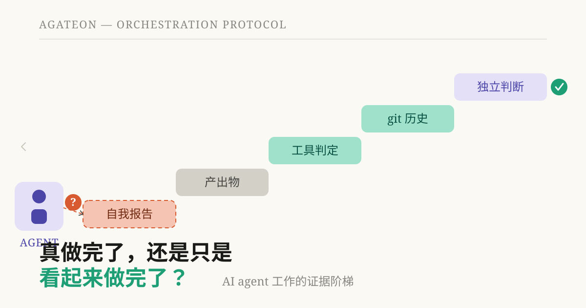
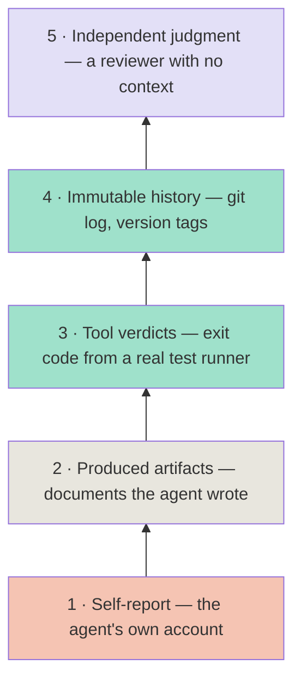
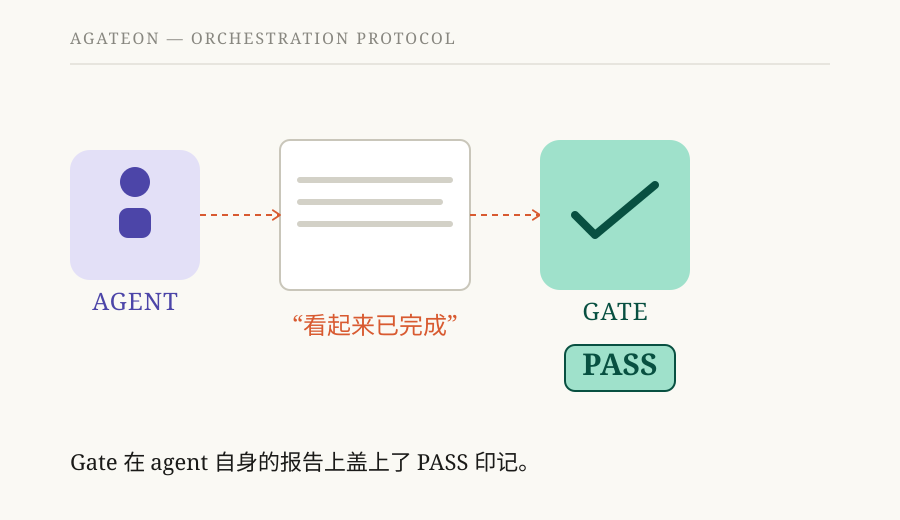

# 完成了吗，还是看起来完成了？AI-agent 工作成果的证据阶梯

我们之前的文章是对一个安全网的事后剖析，该安全网依赖于 agent 的诚实，但它并不诚实。retry counter 是一个本应由 agent 填写的字段，但在四次实际失败中它始终为空，因此安全网从未触发。本文是这一教训的通用版本：一个用于判断 agent 工作何时真正完成的证据阶梯，以及一份用于发现你自己的 gates 中隐藏的“自我报告”的检查清单。

我所说的 *gate*，是指工作阶段在被视为完成之前必须通过的任何检查——没有 gate，就没有进展。事后剖析中的安全网就是一个读取 retry counter 的 gate；本文要回答的问题是：如何区分读取真实证据的 gate 和读取 agent 自述的 gate。

**TL;DR** — 当 agent 说一个阶段完成了，问题从来不是“它是否停止了输出”。而是“你可以指出什么并重新运行什么？”证据按阶梯分级。最低的一级——agent 自己的陈述——几乎毫无价值，因为它可能被遗漏、伪造，或者仅仅是自信地出错。最高的一级——不可变历史和独立判断——锚定在现实世界中，而不是 agent 内部。本文结合 Agateon 的实际案例对这些阶梯进行了分级，指出了阶梯可能撒谎的两种方式，并提供了一份五问审计清单，你可以用它来检查任何控制 agent 进展的机制。

## “完成”背后的问题

问问任何通过 coding agent 运行过长期任务的人：你怎么知道它完成了？诚实的回答通常是“agent 说是这样，而且 diff 看起来很合理”。这不是质量信号——这是被审查方提交的报告，它在三个方面会失效：

- **遗漏 (Omission)** — agent 根本没有记录发生了什么。没有报错；某个字段只是保持为空。依赖该字段的安全网永远不会触发，也没人会注意到。
- **伪造 (Fabrication)** — agent 编造了一份看起来合理的、并未实际发生的工作记录，或者美化了事件版本。
- **自信地出错 (Confident error)** — agent 并没有撒谎；它只是对自己做出的判断是错误的。LLM 会对自己所做的事情生成自信的总结，但这些总结与磁盘上的实际内容并不匹配。

共同点是：这三种情况完全存在于 agent 的“脑海”中。解决方法是让“完成”意味着存在于 agent 脑海之外的东西——你可以重新运行的证据，由工具或现实世界产生的证据，且 agent 无法悄悄篡改的证据。

## 证据阶梯

我们运行通过 gates 的任务已经足够久了，足以停止询问“这是否是证据？”并开始询问“这个证据处于哪一级阶梯？”以下是我们使用的阶梯，从最弱到最强：

### 第 1 级 — 自我报告 (Self-report)

*“看起来完成了。”* *“我运行了测试。”* 这是 agent 对其工作的自我陈述，由于上述三个原因，它本身毫无价值。开启整个项目的错误就在于将第 1 级视为证据。

### 第 2 级 — 生成的工件 (Produced artifacts)

这是 agent 编写并经过*结构性*检查的文档。Agateon 的 requirements gate 位于此处：它会读取 agent 生成的需求文件，并检查其中是否至少包含一个 BDD（行为驱动开发）验收标准，且不存在未解决的 `NEED_CONFIRM` 项。[`agate/scripts/check-scope-resolved.py`](https://github.com/randomgitsrc/agateon/blob/main/agate/scripts/check-scope-resolved.py) 采用相同的模式——当输出包含 `[SCOPE+]` 时，它会查找 `[SCOPE_RESOLVED]` 标记。

这一层级（Rung）既有用又存在严重的局限性。该工件（artifact）之所以存在，是因为 agent 创建了它，而其*判定结果*（verdict）不过是贴了标签的 agent 自述。Agent 可以编写一个与代码不匹配的 BDD 标准，但 gate 依然会通过。Rung 2 证明了文档具有正确的*格式*，而非正确的内容。

### Rung 3 — 工具判定

Gate 本身会执行一个真实的工具并读取其反馈。Agateon 的 test-first gate [`agate/scripts/check-tdd-red.py`](https://github.com/randomgitsrc/agateon/blob/main/agate/scripts/check-tdd-red.py) 会运行实际的测试执行程序并读取退出代码和输出——它能够区分“测试失败是因为缺少实现”（正确的红灯）与“测试失败是因为测试代码本身损坏”（测试中的 bug）。验证 gate 会运行声明的测试命令并检查其是否以 0 退出，而 [`agate/scripts/agate-gate-p5-count.py`](https://github.com/randomgitsrc/agateon/blob/main/agate/scripts/agate-gate-p5-count.py) 要求必须有实际数量的声明命令，因此该 phase 不能通过不声明任何内容来通过。

这是巨大的进步：由 agent 无法控制的工具来做决定。但这里有一个永远无法消除的隐患——*是 agent 选择的工具和命令*。如果 gate 运行的是 agent 声明的任何命令，而 agent 声明了 `echo done`，那么 gate 就会运行 `echo done`。Rung 3 的强度取决于现有的 test suite，而该 suite 是 agent 在任务早期编写的。

### Rung 4 — 不可变历史

这些事实独立于 agent 的编写内容而存在于现实世界中——例如 git 历史、提交 SHA、版本标签。Postmortem 的修复就属于此类：[`agate/scripts/check-state-transition.py`](https://github.com/randomgitsrc/agateon/blob/main/agate/scripts/check-state-transition.py) 不再信任 agent 填写的重试计数器，而是读取提交历史，查看 phase 是否确实发生了回退，并将其与重试记录进行比对——一次带有空计数器的真实回滚会导致提交被拦截。[`agate/scripts/check-protocol-consistency.py`](https://github.com/randomgitsrc/agateon/blob/main/agate/scripts/check-protocol-consistency.py) 在发布时也使用了同样的技巧：其 CHECK 7 会运行 `git describe --tags`，并将 README 中的版本徽章与实际的最新标签进行比对，这样 agent 就无法通过编辑 README 来伪造当前版本。

对于“X 是否发生”这类问题，这是最高层级的检查，因为证据在 agent 接触任何事物之前就已经存在于版本控制系统中，且如果不留下痕迹就无法进行省略。它也是最狭窄的——它只了解 git 所了解的内容。

### Rung 5 — 独立判断

对于任何命令都无法回答的问题——*这个设计对吗？值得发布吗？*——最强有力的检查是由不了解工作背景的评审者进行的。本文在发布前就经过了这样一轮检查：一位没有作者背景的独立评审者根据书面标准对其进行了核查。Agateon 对命令无法判断的工作采用了同样的模式，我们正致力于将独立判断从手动步骤转变为一等公民 gate（[`TAG0020-independent-judge`](https://github.com/randomgitsrc/agateon/tree/main/agate-workspace/tasks/TAG0020-independent-judge)）。

Rung 5 不是自动化的，这正是其核心所在：它是唯一旨在由未受工作过程影响的人（或全新的 agent）进行判断的层级。

## 层级失效的两种方式

### 遗漏

锚定在 rung 1 或 2 的机制可以通过一个空字段被静默禁用。Postmortem（事后分析）案例是一个典型的例子：一个由 agent 写入、用于触发人工暂停的重试计数器，在四次真实故障中均被留空。没有任何报错。该机制仅仅是从未触发，安全网也因此失效。修复方案不是“让 agent 记录得更仔细”，而是将触发器上移至 rung 4，在该层级，无论 agent 是否写入，事实本身已经在 git 中存在。

### Theater（表演性验证）

更隐蔽的故障是：看起来像更高 rung 的证据，实际上是 agent 穿着伪装服的自我报告。一个检查“agent 是否编写了看起来合理的报告”的 gate 就是 Theater——它是伪装成 rung 2 的 rung 1。同样的弊病也会感染 rung 3：如果 agent 选择 gate 要运行的命令，“gate 运行真实命令”就会悄悄变成“gate 运行 agent 声明的任何内容”。只有当*声明*本身也被 gated 时，检查才是真实的——通过要求执行固定数量的命令、通过运行试图声明空操作（no-op）的对抗性测试、或者通过人工审查声明的内容来实现。

我们应用的规则是：对于每一个 gate，都要追踪证据的作者。如果作者是被 gated 的 agent 本身，那么无论标签看起来多么正式，你都处于 rung 1 或 2。

## 审计清单

如果你正在构建 agent 工具，请针对每一个用于控制进度、部署或安全性的机制，对照以下五个问题进行检查：

| # | 问题 | 为什么重要 | 如何检查 |
|---|----------|----------------|--------------|
| 1 | 该机制到底检查了什么？ | “检查工作是否完成”掩盖了它读取的具体证据。 | 写下具体的文件、字段、命令、退出代码。 |
| 2 | 谁产生了这些证据——是 agent、工具还是外部世界？ | 证据的作者就是信任边界。 | 追踪它：谁写了这个文件、设置了这个字段、拥有这个日志？ |
| 3 | agent 能否在不被发现的情况下忽略它？ | 忽略会导致静默失败——机制只是从未触发。 | agent 能否在留空或缺失该项的情况下完成 phase 且依然通过？ |
| 4 | agent 能否在不被发现的情况下伪造它？ | 看起来合理的伪造就是 Theater。 | 一个伪造但看起来合理的版本能通过检查吗？ |
| 5 | 该证据是否真的与你所声称的内容相关？ | “测试通过”≠“这是用户想要的”。 | 如果这通过了，它所支持的声明是否真的得到了支撑？ |

问题 5 的核心值得深思，因为大多数“验证”设置都是在这里悄悄放弃的：一个 rung 3 的 test suite 证明了代码符合*测试*的预期，而这些测试是由编写代码的同一个 agent 编写的。这比 rung 1 确实有了进步，但并不能证明产品就是正确的。这个差距正是 rung 5 和人类介入的目的所在，假装不是这样，就是“已验证”的交付物变成“当时看起来没问题”的事故的原因。

## 我们所处的真实位置

将该阶梯应用于我们自己的 gates，以便你准确了解信任存在于何处，以及不存在于何处：

| Gate | Rung | What it does | What's still open |
|------|------|--------------|-------------------|
| Requirements | 2 | 检查文档是否包含 ≥1 个 BDD 标准，且无未解决的 `NEED_CONFIRM` | Agent 可能会编写与代码不匹配的标准 |
| Test-first (P3) | 3 | 运行真实的 test runner；区分测试 Bug 与缺失的实现 | 取决于 Agent 所写测试的质量 |
| Verification (P5) | 3 | 运行声明的测试命令，检查退出码是否为 0，要求有真实的命令计数 | 命令由 Agent 声明；可能存在空操作声明，通过对抗性测试缓解 |
| State & retry | 4 | 阻止非法的 phase 转换；重试检测锚定于 git 历史记录 | 仅能获知 git 已知的信息 |
| Release consistency | 4 | README 版本徽章必须与实际最新的 git tag 一致 | 无法捕获错误但一致的版本号 |
| Design quality | 5 | 由人工或独立的 Agent 审查命令无法判断的内容 | 仍部分依赖人工；将其设为一等公民是 `TAG0020` |

在此郑重声明：该阶梯衡量的是*进度声明*，而非*产品质量*。一个任务可以通过所有 gate，但最终交付的东西可能依然无人问津。我们并不声称我们的 gate 位于阶梯的最顶端。我们主张的是，该阶梯能让每个 gate 所处的层级变得清晰可见——而这种可见性正是真正的安全特性，因为当你明确某个 gate 处于第 2 层时，你会投入人工关注；而当你*误以为*某个 gate 处于第 4 层时，你就会盲目信任它。

## 问题的一般形态

如果你正在构建任何由 AI agent 输出驱动 gate、部署或安全机制的系统，请进行这次五分钟审计：询问证据是由谁生成的、Agent 是否可能遗漏或伪造证据，以及它是否真的与你所声称的内容相关。最容易获得的收益通常是发现那些伪装成第 3 层的第 2 层检查；而最有价值的做法是将任何与安全相关的内容锚定在第 4 层——即版本控制中已存在、且 Agent 无法悄悄剔除的事实。

这就是 [Agateon](https://github.com/randomgitsrc/agateon) (MIT) 背后的理念：让“完成”意味着你可以重新运行验证，而不是仅仅听信他人所言。之前的文章记录了促成该项目的失败案例（[我们的 AI 安全网依赖于 Agent 的诚实，但它并不诚实](/zh/blog/20260826/post-01-retry-self-authorization)）以及项目的形态（[像构建系统验证编译器一样验证 AI agent](/zh/blog/20260827/post-02-agateon-intro)）。上述所有 gate 均在 [`agate/scripts/`](https://github.com/randomgitsrc/agateon/tree/main/agate/scripts) 中，二十五个历史任务记录在 [`agate-workspace/tasks/`](https://github.com/randomgitsrc/agateon/tree/main/agate-workspace/tasks) 中——内容未经任何删减。
