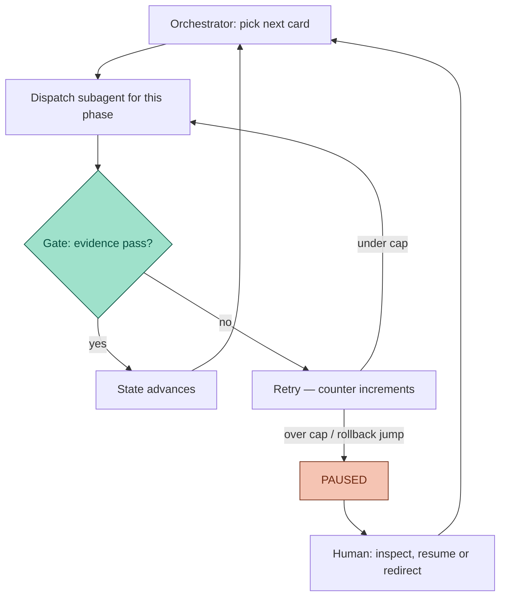

你雇了个 agent 干活。结果一整天，你都守在旁边看它——不是它需要你看，是你不敢把眼睛挪开。这份警惕是笔税，多数 agent 工作流按百分之百收。

先说 gate 是什么。一个 phase 的活，得先过某道检查才算做完；没过 gate，就不许往下走。gate 能不能保证工作正确，上一篇文章讲过了，这里不重复。这篇讲的是一道真管用的 gate 在正确性之外还买到什么：让你敢把视线挪开——也就是标题里说的可以不看权（the right to look away）。

## TL;DR

- 验证不了的 agent，你就不敢放手。不可验证的自主等于没有上限的风险——模型再强，你的注意力也得一直押在上面。
- Agateon 把“什么时候需要人”写成明确的状态机事件：`PAUSED`（重试顶到上限、phase 回退）、`NEED_CONFIRM`（悬而未决的需求疑问）、scope 疑问，以及发布决定。其余的事，明说不归你管。
- 事件之间没人值守：orchestrator 给每个 phase 派一个新 subagent，gate 查证据，状态自己往前走。
- 注意力按风险分，不按先来后到分：风险分是算出来的，决定任务走精简/标准/完整哪一档流程；想走比算出来更轻的一档，会被 fail-closed 拦下。
- 丑话在前：gate 读到假证据，什么也解放不了。自主性拿可验证性换，不拿信任换。

## 保姆税

盯 agent 的老办法有两种，两种都不行。

第一种是全程盯。撑不住：人的警觉几分钟就掉线，agent 一干就是几个小时。第二种是信总结。你读最终报告，agent 说做完就是做完。这么做的代价，两篇之前的复盘文章算过账——agent 汇报成功，它自己的状态文件写的却是另一回事，读总结的人毫无办法分辨。

两种办法共用同一个毛病：“活儿没问题”这个信号，来自被监督的那一方。盯也好，信也好，注意力反正付出去了，哪一种都换不来确定性。

出路不在盯得更紧，也不在信得更多，而在让进展变得程序可读。如果“这个 phase 做完了”是一句脚本可以去核的话，核的依据又是 agent 改不了的证据，第三种选择就出现了：你不盯，也不信。机器走到一个它自己不肯拍板的状态，会来叫你。

## 要不要叫人，机器说了算

在 Agateon 里，人的注意力不是 agent 一觉得没底就能来要的东西。它是状态机在几个特定时刻、按设计花掉的。四类事件会把你拉进来：

| 事件 | 触发条件 | 要你做什么 |
|-------|---------|---------------------|
| `PAUSED` | 重试次数顶到 phase 上限（`P1:3, P2:3, P3:2, P4:3, P5:2, P6:2, P7:2, P8:2`），或 phase 一次回退两步以上——真实事故（T019）：agent 悄悄把前面的活重做了一遍 | 看看卡在哪；决定继续、改道，还是杀掉 |
| `NEED_CONFIRM` | P1 里悬而未决的需求疑问——三值：`[NEED_CONFIRM]` 会卡住，`[SUGGEST:]` 不会，`[NO_NEED_CONFIRM]` 表示确认过没有 | 回答那个不许 agent 自己猜的问题 |
| scope 疑问 | scope 标记会一直开着，直到人来把它关成 `[SCOPE_RESOLVED]`；标记开着，gate 就不放行 | 拿主意：顺手做出来的活算不算在内 |
| P8 release | 活儿自称可以发布了 | 唯一不能托付出去的决定：发 |

除此以外的事，都不归你管。事件与事件之间，这个循环没人看着照样转：

这个循环里没有人——是故意的，不是漏了。orchestrator 自己不写代码；它每个 phase 派一个新 subagent，然后听 gate 怎么说。gate 也不听 agent 对自己工作的评价——它看 exit code、文件 diff 和检查脚本。人想进场，只有上面那四扇门。

## 注意力按风险分，不按队列分

“事件不触发就不归你管”，这句话要成立，前提是风险真高的时候事件真的会触发。便宜任务和危险任务不该走同一套流程——同一串 phase 和 gate——可你也不想亲自给每个任务做分诊，判断谁便宜谁危险。

所以分诊交给算法。每个任务按五个信号（含改动规模和影响面）算出一个风险分，大致在 4–12 之间。分数按“取最大”规则映射到流程档位：任何一个信号高，就走完整流程；全部低，才有资格当精简流程的候选；中间情形，走标准流程。精简候选还得自证配走快车道：交一份耦合检查清单，写明白自己跳过了哪些风险，phase 计划里必须保留验证和验收两个 phase（流程可以精简，验证永远不精简——能砍的只有测试设计和一致性交叉检查），而且算出来的分数得跟它的说法对得上。

这个检查的方向才是关键。你随时可以宣布走比分数要求更重的流程；想走更轻的，fail-closed 直接拦——gate 返回 exit code 1，任务原地不动。换成注意力的话说：快车道存在，但走它的资格来自证据，不是来自自信。低风险的活儿你不用管，自己流过去；有风险的活儿，会在要紧的 gate 上把你拽进来。

## 崩了就是一次暂停（有一点要补充）

上一篇有条评论，把状态设计的价值说得比我们自己还到位：“只要 gate 写的是真实 exit code 和证据文件，中断就从信任问题变成了调度问题。大多数 agent 演示恰恰在这一步含糊。”

我们同意，但要补一条。带版本的状态文件（`active-tasks.md`、`.state.yaml`）能让“干到哪了”可审计——会话被杀、断电、上下文窗口顶到天花板，都算；下一次运行读一下状态文件，从机器停下的地方接着干。但它不能让“干出来的活”变得可信。恢复之后 gate 照样重跑：位置是个调度问题，有效性仍然是个 gate 问题。

retry-counter 那次事故是反面教材。状态文件带版本，恢复也正常，安全网却始终没响——因为它读到的证据，是 agent 自己讲的故事。版本化让你不用再盯“干到哪”；“做得对不对”能不能不盯，取决于证据质量。

## 这套东西哪里不灵

- **gate 读到假证据，什么也解放不了。** 它只是把事故挪到你看不见的时刻。前面说的一切都继承上一篇的证据阶梯（evidence ladder）：rung-2（第二级，产物靠自报）的 gate 也想谈“自主”，那是多绕几步的表演。可以不看权有几分真，取决于你的 gate 站在哪一级。
- **`PAUSED` 不免费。** 一个反复顶到上限的任务，等于把“一个被盯着的 agent”换成“一个反复响的闹钟”。表里那组上限数字是我们还在调的估计值；真实数据——每个事件在我们 25 个任务里实际触发了多少次——等认真收完，值得单独写一篇。
- **scope 疑问每次都得你来。** 这算特性——机器在承认哪些判断它拒绝替你做——但“可以不看”不等于“彻底甩手”。协议不许 agent 独自回答的那几类问题，正好就是你随叫随到的范围。

## 说到底

agent 的自主性，通常被当成信任问题来讨论：你有多信这个模型？我们觉得它是笔账：此刻有多少经过验证的进展，验证失败时状态机怎么动作？信任会被一个个漂亮 demo 磨掉；验证过的步骤记在账上，磨不掉。

机器能在你不在场时往前走，不是因为你信它，而是因为你不必信。它独自迈出的每一步，都是 gate 已经收下的那一步；它独自迈不出的每一步，都落在四扇设计好的门里，而不是涌进你的收件箱。这笔交易就是：你不再持续地付注意力，改成在决策点付——注意力放在那儿才真正有用。

想看那件让我们确信“信任这条路走不通”的事，去读[那篇复盘](/zh/blog/20260826/post-01-retry-self-authorization)。本文写的系统是 [Agateon](https://github.com/randomgitsrc/agateon)（MIT），[介绍在这](/zh/blog/20260827/post-02-agateon-intro)；上面那条警告背后的证据阶梯，见[这一篇](/zh/blog/20260828/post-01-evidence-ladder)。状态机（[`check-state-transition.py`](https://github.com/randomgitsrc/agateon/blob/main/agate/scripts/check-state-transition.py)）、scope gate（[`check-scope-resolved.py`](https://github.com/randomgitsrc/agateon/blob/main/agate/scripts/check-scope-resolved.py)）、流程路由（[`check-routing.py`](https://github.com/randomgitsrc/agateon/blob/main/agate/scripts/check-routing.py)、[`agate-risk-score.py`](https://github.com/randomgitsrc/agateon/blob/main/agate/scripts/agate-risk-score.py)）都在 [`agate/scripts/`](https://github.com/randomgitsrc/agateon/tree/main/agate/scripts) 里；跑过这个循环的 25 个任务在 [`agate-workspace/tasks/`](https://github.com/randomgitsrc/agateon/tree/main/agate-workspace/tasks)，写文章时一个都没删。
