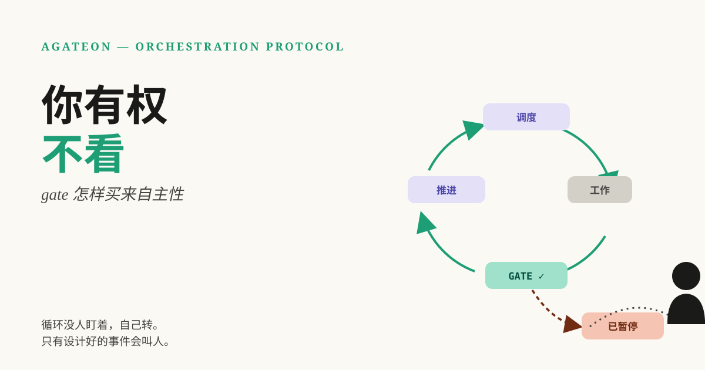
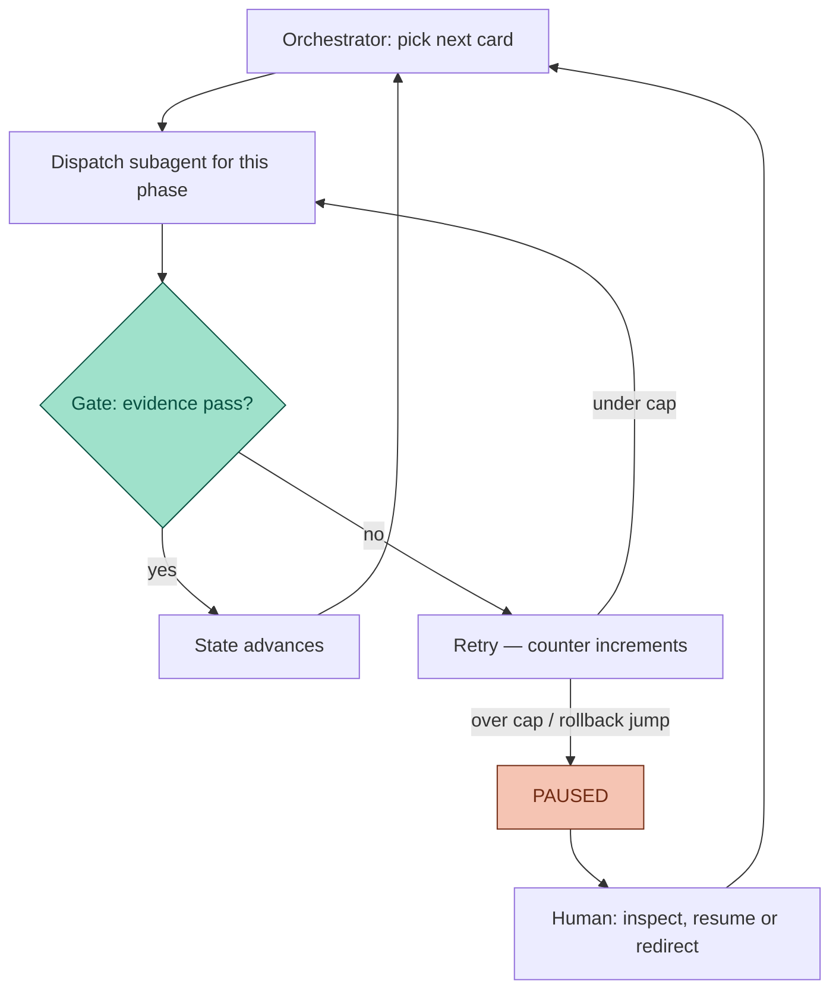
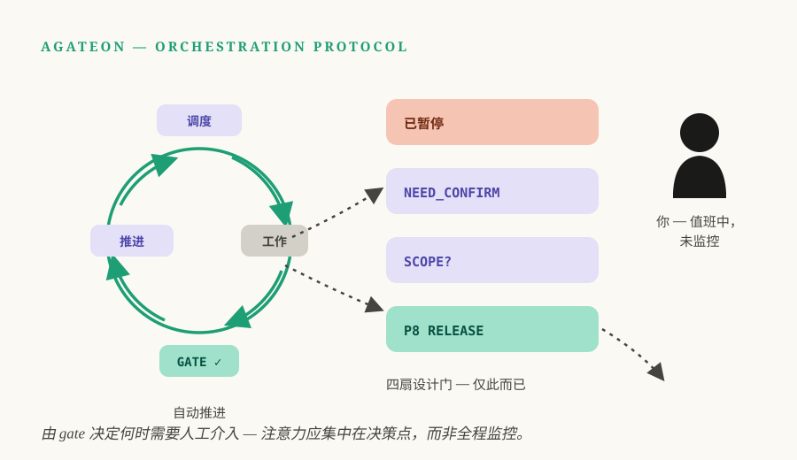

你雇佣了一个 agent 来完成工作。现在，你整天盯着它工作——不是因为它需要你，而是因为你不敢移开视线。这种警惕是一种“税”，而大多数 agent 设置的征收率都是百分之百。

我所说的 *gate*，是指工作阶段在被认定为完成之前必须通过的任何检查——没有 gate，就没有进展。本文讨论的不是 gate 是否能确保工作正确（上一篇文章已经讨论过这一点），而是讨论一个有效的 gate 除了正确性之外还能带来什么：让你不再需要时刻盯着。

## TL;DR

- 无法验证的 agent，你就不敢放手不管。不可验证的自主性意味着无限制的风险，因此无论模型能力多强，你的注意力始终是被绑架的。
- Agateon 将“何时需要人工介入”转化为显式的状态机事件：`PAUSED`（重试上限、回滚跳转）、`NEED_CONFIRM`（未解决的需求）、范围问题以及发布决策。除此之外的一切，明确与你无关。
- 在事件之间，循环无人值守运行：orchestrator 为每个 phase 分派一个新的 subagent，gate 检查证据，状态随之推进。
- 注意力是按风险而非队列分配的：计算出的风险评分会将任务路由到轻量级/标准/全流程路径，且试图选择比计算结果更轻的路径会被“故障安全（fail-closed）”机制拦截。
- 诚实的警告：如果 gate 读取的是虚假证据，它无法带来任何解放。自主性是用可验证性换来的，而不是靠信任。

## 监护税（The babysitting tax）

监督 agent 有两种经典方式，但都行不通。

第一种是全程监控。这无法扩展，且人类并不擅长此道——警惕性在几分钟内就会衰减，而 agent 的工作往往持续数小时。第二种是信任总结：你阅读最终报告，agent 告诉你它完成了。两篇前文的事后分析展示了这样做的代价——agent 报告成功，但其自身的状态文件却显示并非如此，而阅读总结的人类对此毫无察觉。

这两种方法都有一个共同的缺陷：工作正常的信号来自被监督方。无论是监控还是信任，你都在付出注意力，且这两种付出都无法为你换来确定性。

出路既不是更严密的监控，也不是更多的信任。而是让进度对程序而言是可读的：如果“该 phase 已完成”是一个脚本可以根据 agent 无法篡改的证据进行核实的声明，那么第三种选择就出现了——你不监控，也不盲目信任。只有当机器进入它无法自行解决的状态时，你才会收到通知。

## 机器决定何时需要你

在 Agateon 中，人类的注意力不是 agent 在感到不确定时随时索取的资源。它是状态机在特定、预设的时刻才会消耗的资源。以下四类事件会触发人工介入：

| 事件 | 触发条件 | 你需要做什么 |
|-------|---------|---------------------|
| `PAUSED` | 重试次数超过了 phase 上限 (`P1:3, P2:3, P3:2, P4:3, P5:2, P6:2, P7:2, P8:2`)，或者 phase 回退了两次或以上——这属于真实事故 (T019)，即 agent 在未告知的情况下重复了之前的工作 | 查看卡住的原因；决定是恢复、重定向还是终止 |
| `NEED_CONFIRM` | P1 中存在未解决的需求问题——三值逻辑：`[NEED_CONFIRM]` 表示阻塞，`[SUGGEST:]` 表示不阻塞，`[NO_NEED_CONFIRM]` 表示记录不存在该需求 | 回答 agent 被禁止猜测的问题 |
| Scope question | Scope 标记会一直保持开启，直到人工将其关闭为 `[SCOPE_RESOLVED]`；在开启状态下，gate 会拒绝通过 | 决定发现的工作内容是否属于范围之内 |
| P8 release | 工作声称已可发布 | 唯一不能委派的决策：发布它 |

除此之外的事情与你无关。在事件发生期间，循环会在无人值守的情况下运行：

设计上，该循环中没有人类参与，这并非疏忽。orchestrator 从不亲自编写代码；它为每个 phase 分派一个新的 subagent，并读取 gate 的反馈。反过来，gate 从不读取 agent 对工作的评价——它只读取退出代码、文件差异和检查脚本。人类介入的唯一途径就是上述四个“入口”。

## 注意力分配取决于风险，而非队列

“在事件触发前无需理会”这一原则，只有在风险高时确实能触发事件才安全。廉价任务和危险任务不能采用相同的流程（即相同的 phase 和 gate 序列），但你也不希望亲自对每个任务进行分类以决定其优先级。

因此，分类是计算出来的。每个任务都会根据五个信号（包括变更规模和影响范围）获得一个风险评分（大致在 4–12 之间）。该评分通过“最大值规则”映射到流程等级：任何高风险信号意味着完整流程，全低风险意味着可以作为“精简路径”的候选，介于两者之间则为标准流程。精简路径的候选任务必须证明其有资格走快速通道：提供耦合检查清单、明确声明所跳过的风险、提供仍包含验证和验收阶段的 phase 计划（精简流程绝不会精简验证环节——仅测试设计和一致性交叉检查可能会被省略），以及与声明相符的计算评分。

这种检查的方向性是核心所在。你可以随时声明比评分要求“更严格”的流程；但声明“更宽松”的流程则会被 fail-closed 机制拦截——gate 返回 1，任务停止运行。从注意力管理的角度来看：快速通道确实存在，但它是靠证据赢得的，而不是靠自信声明的。低风险工作无需你介入即可流转；高风险工作则会在关键的 gate 处将你拉入流程。

## 崩溃即暂停（仅有一处修正）

上一篇文章的一位评论者比我们更好地总结了状态设计的收益：“如果 gate 能写入真实的退出代码和证据文件，那么中断就变成了一个调度问题，而不是信任问题。这正是大多数 agent 演示中依然避重就轻的部分。”

我们同意，但有一处修正。版本化状态（`active-tasks.md`，`.state.yaml`）使得*位置*可审计——无论是会话被终止、断电，还是上下文窗口达到上限；下一次运行时，系统会读取状态文件并从机器中断的地方继续。但这并不能让*工作*变得可信。恢复时，gate 会重新运行；位置是一个调度问题，但有效性仍然是一个 gate 问题。

retry-counter 事件就是一个警示案例。状态文件已版本化，恢复功能正常，但安全网从未触发——因为它读取的证据是 agent 自己的一面之词。版本化让你不再需要关注*在哪里*；只有证据质量才能让你不再需要关注*是否*。

## 真正失效的地方

- **读取虚假证据的 gate 无法带来任何解放。** 它只是将灾难推迟到你未关注的时刻。上述所有内容都继承了上一篇文章中的证据阶梯（evidence ladder）：一个处于 rung-2（自报告制品）的 gate 所换取的“自主性”不过是多此一举的作秀。你能够“移开视线”的权利，取决于你的 gate 处于哪一个阶梯。
- **`PAUSED` 并非免费。** 一个不断触及上限的任务，会将一个受监控的 agent 变成一个反复出现的中断。表中的上限数值是我们仍在调整的经验性猜测；真实数据——即每个事件在我们 25 个任务中实际触发的频率——在妥善收集后值得单独写一篇文章。
- **范围界定问题依然需要你，每一次都是。** 这是一种特性——这是机器在承认它拒绝做出哪些判断——但这意味着“移开视线”并不等于“彻底离开”。对于协议明确禁止 agent 独自回答的那类问题，你必须随时待命。

## 总体形态

agent 的自主性通常被视为一个信任问题：你有多相信模型？我们认为这是一个核算问题：目前有多少已验证的进展？当验证失败时，状态机该如何处理？信任会随着每一次令人印象深刻的演示而衰减；但已验证步骤的核算不会。

机器之所以能在没有你的情况下推进，不是因为你信任它，而是因为你不需要信任——它独自迈出的每一步都是 gate 已经接受的步骤，而它无法独自迈出的每一步都会导向四个预设的出口之一，而不是塞进你的收件箱。这就是全部的交易：你停止持续关注，转而在决策点投入注意力，因为在那儿注意力才真正有价值。

如果你想了解那个让我们意识到“信任版本”行不通的失败案例，请参阅 [postmortem](/zh/blog/20260826/post-01-retry-self-authorization)。本文描述的系统是 [Agateon](https://github.com/randomgitsrc/agateon) (MIT)，[此处](/zh/blog/20260827/post-02-agateon-intro)有介绍；警告背后的证据阶梯在[此处](/zh/blog/20260828/post-01-evidence-ladder)。状态机（[`check-state-transition.py`](https://github.com/randomgitsrc/agateon/blob/main/agate/scripts/check-state-transition.py)）、范围 gate（[`check-scope-resolved.py`](https://github.com/randomgitsrc/agateon/blob/main/agate/scripts/check-scope-resolved.py)）以及仪式路由（[`check-routing.py`](https://github.com/randomgitsrc/agateon/blob/main/agate/scripts/check-routing.py)，[`agate-risk-score.py`](https://github.com/randomgitsrc/agateon/blob/main/agate/scripts/agate-risk-score.py)）均位于 [`agate/scripts/`](https://github.com/randomgitsrc/agateon/tree/main/agate/scripts)，而经过该循环运行的 25 个任务位于 [`agate-workspace/tasks/`](https://github.com/randomgitsrc/agateon/tree/main/agate-workspace/tasks) ——撰写本文时未做任何删减。
