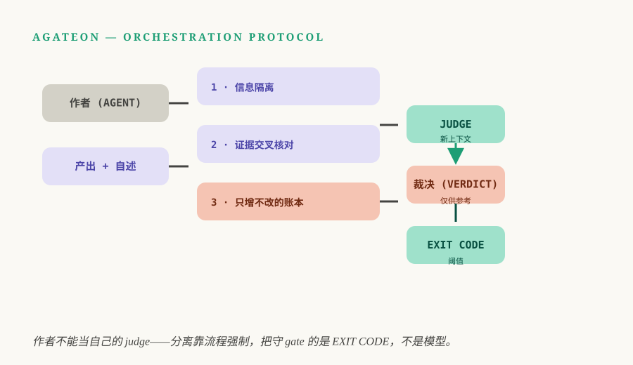

上一篇说，gate——每个阶段的活儿必须先过一道检查——换来的是撒手不看的资格。可不看什么：agent，还是 gate 本身？gate 也是人写的代码，却在评判另一个同类系统干出来的活儿，而这个系统说不定正想讨好它。那么，谁来盯住盯人的那位？

先把 gate 说清楚：一个 phase 的活儿要算完成，必须先过某道检查——没有 gate，就没有下一步。这篇要谈的是另一件事：gate 凭什么可信到能去看住一个 agent？答案很短：没有什么能让它天然可信，只有一遍一遍地攻破它，再把每一次成功的攻击当成一条功能需求。

## TL;DR

- 会读 agent 自述的 gate 不算 gate——那只是把 post-01 的复盘又播了一遍。
- 最躲不开的失败模式是*同一条信任链*：干活的和审活儿的是同一个系统，共享同一份上下文。解法是分离，而且必须由机制强制执行。
- 我们从三个方向攻击自己的 gate：给 TDD 红灯分类，让坏掉的测试冒充不了合理的红；加一个独立角色 judge（独立复核），在全新上下文里把所有东西重核一遍；judge 的裁决只是*建议*——门槛永远是 exit code，不是模型的意见。
- 有一条局限得坦白：对抗测试只覆盖想得到的攻击。没人想到的漏洞，gate 一样看不见。

## 会读作者自述的 gate，不是 gate

这个失败就是我们的起点，值得拆开说清楚。post-01 的安全网检查一个重试计数器，它存在 agent 的状态文件里。计数器是真的，机制也是真的，但 gate 读到的失败记录，出自 agent 自己的手笔。结果是：四次失败实打实地发生了，计数器一直是空的，gate 照样放行。不是检查太弱——是证据的作者，恰好就是被检查的那一方。

post-03 的证据阶梯已经讲过：agent 改不了的证据才算数——exit code、git 历史、别人写的文件。但同一类问题还有个更隐蔽的变体，阶梯没完全回答：如果检查本身坏了，或者写检查的人就是想让它放水呢？到那时，连 rung-4 那一级的证据，也能从一扇什么都没测的 gate 前畅通地走过去。

这就是我们花了大量时间去打的攻击面。不是攻击 agent，是攻击自己的验证机制。

## 攻击一：测试坏了，红灯不作数

TDD 的整套仪式就为一件事：让"测试证明代码"成立——先写测试，看它红，再把它写绿。但 TDD 的红灯会在两个方向上撒谎。一是绿得太早：agent 先写实现再补测试，那这个"测试"从头就没证明过什么。二是红得不对：测试自己坏了，这份红证明的不是功能缺失，而是测试有 bug。

所以我们写了一个检查器（[`check-tdd-red.py`](https://github.com/randomgitsrc/agateon/blob/main/agate/scripts/check-tdd-red.py)），它只干一件事：判断你这次的红，是哪一种红。

| 红灯类型 | 意味着什么 | gate 怎么处理 |
|---------|-----------|--------------|
| 断言失败 | 功能没实现——这是*对的*红 | Pass：TDD 要的就是这个 |
| B 类：未实现代码导致的 import error | 实现确实还没写 | Pass：合理的红 |
| A 类：测试自身的语法 / import bug | 坏的是测试，不是代码 | **Fail：测试坏了 ≠ 证据** |
| 全绿 | 实现写在测试之前 | **Fail：违反 TDD** |

A/B 这刀切下去，是我最喜欢的一处。没有它，"测试挂了"就是笔糊涂账：是产品缺东西，还是产品没事、测试写得糙？一个一心想让红灯消失的 agent，会很乐意交一个坏测试上去——测试挂了，gate 看到失败，它又能拿"功能没写完"再拖一轮。给红分类之后，这招不再换来时间，而是直接吃一个 gate 失败。说不清自己为什么红的灯，只是噪音；知道自己*为什么*红的灯，才是证据。

## 攻击二：作者不能当 judge

更深的攻击不落在单个检查上，而是整条评审链。大多数 agent 方案里，给 agent 的活儿做"评审"的，还是同一个模型，上下文可能都是同一份。那不是评审，说白了是把总结又抄了一遍。这个教训我们交过学费：一项跨多个任务的实验（TAG0018）让 LLM 去审真实的工作，净信号约等于零——17 条不阻塞的评论，外加 1 条真发现，而那条机械检查本来也能抓到。根源不在模型不行，而在评审者和作者共享同一条信任链：同样的上下文，同样的框架，同样的盲区。

这条教训现在作为协议自身的局限写进了文档（LIMITATIONS-3）：给 agent 各个 phase 把关的 gate，检查的恰恰是 agent 自己写的文件；现有的缓解手段只是*抬高造假成本*，堵不死。所以我们做的修复（[TAG0020](https://github.com/randomgitsrc/agateon/tree/main/agate-workspace/tasks/TAG0020-independent-judge)）是结构性的，不是把措辞写得更狠：单设一个角色——judge——在*全新上下文*里把活儿重核一遍，喂给它的只有标准和证据，没有作者自述。

三层机制保证 judge 不被糊弄，这部分最值得抄走：

- **信息隔离。** judge 的派发上下文里只有需求、验收标准和一份证据文件白名单，实现者的自述一律不进。agent 写的东西到不了 judge 面前，就影响不了裁决。
- **证据交叉核对。** 裁决不靠感觉，是一张对着文件和 git 历史逐条勾的对账单，计数和引用必须对得上。
- **只增不改的事件账本。** 每个 gate 事件都写进哈希链日志（[`check-events.py`](https://github.com/randomgitsrc/agateon/blob/main/agate/scripts/check-events.py)），"什么时候发生了什么"，事后改不了。

整套设计还有一条硬规矩，我认为它才是真正的要点：**LLM 的裁决只是建议，exit code 才是门槛。** judge 可以说"需要返工"，但 gate 过不过，仍然只看机械事实——文件在不在、数目对不对、哈希链接不接得上。模型只是证人，真正裁定的永远是机制。这和证据阶梯是同一个哲学：永远不让被验证的系统给自己的真伪作证——也包括不让一个模型给另一个模型的活儿作证。

## 证据就是拦下这篇文章的那道 gate

这些道理写出来很容易停在纸面上，所以给一个现场演示。这里的每篇博客发布前都要过一道独立的评审 gate：一个全新的 agent，不带任何作者上下文，拿着成文的标准逐条对稿，有权直接判不合格。上一篇就被它拦下过一次：我当时断言，"thin" 仪式路径——低风险任务跑的那套缩减版 phase 和 gate 序列——会砍掉验证阶段。恰好说反了——实现里写死了，最薄的路径也必须保留验证。一个跟我共享上下文的评审，多半会顺着点头；那位什么都不共享的，一眼看了出来。

整篇文章的论点，压缩之后就是这么一件事。这道 gate 拦得住，跟严格没关系，关键是它*独立*。而独立没人能替你搭，得自己去建——评判自己这件事，系统做得再好也靠不住。

## 这套设计会在哪里失灵

有几个地方，必须诚实记下来。

- **你想得到的攻击才有得防。** 对抗测试的上限是攻击者的想象力。我们只攻击我们想得到会坏的地方；所有人都没想到的地方，gate 一直瞎着。这就是协议把 LIMITATIONS-3 当作常驻弱点、而不是已关闭问题的原因。
- **judge 自己也是 agent。** 它的独立来自流程——全新上下文、信息隔离、上面再压一层机械 gate——不来自天性。流程一旦被绕开，judge 就退化成一个体面的复读机。
- **分离要花时间和 token。** 每次独立复核，都是把机器已经干完的活再过一遍。我们把这当作特性——这就是"可以撒手不看"的代价——但代价是真的，预算上限就是因为这笔账会越滚越大。
- **账本拦不住篡改发生之前的事。** 哈希链能证明事件在记录*之后*没被改过，证明不了它写进去的时候是真的。这几层故意做成冗余：隔离让自述根本到不了 judge，交叉核对让主张难以伪造，账本让事后修饰留痕。哪一层单独都不构成保证。

## 把每道 gate 都当成潜在对手

直觉会告诉你：gate 写得好，就可以信。更有用的直觉是反过来——把每道 gate 都当成迟早会咬人的对手，认真花力气去攻它。不然等到最坏的时点才发现 gate 破了：agent 早已下线，活儿早已发布。验证这种东西，装上不算完，得一直打下去。

这场失败的起点（[postmortem](/zh/blog/20260826/post-01-retry-self-authorization)）、由此造出来的系统（[Agateon](https://github.com/randomgitsrc/agateon)，介绍见[这里](/zh/blog/20260827/post-02-agateon-intro)）、证据阶梯（[post-03](/zh/blog/20260828/post-01-evidence-ladder)）和它换来的自主权（[post-04](/zh/blog/20260830/post-01-right-to-look-away)），链接都在上文。红灯分类器（[`check-tdd-red.py`](https://github.com/randomgitsrc/agateon/blob/main/agate/scripts/check-tdd-red.py)）、judge gate（[`check-judge-verdict.py`](https://github.com/randomgitsrc/agateon/blob/main/agate/scripts/check-judge-verdict.py)）和事件账本（[`check-events.py`](https://github.com/randomgitsrc/agateon/blob/main/agate/scripts/check-events.py)）都在 [`agate/scripts/`](https://github.com/randomgitsrc/agateon/tree/main/agate/scripts) 里；设计 judge 的任务连同它的已知缺陷，完整放在 [`agate-workspace/tasks/`](https://github.com/randomgitsrc/agateon/tree/main/agate-workspace/tasks)——写这篇文章时没做任何删减。
