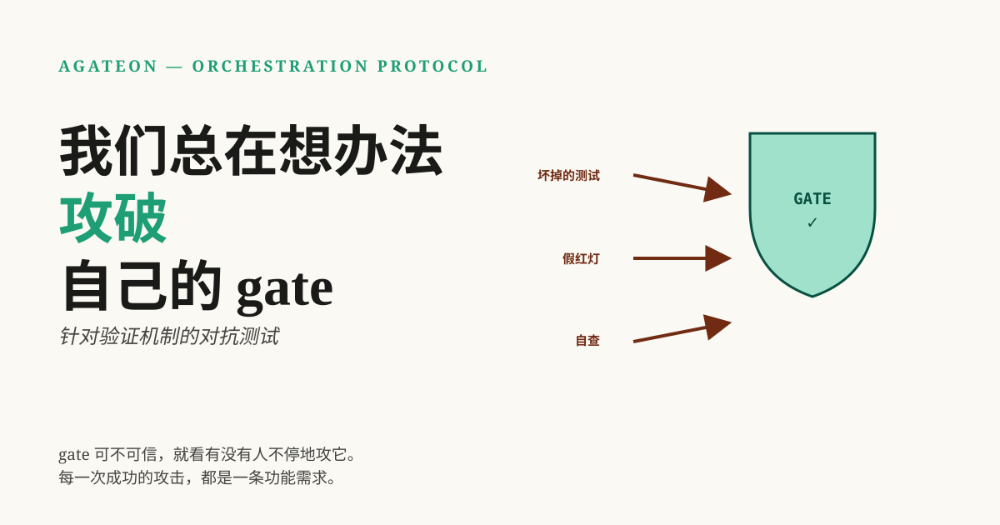

上一篇文章指出，gate 为你赢得了“移开视线”的权利。但要从*什么*上面移开视线呢——是 agent，还是 gate 本身：一段由某人编写的代码，却在评判由同类系统所完成的工作，而该系统可能正试图取悦它？那么，谁来监督监督者呢？

我所说的 *gate*，是指工作阶段在被认定为“完成”之前必须通过的任何检查——没有 gate，就没有进展。本文旨在探讨是什么让一个 gate 足够值得信赖，从而能够去监督一个 agent。简短的回答是：除了反复尝试攻破它，并将每一次成功的攻击视为一个功能需求（feature request）之外，没有任何东西能让它变得值得信赖。

## TL;DR

- 一个读取 agent 自身叙述的 gate 根本不是 gate——它只是 post-01 中事后分析的重演。
- 你无法通过设计规避的失效模式是*信任链同构*：作者和评审者是同一个系统，拥有相同的上下文。解决方法是强制性的机械隔离。
- 我们从三个方面攻击自己的 gate：对 TDD 的红灯进行分类，防止损坏的测试被误认为是合法的红灯；引入一个独立的 judge，在全新的上下文中重新验证一切；以及将 judge 的裁决设为*咨询性质*——退出代码（exit code）始终是门槛，绝非模型的观点。
- 诚实的警告：对抗性测试只能覆盖你预想到的攻击。gate 的可信度上限，取决于攻击它的想象力。

## 读取自身作者的 gate 不是 gate

这就是我们开始的地方，有必要精确地定义这种失效。post-01 中的安全网检查了一个存在于 agent 状态文件中的重试计数器。计数器是真的，机制也是真的，但 gate 读取的是 agent 自己对自身失败的描述。四次真正的失败发生了；计数器却保持为空；gate 通过了。这不是因为检查太弱，而是因为证据是由被检查方自己编写的。

post-03 中的证据阶梯（evidence ladder）已经说明了这一点：agent 无法编辑的证据——退出代码、git 历史记录、由作者以外的人编写的文件。但这个问题还有一个更微妙的版本，阶梯并没有完全回答：如果*检查本身*是损坏的，或者编写出来就是为了讨好它所检查的系统呢？那么即使是 rung-4 的证据，也会被一个实际上什么都没测试的 gate 放行。

这就是我们花费大量时间关注的攻击面。不是攻击 agent，而是攻击我们自己的验证机制。

## 攻击一：损坏的测试不是红灯

TDD 是一种旨在让“测试证明代码”这一论断成立的仪式：你先写测试，观察它失败，然后让它通过。但 TDD 的红灯可能会在两个方向上撒谎。它可能过早变绿——agent 在测试之前就写好了实现，所以“测试”从未证明过任何东西。或者它可能因为错误的原因变红：测试本身坏了，所以红灯并非功能缺失的证据，而是测试有 bug 的证据。

我们编写了一个检查器（[`check-tdd-red.py`](https://github.com/randomgitsrc/agateon/blob/main/agate/scripts/check-tdd-red.py)），其唯一的工作就是对你遇到的红灯进行分类：

| Red light | Meaning | What the gate does |
|-----------|---------|---------------------|
| Assertion failure | 功能未实现 —— *正确*的红灯 | Pass：这正是 TDD 所期望的 |
| B-class：未实现代码的导入错误 | 确实缺少实现 | Pass：合法的红灯 |
| A-class：测试本身存在语法/导入错误 | 测试损坏，而非代码问题 | **Fail：测试损坏 ≠ 有效证据** |
| All green | 在测试前已编写实现 | **Fail：违反 TDD 原则** |

我最喜欢 A/B 分类法。如果没有它，“测试失败”就会产生歧义：到底是产品缺失功能，还是产品没问题但测试写得草率？一个旨在“消除红灯”的 agent 会乐于提交一个损坏的测试 —— 测试失败，gate 看到失败，agent 就可以借口功能缺失再拖延一个周期。对红灯进行分类，使得这种行为会导致 gate 失败，而不是为其争取时间。一个不知道为何变红的红灯只是噪音；而一个知道*因何变红*的红灯才是证据。

## 攻击二：作者不能担任裁判

更深层的攻击不在于单一检查，而在于整个审查链。在大多数 agent 设置中，对 agent 工作的“审查”是由同一个模型完成的，甚至可能是在同一个上下文中，即刚刚完成工作的那个模型。那不是审查，那是带有额外步骤的总结。我们通过惨痛的教训学到了这一点：一项跨越多个任务的实验（TAG0018）用 LLM 对实际工作进行了审查，结果几乎没有任何有效信号 —— 十七条非阻塞性评论，以及一条机械检查也能发现的实际问题。根本原因不在于模型质量，而在于审查者和作者共享同一个信任链：相同的上下文、相同的框架、相同的盲点。

这一教训现在作为其自身的限制（LIMITATIONS-3）被写入了协议：判断 agent 各个 phase 的 gate 正在审查 agent 自己编写的文件，而现有的缓解措施只是*提高了造假成本* —— 并没有使其成为不可能。因此，我们构建的修复方案（[TAG0020](https://github.com/randomgitsrc/agateon/tree/main/agate-workspace/tasks/TAG0020-independent-judge)）是结构性的，而非仅仅是更严厉的措辞：引入一个独立角色 —— 裁判（judge），在*全新的上下文*中重新验证工作，只提供标准和证据，而不提供作者的自述。

三层机制确保了裁判的公正性，这也是最值得借鉴的部分：

- **信息隔离（Information isolation）。** 裁判的调度上下文包含需求、验收标准以及证据文件的白名单 —— 绝不包含实现者的个人叙述。如果 agent 的报告无法触达裁判，它就无法影响裁决结果。
- **证据交叉检查（Evidence cross-checking）。** 裁决不是凭感觉，而是针对文件和 git 历史的具体主张清单，其中的计数和引用必须完全吻合。
- **仅追加事件账本（An append-only event ledger）。** 每个 gate 事件都会记录在哈希链日志中（[`check-events.py`](https://github.com/randomgitsrc/agateon/blob/main/agate/scripts/check-events.py)），因此“何时发生了什么”在事后无法被篡改。

该设计有一条硬性原则，我认为这才是核心所在：**LLM 的结论仅供参考，而 exit code 才是判定阈值。** Judge 可以说“需要修改”，但 gate 的通过与否依然取决于机械事实——文件是否存在、数量是否匹配、哈希链是否完整。模型是证人，而非裁判；裁判是机制本身。这与证据阶梯（evidence ladder）的哲学一致：永远不要让被验证的系统成为关于其自身的真理来源，这包括不能让一个模型成为另一个模型工作成果的真理来源。

## 证明机制正是拦截下这篇博文的 gate

如果只谈抽象概念会很容易，所以这里有一个实时演示。此处的每一篇博文在发布前都会经过一个独立的 review gate——一个没有任何作者上下文的全新 agent，根据书面标准对文章进行检查，并拥有否决权。在上一篇博文中，该 gate 发现了一个真正的错误：我曾声称“thin”仪式路径（低风险任务所运行的简化阶段和 gate 序列）会舍弃验证阶段。事实恰恰相反——实现逻辑坚持认为即使是最简路径也必须保留验证。一个与我拥有相同上下文的审阅者可能会顺着我的思路点头，但那个没有上下文的审阅者一眼就发现了问题。

这就是整个论点的缩影。gate 的价值不在于它有多严格，而在于它是*独立*的——而这种独立性是你必须亲自构建的，因为无论技术多么高超，系统都无法成为自身合格的裁判。

## 诚实地讲，它在哪些地方会失效

- **你只能发现你预想到的攻击。** 对抗性测试受限于攻击者的想象力。我们攻击的是我们能想象到的故障点；而对于我们无人能想象到的盲区，gate 依然无能为力。这就是为什么该协议将 @@LIMITATIONS-3@@ 视为一个长期存在的弱点，而非已解决的问题。
- **Judge 本身也是一个 agent。** 它的独立性源于流程——全新的上下文、信息隔离、叠加的机械 gate——而非其本质。如果流程被绕过，Judge 就会退化为只会附和的“应声虫”。
- **独立性需要付出时间和 token 的代价。** 每一次独立的重新验证都是对机器已经完成的工作进行的二次处理。我们认为这是一种特性——这是能够“无需时刻盯着”所支付的代价——但这确实是实打实的成本，预算上限的存在正是因为这些开销会不断累积。
- **账本无法阻止篡改发生之前的内容重写。** 哈希链证明了事件在记录*之后*没有被更改；它无法证明事件在写入时就是诚实的。这些层级是有意设计的冗余：隔离使得叙述内容不可用，交叉检查使得声明难以伪造，账本使得修饰痕迹可见。没有任何单一层级能提供绝对保证。

## 总体形态

人们的本能反应是信任一个写得很好的 gate。更有用的本能是将每一个 gate 都视为潜在的对手，并投入真正的精力去尝试攻破它——因为另一种选择是在最糟糕的时刻发现漏洞，那时 agent 已经离去，工作也已经交付。验证不是你添加的一个功能；它是你必须不断攻击的一个系统。

引发此次故障的起因（[postmortem](/zh/blog/20260826/post-01-retry-self-authorization)）、由此构建的系统（[Agateon](https://github.com/randomgitsrc/agateon)，[此处](/zh/blog/20260827/post-02-agateon-intro)有介绍）、证据链（[post-03](/zh/blog/20260828/post-01-evidence-ladder)）以及它所带来的自主性（[post-04](/zh/blog/20260830/post-01-right-to-look-away)）均已在上方链接。红灯分类器（[`check-tdd-red.py`](https://github.com/randomgitsrc/agateon/blob/main/agate/scripts/check-tdd-red.py)）、judge gate（[`check-judge-verdict.py`](https://github.com/randomgitsrc/agateon/blob/main/agate/scripts/check-judge-verdict.py)）和事件账本（[`check-events.py`](https://github.com/randomgitsrc/agateon/blob/main/agate/scripts/check-events.py)）均位于 [`agate/scripts/`](https://github.com/randomgitsrc/agateon/tree/main/agate/scripts) 中，而设计 judge 的任务（包括其已知故障）则在 [`agate-workspace/tasks/`](https://github.com/randomgitsrc/agateon/tree/main/agate-workspace/tasks) 中——撰写文档时未做任何删减。
