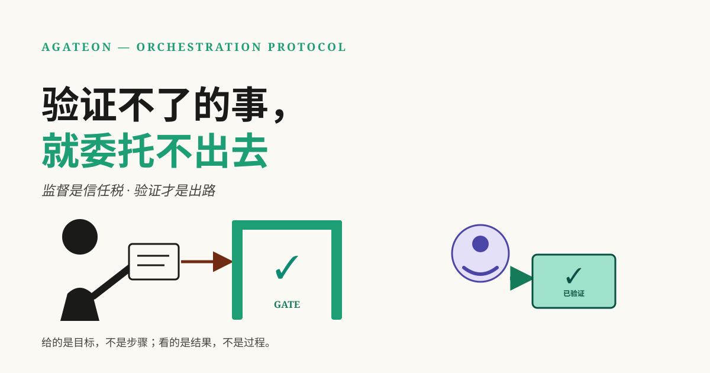
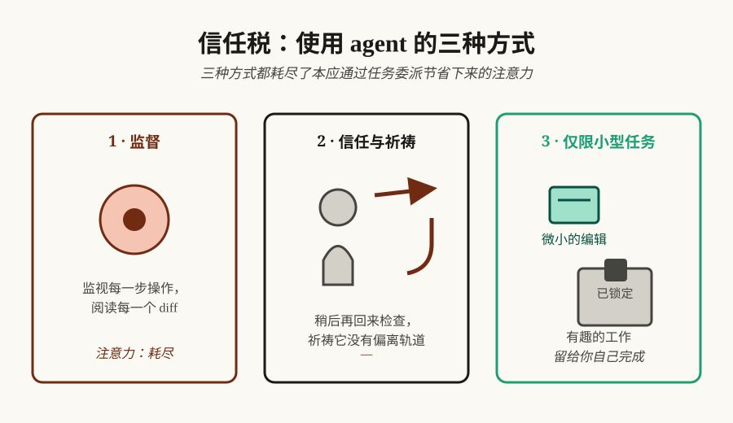

# 验证不了的事，就委托不出去



你雇 AI agent 是为了省心。结果不知道从哪天起，你成了它的监工。每个长任务都把你逼回同一道选择题：要么全程盯着，要么扭头不管赌它别出事。哪一种都不像委托——英文里那句话说得更直白：**You can't delegate what you can't verify**。

**TL;DR** —— 模型能力涨得很快，但决定你能把多少活交给 agent 的，不是模型够不够聪明，而是它干的活你能查验多少。在验证成为结构之前，你交的是一笔"信任税"：盯着看，注意力没了；不看，赌它别静默翻车；或者只敢交一眼能扫完的小活。这篇文章想讲清楚：验证从"盼着它靠谱"变成基础设施的那天，上限才会真的动——以及我们一直在做的编排协议 Agateon，今天走到了这条路上的哪一步。

## 信任税

看任何人用能力很强的 coding agent 干一件真正要紧的活，你都会看到下面三种行为之一：



1. **监督。** 每个 diff 都读，每个 commit 都要问一句，tool call 一个不落地看。注意力就这么没了——委托本来要省下的那份精力，全贴给了监督本身。
2. **信任与祈祷。** 长任务开着就转身走，过阵子回来看一眼。顺利的时候觉得自己挺聪明；一旦它悄悄跑偏，你发现它的时机往往最糟——已经合并了，已经部署了，或者出错的源头埋在三天前的上下文里。
3. **只敢交小事。** 改动小、能回滚、单文件，一眼能扫完。有意思的活全留在自己手里——不是想留，而是只有这些活出了问题，你才发现得了。

三种做法，付的是同一笔税。最容易掉进去的是第三种：你真正想做的那次重构，最后还是自己动手了——不是舍不得放，是它半夜坏了你不知道。稀缺的从来不是能力，而是**你能查验的那份信心**。

## 卡上限的不是模型能力，是验证

一次跑完的 agent 任务容易信。搭个 repo 脚手架、修个 lint 报错、给已知场景补个测试——整件事一眼能看完，模型的能力也真在那儿。

长任务完全是另一回事。一个跑几个小时、几十步的任务，产出多得脑子装不下，而大多数配置能给你的唯一摘要，还是 agent 自己写的。从这一刻起，"这活我敢不敢交"就不再是关于模型的问题，而是关于你的问题：**真到非查不可的时候，这些产出你查得动多少？**

这个答案不太舒服，但它就是你的上限。用同一个模型的两名工程师，上限可以差很远——差的全在各自能验证多少，跟模型没关系。

## 上限会怎样改变你的工作

接下来才是重点。验证一旦成为结构，你的工作形态会跟着变：

- **你给的是目标，不是步骤。** 不用盯着过程，因为不用盯——流程不会因为一句"我做完了"就往前走，只认查验过的证据。
- **你审的是成果，不是全程记录。** 注意力花在交回来的东西上，花在机器做不了的那些判断上，而不是花在"看它干活"上。
- **你敢答应的事变多了。** 委托的边界从"我敢冒多大险"挪到"我能查什么"。边界外移还有复利：每安全交出去一件事，就腾出一份判断力，留给只有你能做的事。

这就是终点：一个真正*可委托*的 agent——不是因为它诚实，而是因为它的活查得动。结果还是你负责，只是你不用再一五一十替它的每一步说话。

## 为什么是现在：能力涨得太快，验证跟不上

这件事每个季度都更紧迫一点：模型能力在复利增长，快过任何人靠读输出去核实的速度。模型*能做到什么*和你*敢让它做什么*之间的缝，还在变宽。先用结构把这缝合上的人，能多分到能力红利；剩下的人，继续盯着。

这就是我们的赌注：验证可以被做成结构。真做成那天，定你上限的就不再是焦虑，而是判断力。

## 今天已经能跑的部分

这不是空头的产品愿景——机制是现成的，而且我们自己天天在用。Agateon 是一个开源的 agent 编排协议（[介绍文](/zh/blog/20260827/post-02-agateon-intro)里讲过），把软件任务跑过八个 phase（阶段）。每个 phase 都要拿客观证据过一道 gate（闸门式的机器检查，证据不过就不放行）：测试运行器的 exit code、git log、磁盘上的文件——agent 的口头汇报不算数。具体来说，今天已经有的：

- **"看起来做完了"推不动进度。** 每个 phase 都得先过机器检查，状态机才往前走。检查不过，phase 退回去——退回动作会记进 git 历史，所以悄悄重置重试计数器，也没法让这张安全网失效（[事后复盘](/zh/blog/20260826/post-01-retry-self-authorization)）。
- **崩溃丢不了状态。** 所有进度都存在版本化的 Markdown 里，会话被打断，就从上一个过了检查的 phase 续跑。中断从"重来一遍"变成"排个期"——[上一篇文章](/zh/blog/20260830/post-01-right-to-look-away)讲的就是 gate 怎么换来自主权。
- **验证者自己也被验证。** 我们对自己的 gate 跑对抗测试，再让一个 judge（独立复核）在全新上下文里重查验收；门槛是 exit code，不是模型自己的意见（[我们一直在试着砸自己的 gate](/zh/blog/20260831/post-01-we-break-our-own-gates)）。
- **我们自己就在用。** 这个仓库本身就是拿 Agateon 建出来的。[`agate-workspace/tasks/`](https://github.com/randomgitsrc/agateon/tree/main/agate-workspace/tasks) 里的任务历史就是整个循环的记录——包括修协议自身弱点的任务：[mechanism checks](https://github.com/randomgitsrc/agateon/tree/main/agate-workspace/tasks/TAG0023-mechanism-checks) 补上了协议自查发现的漏洞，[protocol hygiene](https://github.com/randomgitsrc/agateon/tree/main/agate-workspace/tasks/TAG0016-protocol-hygiene) 砍掉了重复的验证运行。

原则上，信任税可以用工程手段压下来——机制现成，狗粮也一直在吃。至于规模化之后实际能省掉多少监督，是下面要摊开讲的问题。

## 还没解决的（押注我们之前先读这段）

终点是个方向，不是已到站。诚实交代几个缺口：

- 它是协议，不是产品。用起来是实打实的工作：装 symlink、挂 hooks、让你的 agent 守一套 phase 纪律。税降了，但换来的是搭建成本和流程仪式——所以渐进式采用很重要，小任务只跑精简流程。
- gate 有多强，取决于证据有多硬。拿弱测试当证据的 gate，验证出来的是"测试弱"，不是"活干好了"——质量上限就是测试本身的质量，这一条协议救不了（[known limitations](https://github.com/randomgitsrc/agateon/blob/main/agate/LIMITATIONS.md)）。
- 自我授权的残余缺口。agent 自己写的文件自己受审，这类 gate 只能缓解、不能根治——judge（独立复核）抬高了造假成本，也留下审计痕迹，但"作者和 judge 是同一个角色"是结构性的（[LIMITATIONS-3](https://github.com/randomgitsrc/agateon/blob/main/agate/LIMITATIONS.md)）。
- 长周期数据还没有。这套结构在真实项目里到底省掉多少监督，我们还没有跑够时长的数字。数字攒够了，就是下一篇诚实汇报。

所以：机制是真的，方向有论据撑着，差距也摆在了明面上。

## 如果你在用 agent 干活，先查查自己交了多少税

这个思路不需要 Agateon 也成立。下一个长任务开始前，问自己两个问题：哪里是因为查不动才不得不盯着？那个"查"，能不能变成机械检查？交给 AI 的人只需要记住一个问题：

> **要做到"我可以不盯着它"，还差什么？**

如果诚实的回答是"什么都不差，只能信它"——那这不是模型的问题。这是验证缺口，也是真正值得补上的那一个。

## 上手试试

仓库在 [github.com/randomgitsrc/agateon](https://github.com/randomgitsrc/agateon)（MIT）。一行安装，不装运行时：

```bash
curl -sSL https://raw.githubusercontent.com/randomgitsrc/agateon/main/install.sh | bash
```

验证不了的事，就委托不出去。Agateon 赌的就是验证可以被造出来——造出来那天，你敢交出去的活，和你的委托上限，都会跟着外移。
