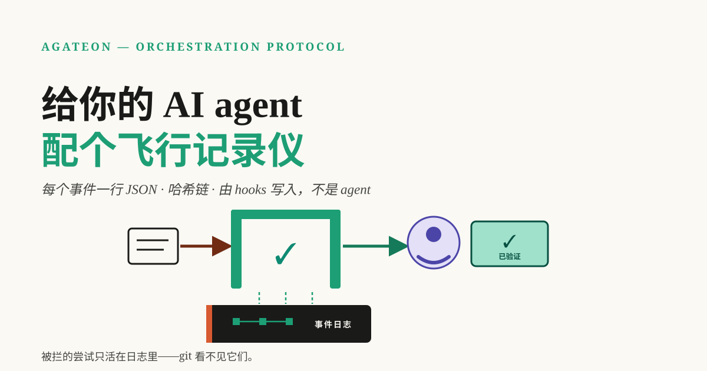
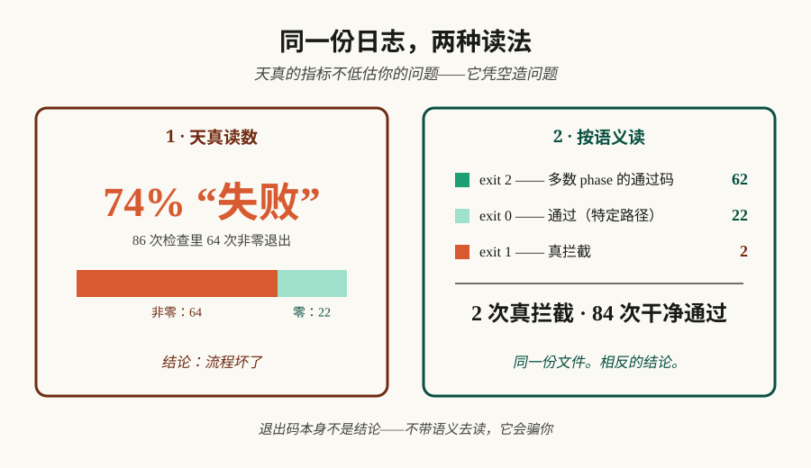

# 为你的 AI agent 配备一个飞行记录仪



关于上个月的快速测验：你向 AI agent 交付了多少任务？有多少次检查拦截了任务？又有多少工作是在悄无声息中被重做的？如果你和大多数团队一样（包括我们，直到最近也是如此），你无法回答这些问题，因为工作流没有留下任何记录。因此，我们让系统把所有事情都记录下来，这篇文章记录了日志的实际内容——包括它在哪些地方会误导你，以及它无法看到什么。

**TL;DR** —— 默认情况下，Agent 的工作不会留下任何痕迹，因此关于它的所有主张都基于记忆，而记忆不仅是错误的，而且是“自信地”错误。解决方案很简单——每个事件一行 JSON，通过哈希链连接，篡改即会破坏链条。我们的记录在十个任务中产生了约 200 个事件，阅读这些日志让我们学到了三件无法通过其他方式获知的事：朴素的指标会颠倒事实（我们的日志“显示”74% 的检查失败了；但实际次数只有 2 次）；从未提交（commit）的失败对 git 而言是不可见的，它们仅存在于日志中；每个日志都有你应该刻意去映射的盲点。请借鉴我们的词汇表，而不是我们的数据。

## 记忆不是记录

询问一个使用编码 agent 的团队，你会听到自信的回答：“它运行得很好”、“我们上周表现不佳”、“它为我们节省了大量时间”。这些都不是数据——它们只是最近发生或印象最深刻的事情的残留物。人类擅长记住 AI 在同一个下午写出令人印象深刻且糟糕的代码，但在统计比率和计数方面却毫无用处，而决策恰恰需要这些比率和计数。

我们以一种尴尬的方式意识到了这一点。当我们坐下来撰写一份诚实的回顾时，我们无法回答关于自身工作流的基本问题：检查到底多久拦截一次任务？工作倒退的频率是多少？我们有观点，但没有数据。而我们构建的软件，其核心职责就是验证——如果我们都在凭“感觉”行事，那么所有人也一定如此。

## 最小可用日志

因此，我们添加了一个飞行记录仪。它不是一个平台，也不是一个仪表盘：而是每个任务对应一个 JSONL 文件，由强制执行 gate 的钩子（hooks）写入——所谓 *gate*，即一个阶段（phase）在工作推进前必须通过的检查——它包含三种事件类型，词汇量小到足以记在脑子里：

- **`gate_run`** —— 执行了一次检查：哪个阶段、哪个命令、退出代码是什么、由谁执行。
- **`state_transition`** —— 任务的阶段发生了移动：从哪里到哪里。
- **`judge_verdict`** —— [一次独立复核](/zh/blog/20260831/post-01-we-break-our-own-gates)对工作做出了裁定。

有两个设计选择比词汇表本身更重要。首先，日志由*强制执行*钩子写入，而不是由 agent 写入——一个会忘记做工作的 agent 同样会忘记记录它。其次，每个事件都携带前一个事件的哈希值，因此文件构成了一个链条：编辑任何一行都会破坏链条，而检查脚本（[`check-events.py`](https://github.com/randomgitsrc/agateon/tree/main/agate/scripts)）会验证链条的完整性、时间戳的单调性以及判定计数。事后可以编辑的日志只是日记；无法编辑的日志才是记录。

## 我们的日志实际说了什么

在十个任务之后，日志中保存了大约 200 个事件。以下是值得你关注的部分：**我们最初对它的解读几乎完全是错误的。**

原始统计显示运行了 86 次检查，其中 64 次以非零状态退出——失败率高达 74%。如果把这个数据放到仪表盘上，合理的结论是工作流已崩溃。但事实恰恰相反：在我们的状态机中，exit 2 对大多数 phase 而言*就是*通过代码——一个成功的 gate 往往会故意以非零状态退出，因为 shell 惯例无法区分“已通过”、“无需检查”和“带警告通过”这些不同的结果。结合语义来解读，日志显示：**86 次检查，2 次真正的阻塞，84 次正常。** 这种单纯的指标并没有低估我们的问题，而是凭空捏造了问题。



那两次真正的阻塞是我文件中最喜欢的记录，因为它们*不存在*于别处。这两次都是在 implementation phase 对任务进行的 gate 拦截——某天晚上，两个 commit 在一分钟内相继被拒，随后在次日凌晨修复并顺利通过。如果你去 git 历史中查找，会一无所获：**被阻塞的 commit 永远不会成为 commit。** Git 只记录已发布的内容；它没有位置留给那些被阻止的操作。这两次失败存在的唯一地方就是日志——这正是记录（record）与传闻（rumor）的区别。不必只听我们的一面之词：账本就在仓库中，被阻塞任务的 [gate-events.jsonl](https://github.com/randomgitsrc/agateon/blob/main/agate-workspace/tasks/TAG0027-orchestration-semantics/gate-events.jsonl) 可以通过 `"exit":1` 进行 grep 搜索。如果没有它，“我们的 gate 大多直接放行”这一说法将无法证伪，而“gate 曾拦截过两个糟糕的 commit”也会变成一个无人能核实的传说。

## 它（目前）无法说明什么

一份日志通过承认其局限性来赢得信任，因此，通过询问该文件*无法*告诉我们什么，我们发现了以下局限：

- **它涵盖了我们 31 个任务中的 10 个。** 我们是在中途才加入记录器的；早期的工作没有留下事件。对整个项目计算任何“平均值”都是分母上的谎言，所以我们不进行此类计算。
- **它在发布前结束。** 每个任务的日志都在 judge 的裁决处关闭——release phase 发生在日志关闭之后，因此记录涵盖的是工作过程，而非后续结果。（我们知道这一点；但尚未修复。）
- **它在结构上对暂停（pauses）视而不见。** 记录器会跳过处于暂停状态的任务——暂停的任务不会写入任何事件。在十个任务中，没有出现过一次暂停事件，我们*无法*从日志中判断这究竟意味着“从未暂停过”还是“暂停是不可见的”。这种歧义是我们的 bug，而撰写这篇文章正是为了将其暴露出来。
- **零回滚——这是一个发现，而非胜利。** 我们的设计中包含了当检查在后期失败时将工作回退的机制。但在账本时代，它从未触发过一次。与此同时，31 个任务中有 17 个显示了另一种重试——为了质量而重新分发的 subagent——记录在完全独立的文件中。两个工具，两个局部视图；两者都不是完整的工作流。

最后一点是更深层的教训：**监测漏洞本身也是一种发现。** 日志无法看到的内容，恰恰揭示了你对自身工作流的建模在何处出了错。

## 你只需一个下午就能实现自己的版本

你不需要我们的协议也能做到这一点。核心思路是：挑选出你的工作流中宣称“某事已发生”的时刻，并在它们发生时写入一行 JSON。三种事件类型足以起步：

```bash
echo '{"event":"gate_run","phase":"test","exit":0,"ts":"2026-09-05T10:00:00Z"}' >> .agent-events.jsonl
```

然后按此顺序向日志提出三个问题：

1. **最直观的读取结果是什么？** 用你现有的最原始指标来统计失败次数——然后去核实你的退出代码（exit codes）和状态是否真的如你所想。 （我们的结果并非如此。）
2. **日志中缺失了什么？** 列出你的工作流可能处于的所有状态，然后找出哪些状态没有产生任何事件。每一个静默状态要么是正常的，要么是盲点——你需要明确知道它是哪一种。
3. **发生了什么 git 无法展示的事情？** 被阻塞的尝试、被拒绝的评审、重新运行的命令——那些没有留下 commit 的工作，往往正是你最需要记录下来的部分。

只需针对一个任务执行此操作——不是整个平台，仅仅是一个任务——你就已经领先于那些仅凭记忆争论 agent 表现的团队了。

## 尝试一下

Agateon 的地址是 [github.com/randomgitsrc/agateon](https://github.com/randomgitsrc/agateon) (MIT) —— 这是这些事件所遵循的协议，其 recorder 已内置于钩子（hooks）中。一行命令安装，无需运行时：

```bash
curl -sSL https://raw.githubusercontent.com/randomgitsrc/agateon/main/install.sh | bash
```

本文中的数据规模较小且处于早期阶段——十个任务只是一个开始，而非定论。我们在[上一篇文章](/zh/blog/20260903/post-01-you-cant-delegate-what-you-cant-verify)中承诺过，一旦数据积累起来，就会如实公布；这篇就是那篇文章，包含了所有的缺口。但方向已经明确：没有记录的 agent 工作流既不是已验证也不是未验证——它是*不可观测的*，而不可观测意味着关于它的任何争论最终都只能是不了了之。给它装上一个飞行记录仪吧。日志会反驳你的记忆，而日志才是对的。
